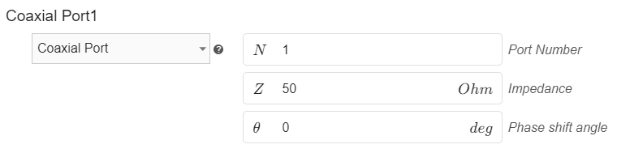

**Boundary conditions** or **Boundaries** are very important part of the simulation, as they are needed to physically define your antenna design. Even though *Boundaries* are always filled automatically, in some occasions you will need to **change or adjust the default definitions**.

In this article we will **go over the boundary conditions available** in *CENOS Antenna Design* app and **learn the meaning of each definition**.

## Uniform/Coaxial port

This is the most important boundary, as it is responsible for the **antenna feed definition**.

CENOS will **automatically set** ***Uniform*** or ***Coaxial*** port depending on *Role* definition. Port **Impedance** by default is set to **50 Ohm**, which you can adjust depending on your case.

### Automatic Feed Parameters - Uniform

**Automatic Feed Parameters** will be set by default. If you uncheck the selection, you will have access to the **manual definitions** of ***Feed Parameters***.

**Uniform Parameters**:

- **Voltage [V]** - Applied voltage to the feed;
- **Gap [m]** - Inset gap (for patch antennas). If you don't have an inset, put **0**;
- **Feed vector X, Y, Z** - Vector parallel to the feed plane.

### Automatic Feed Parameters - Coaxial

**Coaxial Parameters**:

- **Voltage [V]** - Applied voltage to the feed;
- **Inner radius [m]** - Inner radius of the Coaxial port;
- **Outer radius [m]** - Outer radius of the Coaxial port.

### Phase shift

By enabling the *Phase Shift* checkbox, you can define phase shift through which you can change the angle of excitation of the wave at the antenna input.

## Perfect Electric Conductor

**Perfect Electric Conductor** is a condition which is by default **applied to wire of wire antenna or conductive layers of patch antenna** (patch and ground). It assumes perfect electric conductivity of the boundary.

## Conductor

You can use **Conductor** boundary instead of *Perfect Electric Conductor*. **Conductor** takes into account the resistive losses, which can give more precise simulation results.

## Radiation Boundary

**Radiation Boundary** is by default applied to the **outer surface of the air box** - a domain which is automatically generated around your antenna.

## Interface

**Interface** is used to define an internal contact surface between two separate domains.

