For geometry manipulations *CENOS Antenna Design* uses a very strong geometry editor - *FreeCAD*. This editor is used with both *Import CAD* and *Geometry Editor*, so **it is important for us to understand how to work with FreeCAD**. 

:::tip
*FreeCAD* has all its tools organized into ***workbenches***, such as *Part* or *Sketcher*, and most tasks can be done using only these two workbenches. You will see them referenced throughout the article.
:::

---

## Geometry import

Sometimes when building an antenna simulation, you will already have a pre-made geometry, which you will want to use. In such cases you can easily import your CAD in **DXF** or **STEP** file formats.

**To import such files**, open *Geometry Editor* and simply **drag & drop** your geometry in *FreeCAD*!

---

## Sketches

A **sketch is the base for almost all geometrical objects** you can create, **including geometries for antennas**, which is why we need to know how to create one.

---

### From scratch

In *FreeCAD* you can create sketches in **Sketcher workbench**, which you can access directly through the shortcut icon:

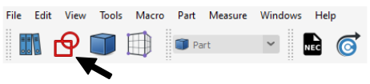

Once in the workbench, click **Create a new sketch**.

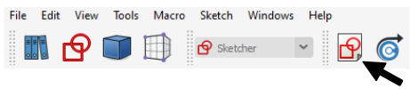

**Select the plane where you want to create you sketch**, and you can start to draw the actual geometry.

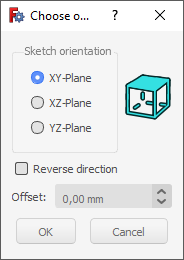

*FreeCAD* offers a large variety of tools designed to easily and precisely create any geometry.

:::tip
Hold down **Alt** to rotate the camera in sketch view
:::

Draw your antenna geometry, and, once you are done, click **Close**.

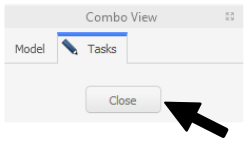

---

### On volumes

In some cases **it is beneficial to create a sketch on an already created volume**, for example, for PCB antennas. Once you have created a 3D volume, for example, a box, you can select one surface on which to create you sketch.

:::note
The geometry you create will be partitioned upon sending it to CENOS, which means that **sketches created on top of volumes will appear as separate surfaces in CENOS**!

For example, you don't need to create an extrusion for patch, as it is enough to create only a sketch for it.
:::

In the **Part** workbench select the face on which you want to draw.

Click **Sketcher workbench**.

Then click **Create a new sketch**.

Click **OK** to *FlatFace* definition, and start to draw.

:::tip
Hold down **Alt** to rotate the camera in sketch view
:::

Once you have finished drawing your sketch, simply **Close** it and you are done!

---

## 3D volumes

For a lot of times it will be necessary to **create 3D geometries, not only 2D sketches**. Fortunately 3D modeling in *FreeCAD* is very straightforward!

:::warning important
When creating volumes, make sure that they do not overlap with each other. **Overlapping volume objects are forbidden**!
:::

---

### Primitives

For the **simplest volume objects** like cubes, spheres or cylinders, *FreeCAD* offers an easy way of creating such geometries. As you open *FreeCAD*, you will be automatically put in **Part** workbench. There you can simply **select any geometry you want and build it**.

As you select an object, it will be built with pre-defined size. **To change the size of your geometry**, select your object and change its properties.

---

### Extrusion

For **more complicated geometries** it is possible to draw a sketch and create a 3D volume object from that sketch. There are multiple functions for this procedure, but the most commonly used one is *Extrusion*.

To use *Extrusion*, you need to **first create a sketch you need**.

Then switch to **Part workbench**

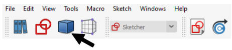

and click **Extrude a selected sketch**.

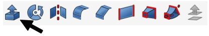

In *Extrude* properties window define the **extrusion lenght**, check **Create solid** and select **Sketch** as a shape to extrude. Once done, click apply.

Now you have succesfully created a complex 3D object!

---

## Geometry parameters

A very useful thing to have is **parameterized geometry**. This way you can **create your geometry and dynamically change it through parameters** without the need to rebuild everything.

You can **define parameters** in the *Cenos Parameters* spreadsheet where you can use various units and/or mathematical equations for the values.

:::tip
To navigate between *Cenos Parameters* and geometry preview, use the tabs below the spreadsheet.

:::

To **use these parameters**, click the *Formula Editor* button in the value field and then enter `CenosParameters.name`

:::note
For now, to update the parameters, you will have to open FreeCAD and re-send the geometry to CENOS. In the next CENOS Antenna Design versions parameters will be accessable directly from CENOS interface.
:::

---

## Getting the geometry to CENOS

Once you have finished the geometry, you need to send the mesh to CENOS. To do that:

1. **Select all final objects** in the tree view.

2. Click **Geometry to CENOS**.

3. As geometry is being sent to CENOS, **FreeCAD study will be automatically saved** in the simulation folder, so you can close it.

---

## Manual meshing in FreeCAD

By default *FreeCAD* is necessary only for the geometry building, as the numerical mesh for your antenna is generated automatically when you calculate your simulation. However, **in some cases the automatic meshing might fail**, and **in such occasion you will need to create your geometry manually**.

If during the calculation you get a **message about meshing problems**, you will need to manually mesh your antenna in *FreeCAD*. You can also mesh it manually already when building your geometry (while still in FreeCAD) in case you want more control over your simulation.

---

### General mesh

To create the mesh manually in *FreeCAD*:

1. Switch to the **Meshing** workbench

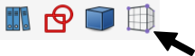

2. Select all objects of your design from the tree view and click **Create Mesh**.

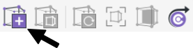

Mesh size will be **automatically chosen** and mesh generated.

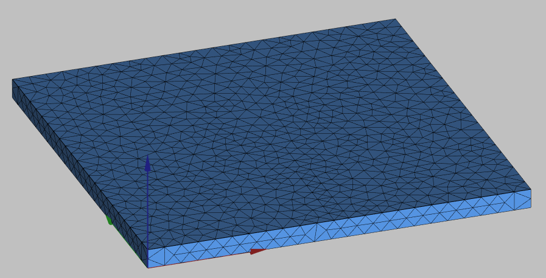

:::tip
If you want to **change mesh size**, you need to click on the respective submesh and in properties change the **Characteristics** value.

:::

---

### Mesh refinements

Based on the mesh we genereated previously, it looks like we meshed just a simple plate, but if we disable mesh visibility and visualize the original geometry, we can see that on this plate we actually have a patch drawing.

As you can see, the **mesh we created for the box does not resolute the patch on it**, so we need to **create this resolution manually**.

You can **create a mesh refinement** for elements (faces, edges, vertices) in the 3D view or whole objects (sketches, solids) in the tree view:

1. **Select the objects** which you want to use mesh refinement.

2. Click **Refine mesh**.

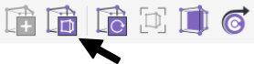

3. Click **Recompute mesh**.

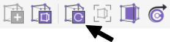

4. Enable the *mesh* visibility to see the new mesh.

:::tip
To **toggle visibility** of any object, right-click on it and click **Show/Hide selection**.
:::

---

### Send mesh to CENOS

Once you are satisfied with the mesh, click **Send mesh to CENOS**!

