For geometry manipulations *CENOS Antenna Design* uses a very strong geometry editor - *FreeCAD*. This editor is used with both *Import CAD* and *Geometry Editor*, so **it is important for us to understand how to work with FreeCAD**. 

**Watch a short video on how to use FreeCAD for CENOS Antenna Design app**:

---

## Geometry import

Sometimes when building an antenna simulation, you will already have a pre-made geometry, which you will want to use.

### DXF/STEP

You can easily import your CAD in **DXF** or **STEP** file formats.

**To import such files**, open *Geometry Editor* and simply **drag & drop** your geometry in *FreeCAD*!

### .NEC

If you have a ***.NEC*** (or other format) file, you can import it from the Part module.

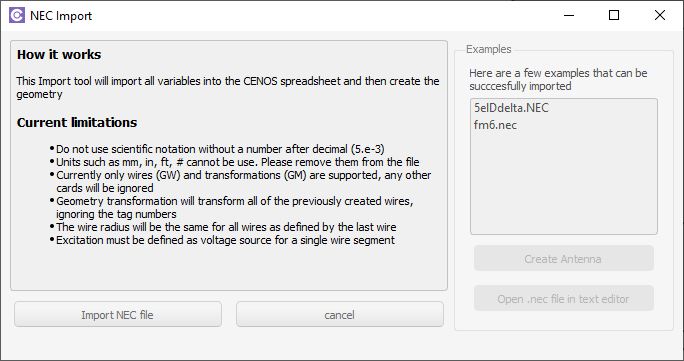

---

## Component Library

You can use **CENOS Component Library** templates to **build patch or connector geometries**.

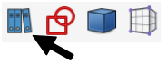

**Select the part you want to build** and click **Create**. **Fill out the template** parameters for those parts that it is necessary, and click **OK** to build your geometry!

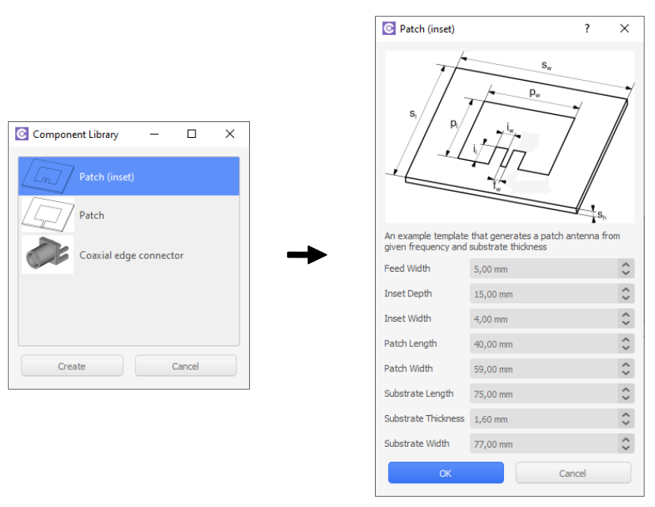

---

## Sketches

A **sketch is the base for almost all geometrical objects** you can create, **including geometries for antennas**, which is why we need to know how to create one.

---

### From scratch

In *FreeCAD* you can create sketches in **Sketcher workbench**, which you can access directly through the shortcut icon:

Once in the workbench, click **Create a new sketch**.

**Select the plane where you want to create you sketch**, and you can start to draw the actual geometry.

*FreeCAD* offers a large variety of tools designed to easily and precisely create any geometry.

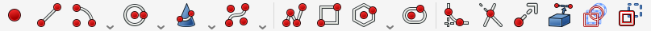

:::tip
Hold down **Alt** to rotate the camera in sketch view
:::

Draw your antenna geometry, and, once you are done, click **Close**.

---

### On volumes

In some cases **it is beneficial to create a sketch on an already created volume**, for example, for PCB antennas. Once you have created a 3D volume, for example, a box, you can select one surface on which to create you sketch.

:::note
The geometry you create will be partitioned upon sending it to CENOS, which means that **sketches created on top of volumes will appear as separate surfaces in CENOS**!

For example, you don't need to create an extrusion for patch, as it is enough to create only a sketch for it.
:::

In the **Part** workbench select the face on which you want to draw.

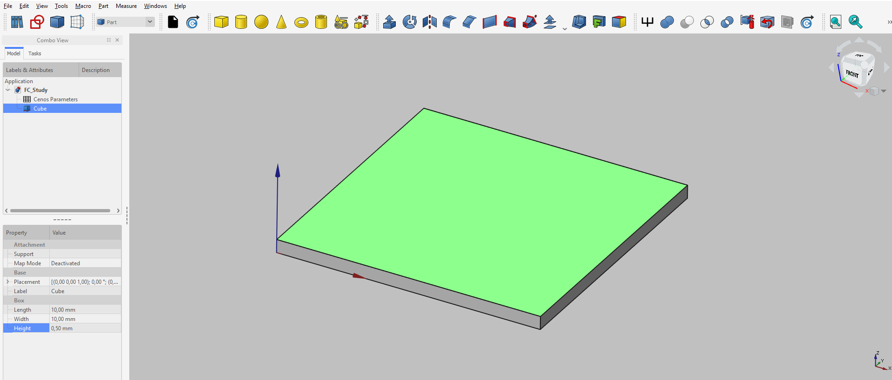

Click **Sketcher workbench**.

Then click **Create a new sketch**.

Click **OK** to *FlatFace* definition, and start to draw.

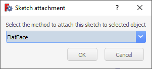

:::tip
Hold down **Alt** to rotate the camera in sketch view
:::

Once you have finished drawing your sketch, simply **Close** it and you are done!

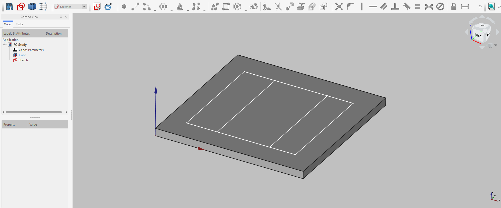

---

## 3D volumes

For a lot of times it will be necessary to **create 3D geometries, not only 2D sketches**. Fortunately 3D modeling in *FreeCAD* is very straightforward!

:::warning important
When creating volumes, make sure that they do not overlap with each other. **Overlapping volume objects are forbidden**!
:::

---

### Primitives

For the **simplest volume objects** like cubes, spheres or cylinders, *FreeCAD* offers an easy way of creating such geometries. As you open *FreeCAD*, you will be automatically put in **Part** workbench. There you can simply **select any geometry you want and build it**.

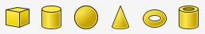

As you select an object, it will be built with pre-defined size. **To change the size of your geometry**, select your object and change its properties.

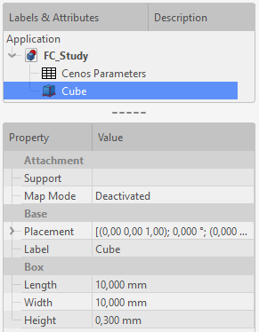

---

### Extrusion

For **more complicated geometries** it is possible to draw a sketch and create a 3D volume object from that sketch. There are multiple functions for this procedure, but the most commonly used one is *Extrusion*.

To use *Extrusion*, you need to **first create a sketch you need**.

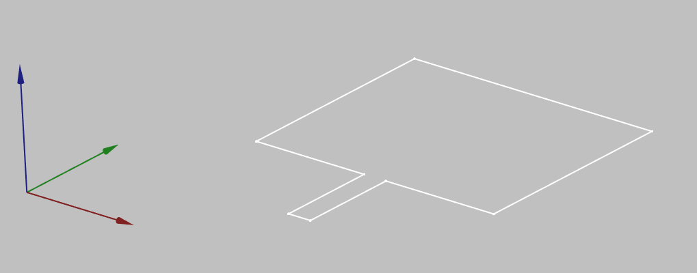

Then switch to **Part workbench**

and click **Extrude a selected sketch**.

In *Extrude* properties window define the **extrusion lenght**, check **Create solid** and select **Sketch** as a shape to extrude. Once done, click apply.

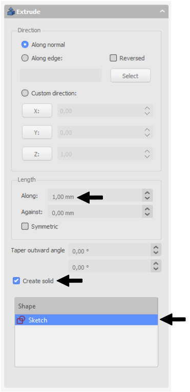

Now you have succesfully created a complex 3D object!

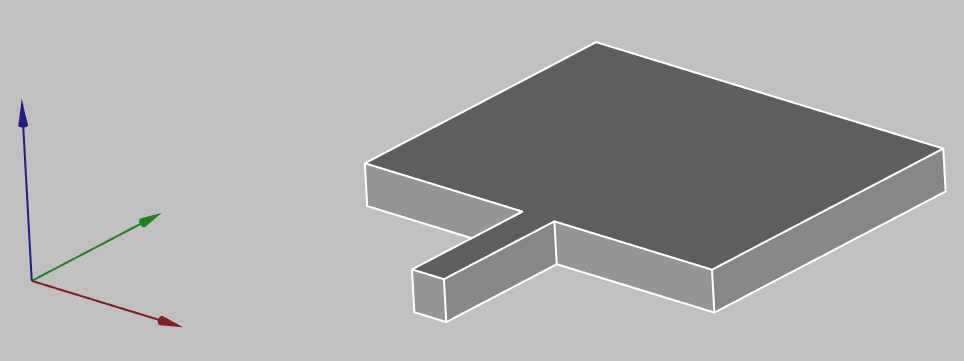

---

## Geometry parameters

A very useful thing to have is **parameterized geometry**. This way you can **create your geometry and dynamically change it through parameters** without the need to rebuild everything.

You can **define parameters** in the *Cenos Parameters* spreadsheet where you can use various units and/or mathematical equations for the values.

:::tip
To navigate between *Cenos Parameters* and geometry preview, use the tabs below the spreadsheet.
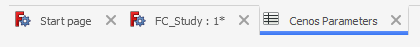
:::

To **use these parameters**, click the *Formula Editor* button in the value field and then enter `CenosParameters.name`

:::note
For now, to update the parameters, you will have to open FreeCAD and re-send the geometry to CENOS. In the next CENOS Antenna Design versions parameters will be accessable directly from CENOS interface.
:::

---

## Getting the geometry to CENOS

Once you have finished the geometry, you need to send the mesh to CENOS. To do that:

1. **Select all final objects** in the tree view.

2. Click **Geometry to CENOS**.

3. As geometry is being sent to CENOS, **FreeCAD study will be automatically saved** in the simulation folder, so you can close it.

