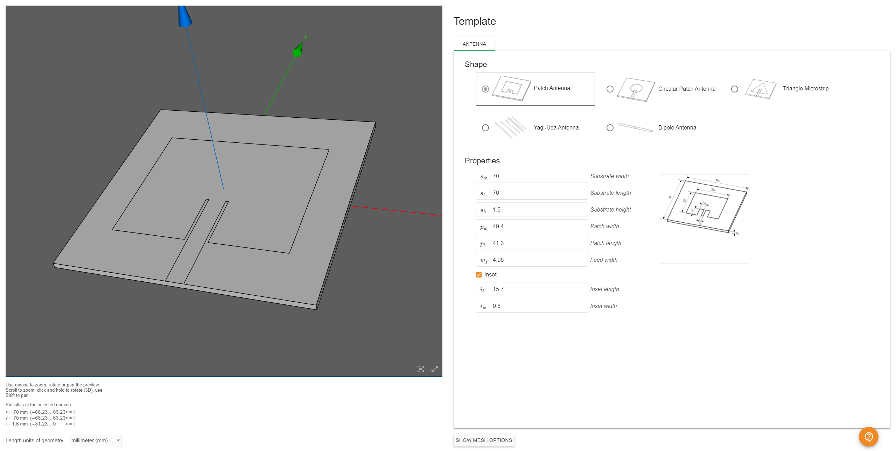

Once you have imported your CAD file and [sent it to CENOS](creation#getting-the-geometry-to-cenos), you will need to **define volumes and surfaces of your antenna**.

---

### Select the type of your antenna.

Fist you need to **select the type of your antenna** - *PCB*, *Wire* or *Other*.

:::note tip
If you want to **change selected antenna type**, click *Reset geometry type*.

:::

---

### Assign roles to your geometry.

 1. Click *Select...* to **enter role selection**.
 2. Choose if you will define *volume* or *face*.

 3. **Select the appropriate object** (volume or surface). Once done, click **ASSIGN** to finish role selection.

:::note tip
You can **rename objects** by simply clicking the edit tool next to the name.

:::

---

### GO TO PHYSICS

Once all *Roles* are assigned, **GO TO PHYSICS** button will enable, and you can move on to the physics setup!

:::note tip
You can **add more roles** if for example you created a coaxial connector, then you can add a dielectric, and two more conductors.

:::
