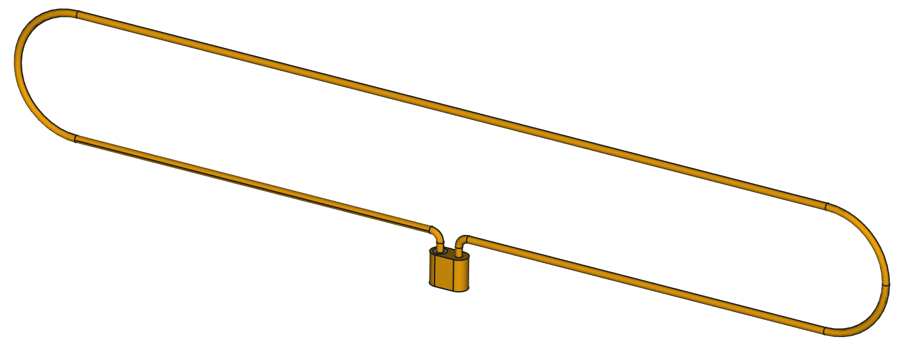
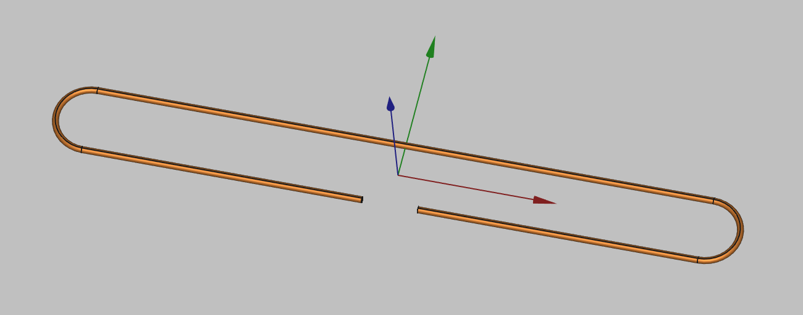
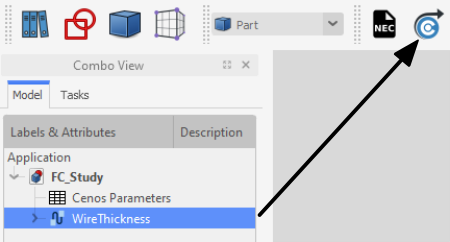
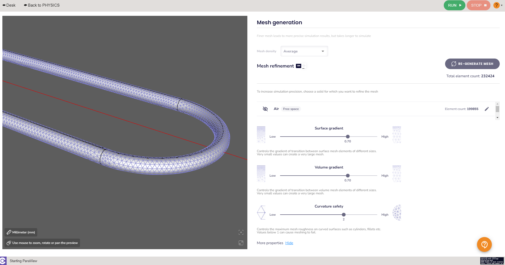
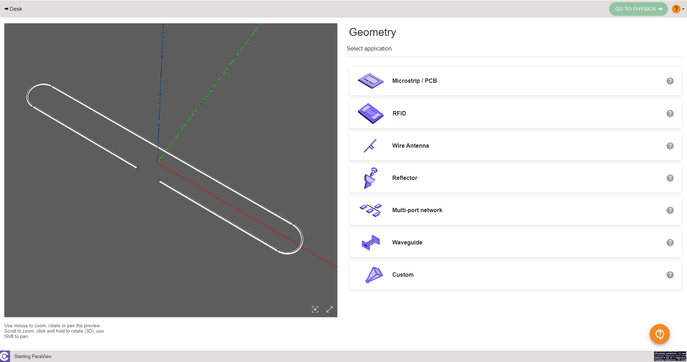
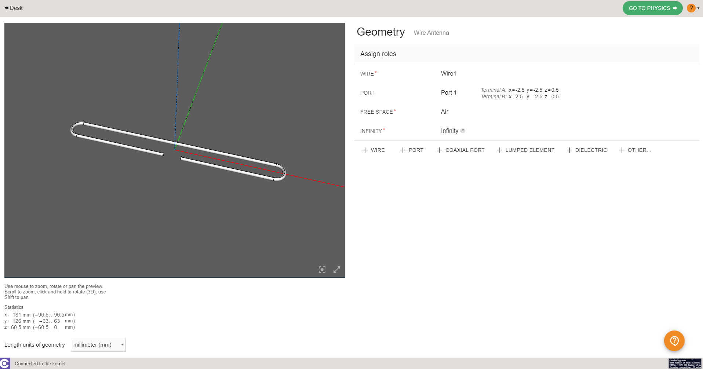
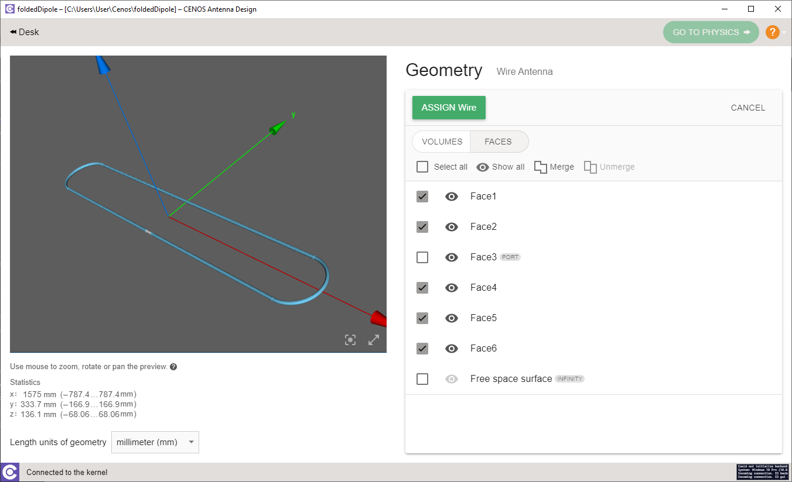
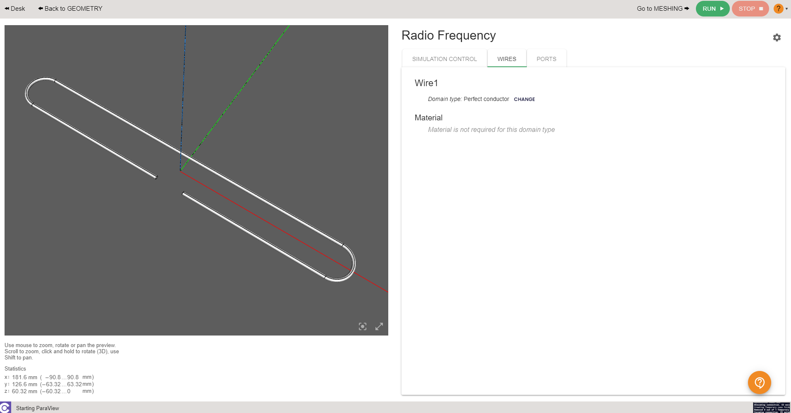
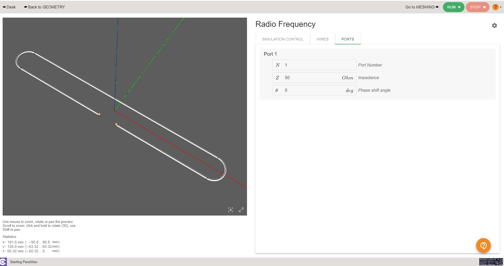

In radio and telecommunications a dipole antenna is the **simplest** and **most widely used** class of antenna. There are multiple types of dipole antennas - the simplest ones you can simulate using *CENOS Antenna Design* **Templates**, but for more complex ones (such as loop or folded dipole) **Geometry Editor** can be used!

In this guide we will take a look at **how to build a complete folded dipole antenna simulation from scratch in CENOS Antenna Design app**, using its built-in geometry editor, *FreeCAD*.

---

## Case setup

Before we can actually start building our simulation, we need to first prepare our case - **choose the way we will build our geometry**, and **save the case**.

---

### Choose geometry approach

You have three options from which to choose - **Templates**, **Import CAD** (if you have your own CAD file ready) and **Geometry Editor**.

For this example we will choose **Geometry Editor** and build our folded dipole geometry ourselves.

---

### Save the case

At this point you need to **save the case**, otherwise if you try to open *FreeCAD*, *CENOS* will not let you move forward.

Once the case is saved, click the *Play* icon to open *FreeCAD* - CENOS geometry editor.

---

## Geometry creation

In *FreeCAD* we have all the possibilities to **build our antenna geometry**, and we are going to do just that.

In this *Geometry creation* section we will cover **all main points you need to complete** to build your own patch antenna geometry manually.

---

### Dipole wire sketch

First thing we need to do is to **draw the sketch of our wire**. In **Sketch** workbench **[create a sketch](creation#on-volumes)** and draw the wire outline.

:::note
For dipole antenna feed definition we can use a **simple curved uniform port** instead of a more *complex SMA connector*.

To create separate **surface for our port**, draw a **separate line in the sketch** where you want to put your feed!

:::

---

### Wire thickness

Once the sketch is created, add **[wire thickness](creation#wire-thickness)** to the sketch to build the actual wire geometry.

With wire creation you have **finished your geometry creation**!

---

### Send geometry to CENOS

Once you have finished the geometry, you need to send the mesh to CENOS. To do that:

1. **Select all final objects** in the tree view.

2. Click **Geometry to CENOS**.

As geometry is being sent to CENOS, **FreeCAD study will be automatically saved** in the simulation folder, so you can close it.

---

### Manual meshing

If during the calculation you get a **message about meshing problems**, you will need to **[manually mesh](meshing#general-mesh)** your antenna in FreeCAD. You can also mesh it manually already when building your geometry (while still in FreeCAD) in case you want more control over your simulation.

---

## Roles

Once the geometry is finished and sent to CENOS, you need to **define your geometry** before defining the physics on it.

Essentially you need to clarify which part of your geometry is the dielectric, which is the port etc., in other words, **define roles for parts of your geometry**.

---

### Type of antenna

Before you define roles, you need to **[select what kind of antenna you have](definition#select-the-type-of-your-antenna)** - *Microstrip*, *Wire* or *Other*.

For this example we choose **Wire** antenna type.

---

### Wire/port roles

Now you need to **[define surface and volume roles](definition#assign-roles-to-your-geometry)** for your wire and port.

:::note tip
If you define *Wire* as the full wire volume, it will overlap with the *Port* surface and **affect the results**. For *Wire* definition **choose faces and select all faces except** ***Port***!

:::

---

### Got to physics

When roles are assigned, **GO TO PHYSICS** button will become active - click it to **move to the Physics definition**!

---

## Physics

In physics you need to **define the physical parameters of your simulation**, which include **frequencies**, **material definitions** and **boundary conditions**.

---

### Simulation control

In **SIMULATION CONTROL** you define either a **single frequency** or a **frequency sweep**.

---

### Wire/Free space

***Wire*** and ***Free space*** **is already predefined for you**, so you don't need to worry about these parts at all!

### Boundaries

**Boundaries** or boundary conditions have also been **predefined**:

- *Feed* surface → **Uniform Port** (with default 50 Ohm Impedance)

- *Wire* → **Perfect Electric Conductor**

- Free space surface → **Radiation Boundary**

Once all physical parameters are filled, **RUN** button will become active and you will be able to **run the simulation**!

---

## Results

When calculation is done, results will automatically open in a new window. Congratulations, you have **successfully finished a folded dipole antenna simulation**!

