**Helical antennas** are a simple example of wire antennas that are often used in high-frequency mobile communications.

In this guide we will take a look at how to build a complete helical antenna simulation from scratch in _CENOS Radio Frequency_ app, using its built-in geometry editor, _FreeCAD_.

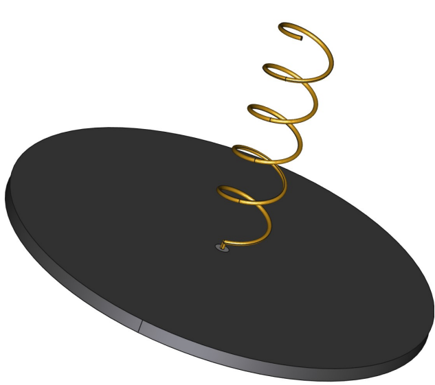

## Case setup

Before we can actually start building our simulation, we need to first prepare our case - choose the way we will build our geometry, and save the case.

### Choose geometry approach

You have three options from which to choose - _Templates_, F_rom CAD_ (if you have your own CAD file ready) and _Geometry Editor_.

For this example we will choose _0Geometry Editor_ and build our helical geometry ourselves.

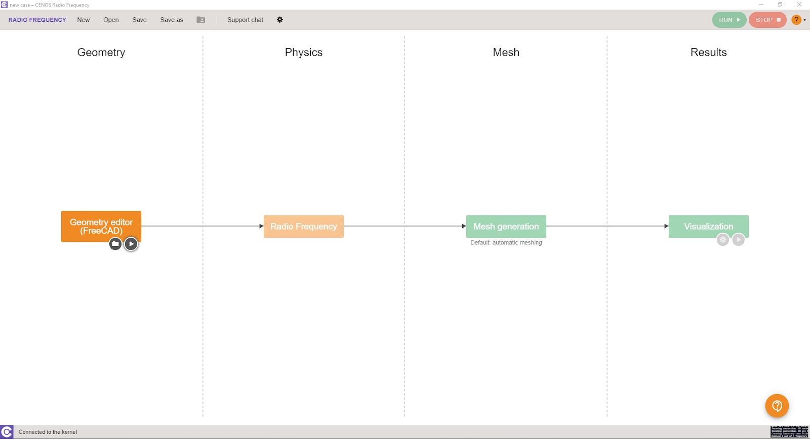

### Save the case

At this point you need to save the case, otherwise if you try to open _FreeCAD_, CENOS will not let you move forward.

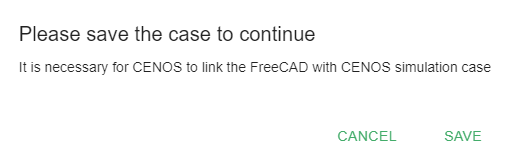

After saving the case, FreeCAD will open.

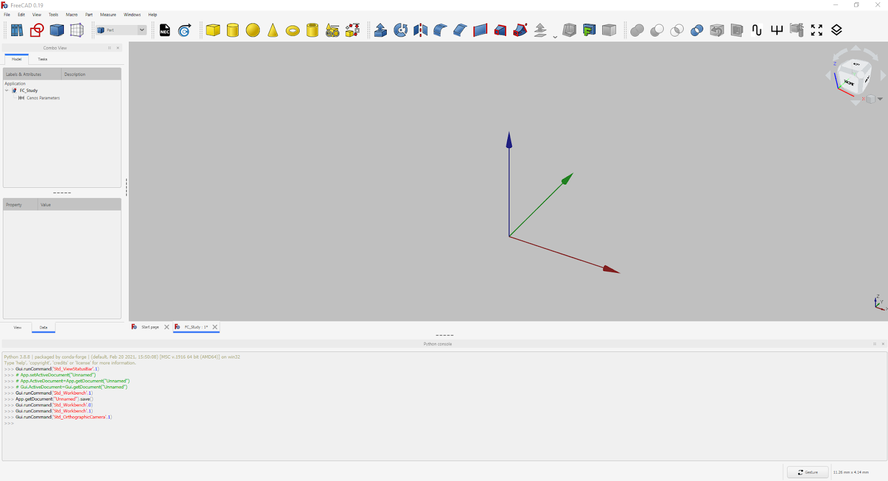

## Geometry creation

In _FreeCAD_ we have all the possibilities to build our antenna geometry, and we are going to do just that.

In this Geometry creation section we will cover all main points you need to complete to build your own helical antenna geometry manually.

### Helix wire sketch

First thing we need to do is to **create the sketch of our wire**. In  **Part** workbench select the creation of **[parametrized geometric primitives](geometry-creation#basic-shapes)**. In the _Combo View_ select _Helix_ and you will be able to modify both its parameters and its position. You can position **one of the helix terminals in the center of the coordinate axes** so that the rest of the geometry can be easily placed.

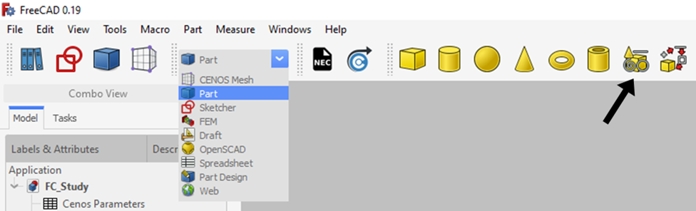

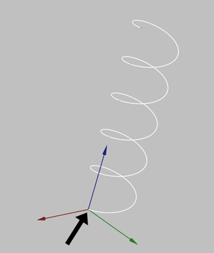

### Wire thickness

Once the sketch is created, add **[wire thickness](geometry-creation#wire-thickness)** to the sketch to build the actual wire geometry.

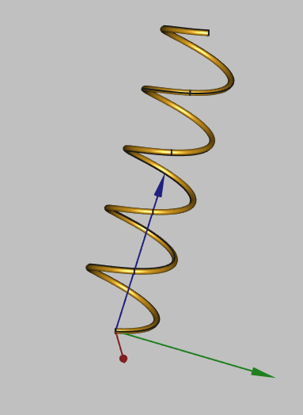

### Port/feed

One important thing we need to add is the **port**. For this case we are going to use a **coaxial port**, in order to do that, we need to create the inner conductor and the dielectric of the cable.

### Inner conductor of coaxial cable

To create the inner conductor we need to draw the sketch of our wire. In **Sketch** workbench **[create a sketch](geometry-creation#sketches)** and draw the wire outline making sure it makes contact with the helix. After this add a wire thickness as we did before.

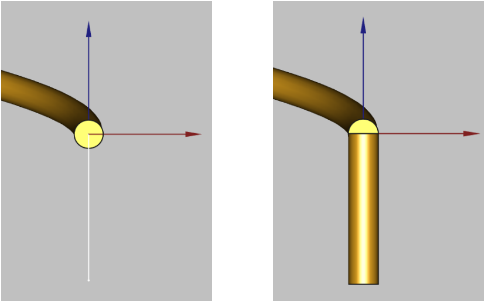

In order to completely unite the helix with the inner conductor of the coaxial cable, we will place a sphere, which can be found in the toolbar of the **Part** workbench. Do not forget to set the radius of the sphere to the same dimensions as the radius of the antenna wire.

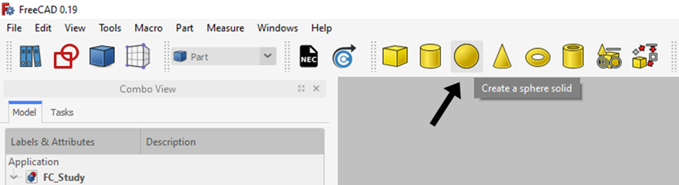

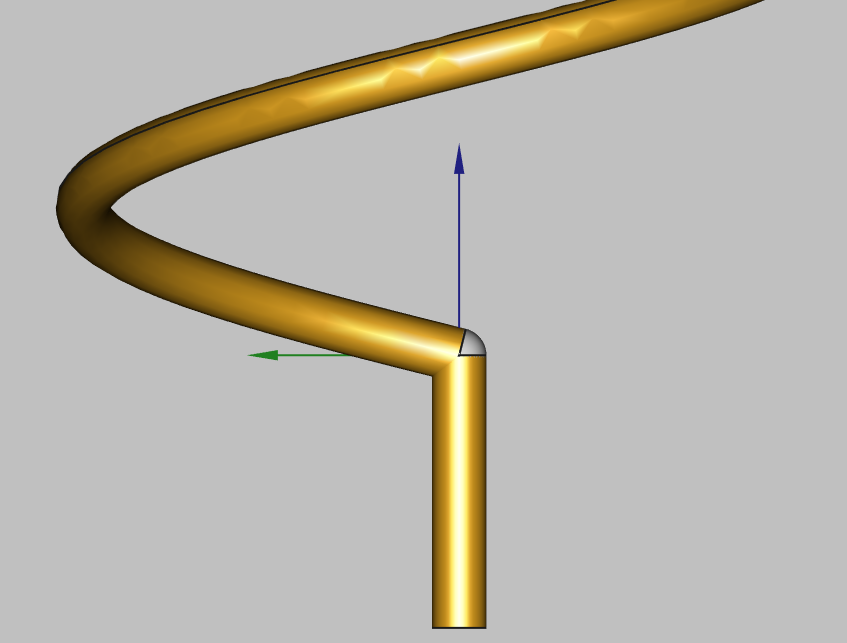

The next step is to join the pieces that we have created to have a single conductive element, to do so, select the objects from the tree view and select the _Union_ tool.

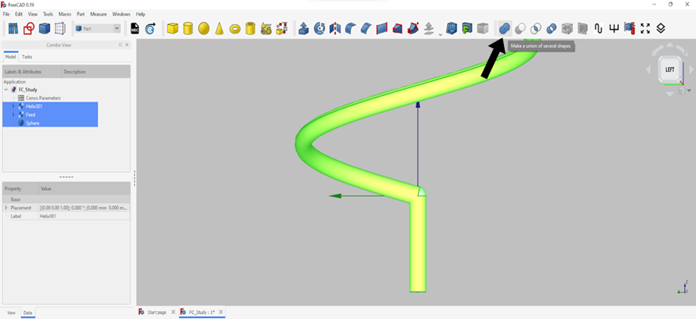

### Dielectric of coaxial cable

To create the dielectric you have to select the geometric shape tube, which is on the **Part** workbench. Take into account that the dimension of the inner radius must be equal to the radius of the antenna wire to avoid overlapping.

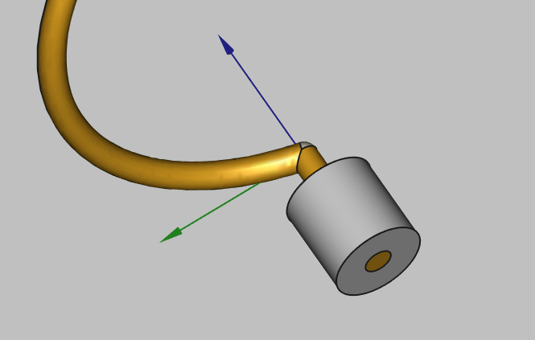

### Ground plane

Finally, we need to create the ground plane. An easy way to do this is by creating a 2D sketch  and then creating a **[3D extrusion](geometry-creation#extrusion)**. Remember to include the hole where the coaxial cable will be positioned. 

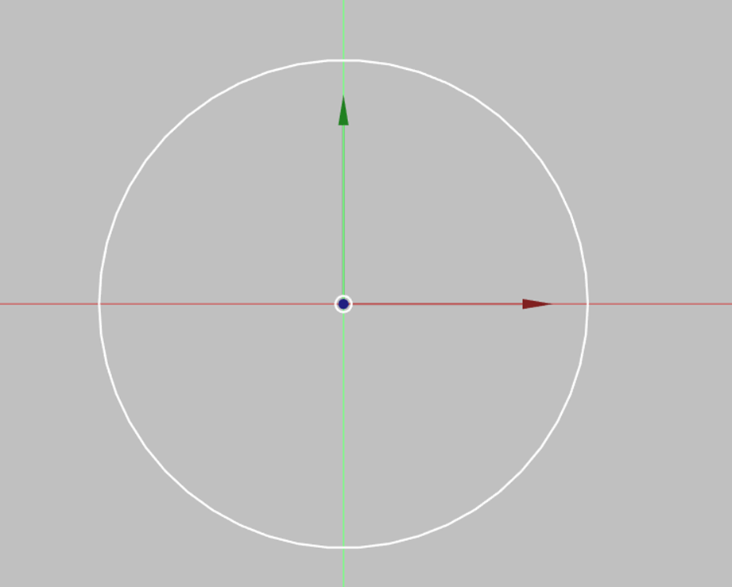

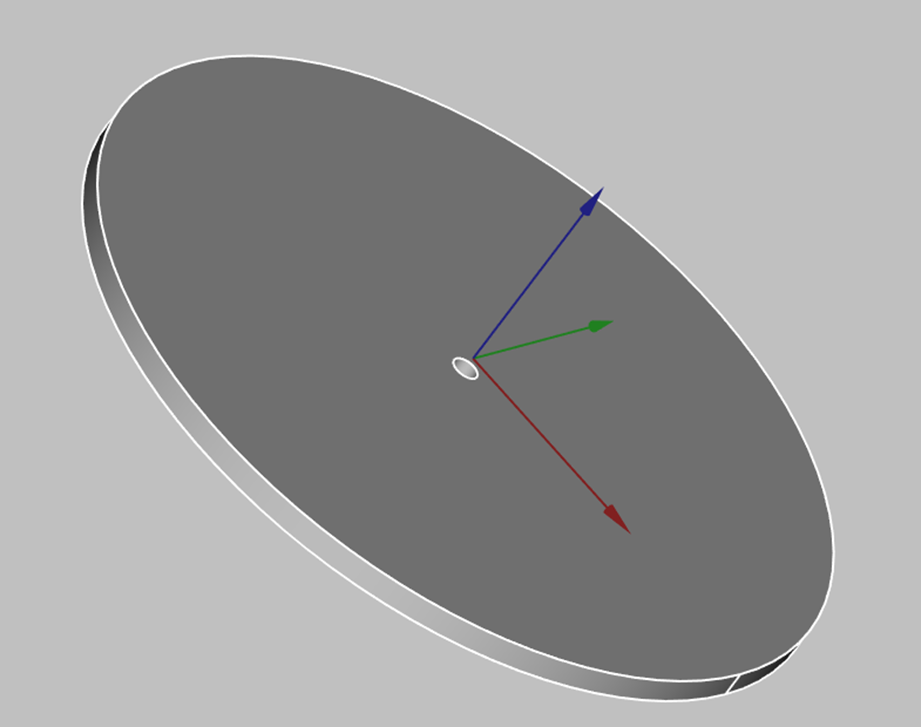

With ground plane creation you have **finished your geometry creation**!

### Send geometry to CENOS

Once you have finished the geometry, you need to send the mesh to _CENOS_. To do that:

1. **Select all final objects** in the tree view.

2. Click **Geometry to CENOS**.

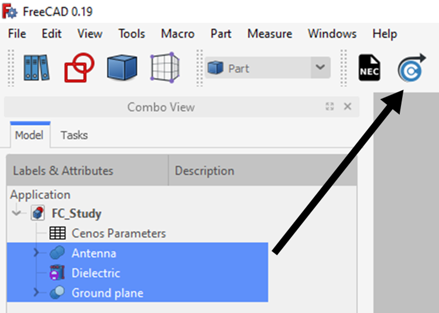

## Roles

Once the geometry is finished and sent to CENOS, you need to **define your geometry** before defining the physics on it.

Essentially you need to clarify which part of your geometry is the dielectric, which is the port etc., in other words, **define roles for parts of your geometry**.

### Type of antenna

Before you define roles, you need to **[select what kind of RF model you have](geometry-roles#select-the-type-of-your-model)** - _Microstrip_, _RFID_, _Wire_, _Reflector_, _Multi-port network_, _Waveguide_ or if you consider that your antenna does not fit into any of the preloaded categories, select _Custom_.

For this example we choose **Wire** antenna type.

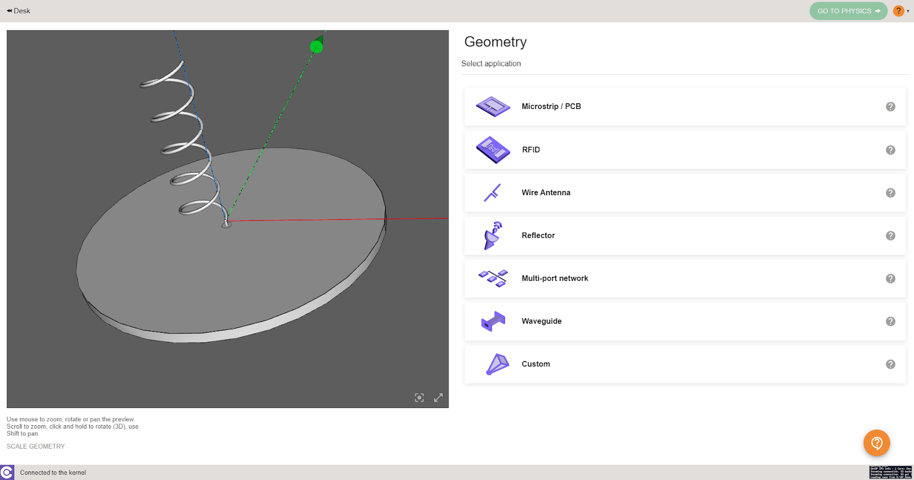

Once you have defined the wire and the port, you must assign a role to the rest of the elements, otherwise you will not be able to advance in the simulation process.

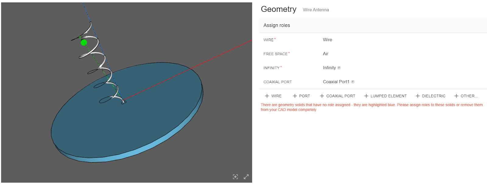

Below the pre-assigned roles you can find other roles, if you don't find the one you are looking for, simply click on _OTHER_ and you will see more options.

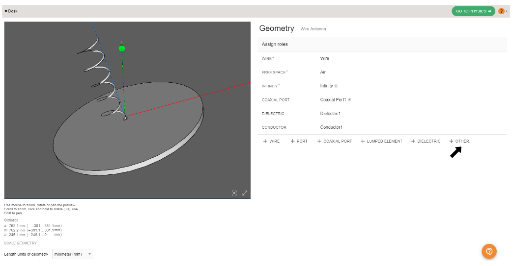

:::note
In the case of this example we have defined the geometry of a coaxial port so, in order to obtain more accurate results, it is convenient to use the **[coaxial port](geometry-lumped-ports#coaxial-port)** type. To do this, simply delete the discrete port and select to add a coaxial port.  

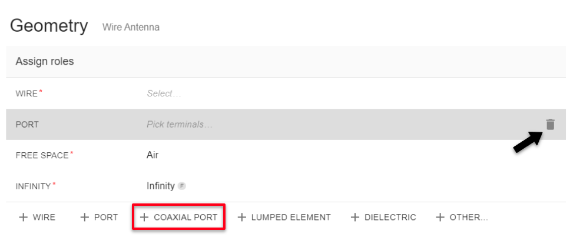

:::

### Go to Physics

When roles are assigned, the _GO TO PHYSICS_ button will become active - click it to **move to the Physics definition**!

## Physics

In physics you need to **define the physical parameters of your simulation**, which include **frequencies, material definitions** and **boundary conditions**.

### Simulation control

In **SIMULATION CONTROL** you define either a **single frequency** or a **frequency sweep**.

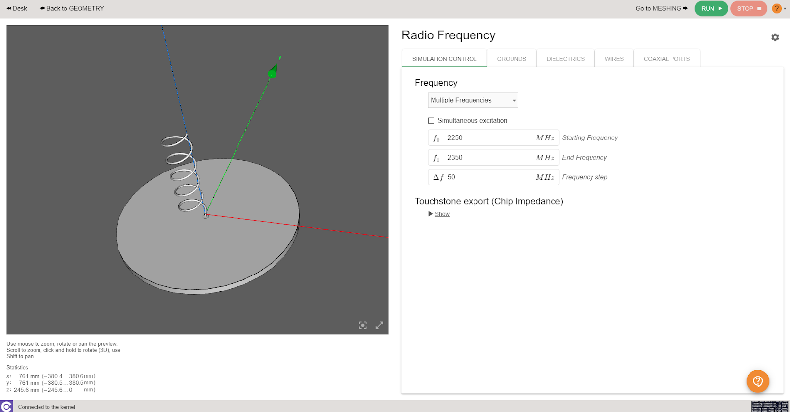

### Wire/Ground plane

**Wire** and **Ground** are already predefined for you, so you don't need to worry about these parts at all! 

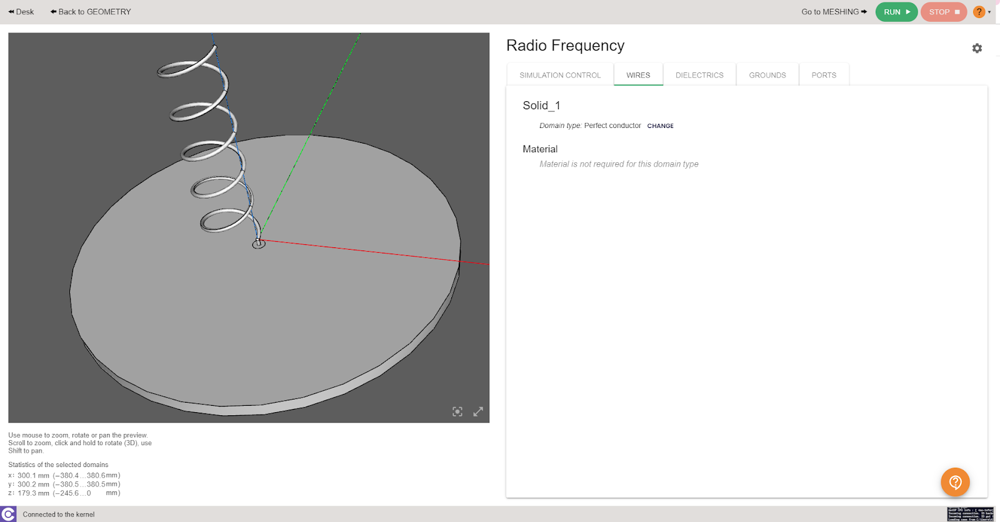

However, if you wish, you can change the material of these roles.

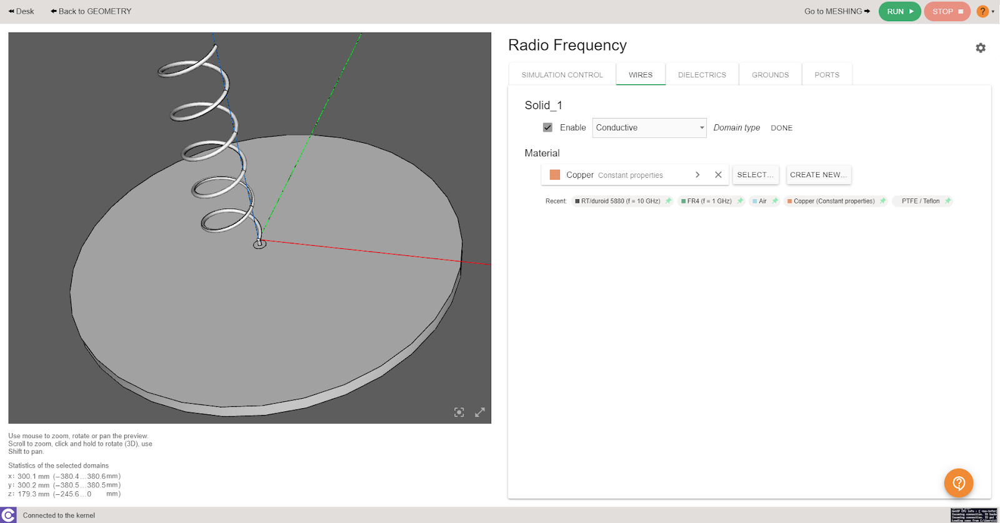

### Dielectric

We select _PTFE/Teflon_ which is within the _CENOS RF Materials Library_.

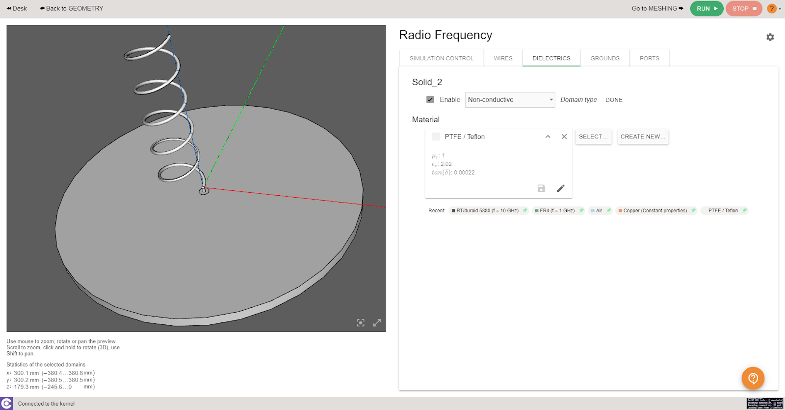

### Port

The port has also been predefined, using an impedance of 50Ω.

Once all physical parameters are filled, _Go to MESHING_ button will become active and you will be able to continue with the generation of the mesh.

## Mesh Generation

Once all physical parameters are filled, we need to **[create the mesh](geometry-CENOS-meshing#meshing-in-cenos)**. CENOS gives you the possibility to create a mesh automatically, all we need to do is click on _GENERATE MESH_.

You can select the density of the mesh that will be generated, you can choose between _Rough, Average_ and _Fine_.

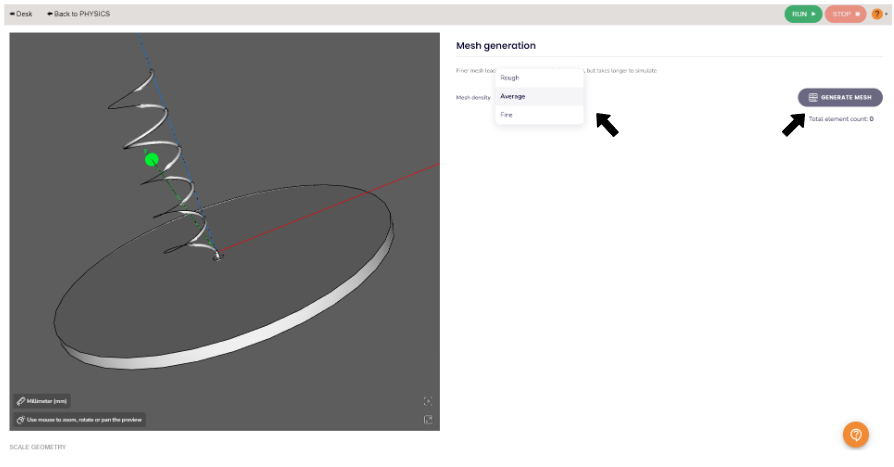

Once the mesh has been generated, _RUN_ button will become active and you will be able to **run the simulation**!

## Results

When calculation is done, results will automatically open in a new window. Congratulations, **you have successfully finished a helical antenna simulation**!

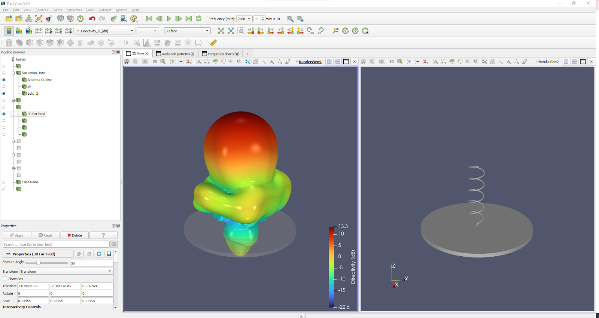

