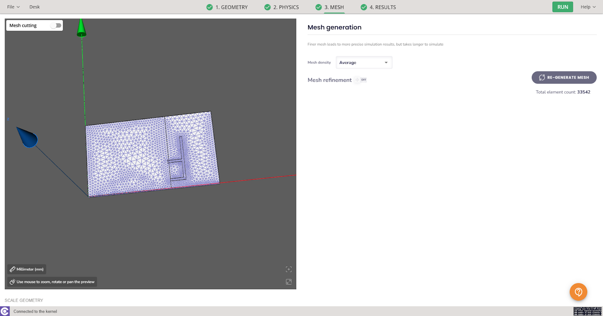

The Inverted-F Antenna (IFA) is a type of antenna widely used in wireless communication systems. It is named "inverted" because its design is essentially an inverted-L shape. The simulation of IFA antennas plays a crucial role in the design process, enabling engineers to predict and enhance their behavior without the need for extensive physical prototyping. 

In this article, we will learn how to set up the simulation of an IFA antenna using the **CENOS Radio Frequency** simulation software.

## Prepare your geometry

The initial step and a fundamental aspect of every simulation involves preparing the geometry. Hence, we must commence by readying our geometry for the simulation. 

### Import CAD files

First we need to select the method with which we will load our geometry, in this case we will use the *From CAD* approach.

  

Click the blinking **Folder** icon to select the CAD files of your IFA antenna.

  

Select **STEP files** of your antenna and click **Open** to import them into CENOS.

  

:::note
For this example, we are importing only 1 STEP file (assembly). When working with your own CAD files, you can separate out the parts into multiple STEP files — perhaps one for the substrate and another for the conductive elements. It really doesn't make any difference in the simulation! Just ensure that each element has the correct position.
:::

### Thin PCB conductors

In case you are working with very **thin conductors** (<50um) these will be detected by the software and you will have the option **[to flatten](geometry-oveerview#thin-pcb-conductor-flattening)** them to work with 2D faces or you can continue without modifying the original geometry at all.

In this example our antenna and ground plane have a thickness of 35um and we will select YES to convert these solids to 2D faces.

  

### Generate air box

Once the CAD files are uploaded, CENOS will ask if you want to automatically generate the air box (ambient environment around your system). If your CAD model does not include the air box click **Yes** on the choice, and then **CONTINUE**.

  

## Roles

Before defining physics it will be necessary to define a type of application, as well as the roles of your system. Essentially you need to clarify which part of your geometry is the dielectric, which is the port etc., in other words, **define roles for parts of your geometry.**

### Type of application

This time we are working with a patch antenna, so we will select the *Microstrip/PCB* application. You will see that there are already some defined roles, which makes it easier to assign each element. 

### Go to Physics

Once all the necessary elements have been assigned, it is possible to move on to the **Physics definition!**

## Physics

You will be redirected to the Physics window, where physical definitions are present. On the left you can see the **preview window** of your geometry, but on the right - the actual **physical definitions.** You can navigate physics through the domain tabs above the physical definitions.

### Simulation control

We will do a **frequency sweep**, for which we select the start frequency, end frequency and frequency steps in the **SIMULATION CONTROL** section.

### Substrate

Select the **FR4** material that is predefined in the **CENOS RF material library.**

### Patch

You will notice that the patch is automatically set to **Perfect Electrical Conductor**, for this simulation we will leave this setting.

### Ground
As with the patch, we will use **PEC** for the ground plane.

### Port

Finally we have the port. For this particular case we will enter an input impedance of 50Ω.

Once all physical parameters are filled, it will be possible to move on to the meshing stage. You will notice that there are no more unfilled parameters once you see the Physics tab in green.

## Mesh Generation

Once all physical parameters are filled, we need to **create the mesh.** CENOS gives you the possibility to create a mesh automatically, all we need to do is click on **GENERATE MESH**.

After a couple of seconds you will see on the left side a preview of the created mesh. You will notice that there are already some refinements applied, in case you want to modify further you can activate the **[manual refinements](geometry-CENOS-meshing)**

Finally click **RUN** to calculate your simulation!

The software will ask you to **save the case** at this point, select the desired folder and once you save the case the simulation will start computing!

## Results

When calculation is done, results will automatically open in a new window. Congratulations, **you have successfully finished an Inverted-F Antenna simulation!**

## CAD replacement

If at a certain point you want to change the .step file because of a change in your geometry you can do so by simply going back to the Desk window and clicking on the folder icon under the From CAD box.

You can overwrite the results or save the file as a new case.

In the case that the new file only has dimension changes, i.e. no new solid or face is added, you will notice that both the roles and the physical parameters will be maintained. This allows you to **save time** since it will not be necessary to go through the steps we saw previously to set up the simulation. 

Simply view the meshing section and regenerate the mesh so that the geometry changes are processed properly. Then just click RUN again and you will have the new results!

