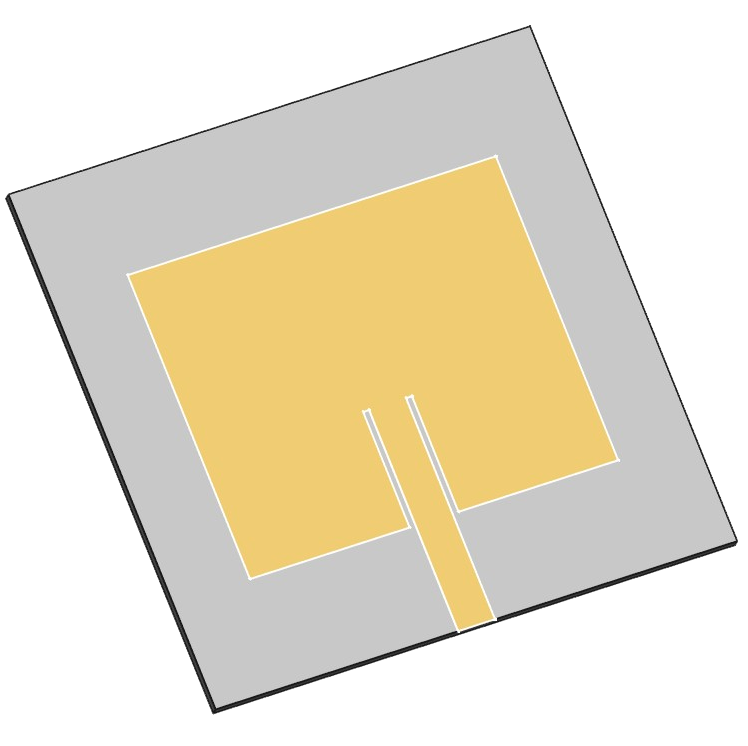
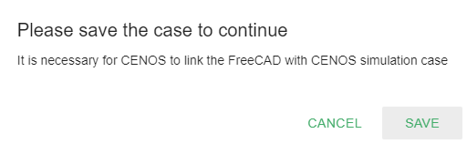
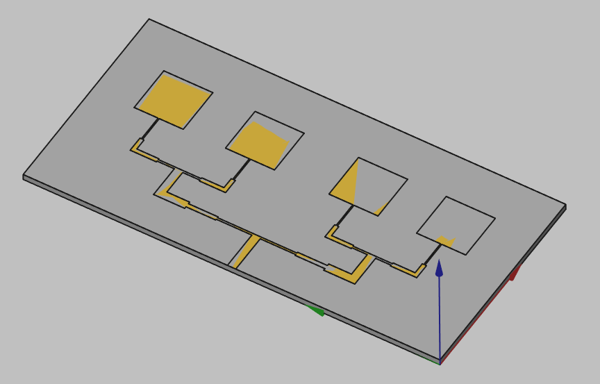
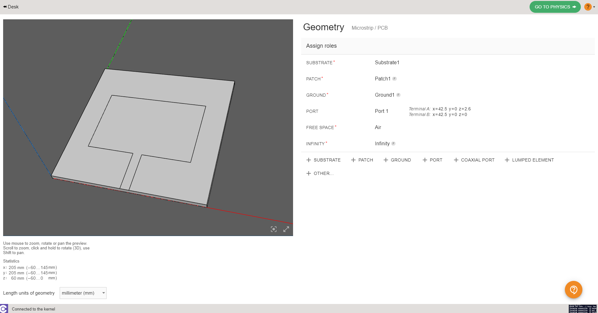
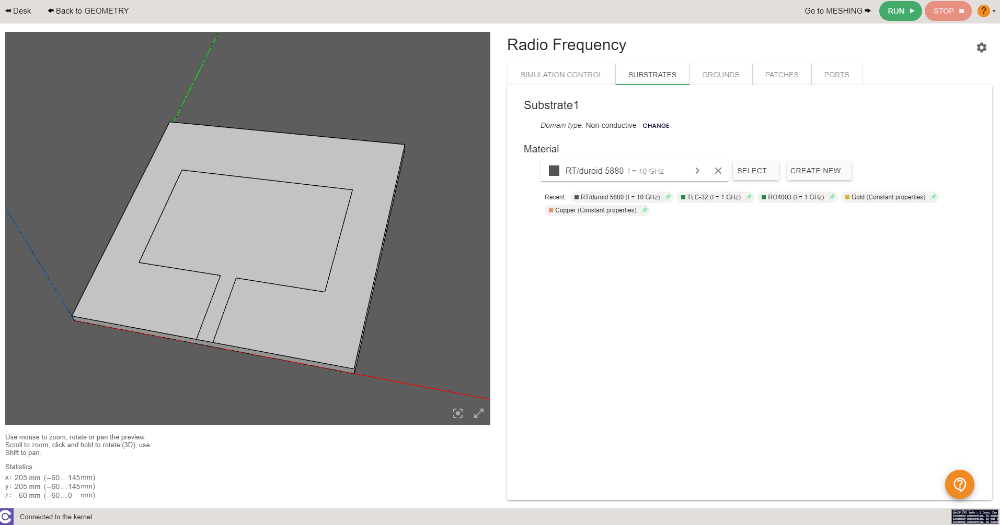
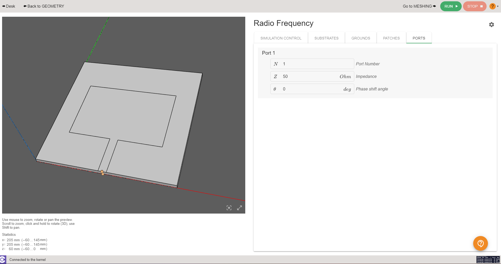
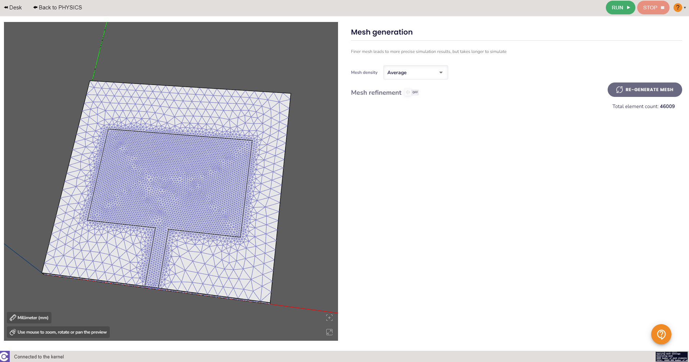

PCB/planar/patch antennas are **very widely used in modern electronics**, and often it is **beneficial to make a computer model to predict the behaviour** of the patch antenna even before the physical tests have started.

In this guide we will take a look at **how to build a complete patch antenna simulation from scratch in CENOS Radio Frequency app**, using its built-in geometry editor, *FreeCAD*.

## Case setup

Before we can actually start building our simulation, we need to first prepare our case - **choose the way we will build our geometry**, and **save the case**.

### Choose geometry approach

You have three options from which to choose - **Templates**, **Import CAD** (if you have your own CAD file ready) and **Geometry Editor**.

Patch antenna **can be simulated with any one of these approaches**, as there is also a template for it, but for this example we will choose **Geometry Editor** and build our patch geometry ourselves.

### Save the case

At this point you need to **save the case**, otherwise if you try to open *FreeCAD*, *CENOS* will not let you move forward.

Once the case is saved, click the *Play* icon to open *FreeCAD* - CENOS geometry editor.

## Geometry creation

In *FreeCAD* we have all the possibilities to **build our antenna geometry**, and we are going to do just that.

In this *Geometry creation* section we will cover **all main points you need to complete** to build your own patch antenna geometry manually.

### Substrate (dielectric)

First thing we need to do is to build the substrate. The easiest way to do that is through box creation.

In **Part** workbench **[create a box](geometry-creation#primitives)** and **change the parameters** to the values corresponding to your antenna substrate.

### Patch / Conductive layers

Next we need to create the patch for our antenna. In **Sketch** workbench patch can be drawn directly on the substrate as a **[2D sketch](geometry-creation#on-volumes)** or created as a **[3D extrusion](geometry-creation#extrusion)**. **They both work!**

#### PROS/CONS

For 2D patch:
* **Easier to create** ([Sketch on surface](geometry-creation#on-volumes)).
* Can **avoid meshing problems**.

For 3D layer:
* Slightly more **difficult to create** (Have to create an [extrusion](geometry-creation#extrusion)).
* **More accurate results**.

### Feed networks

For more **complex patch antennas** the **feed network needs to be drawn separately**. To make the feed creation as fast and easy as possible, **CENOS has a specific tool designed for this exact purpose**.

1.  In **Sketch** workbench create a sketch on top of the substrate volume.

    - Create the feed lines as **1D edges**.
   
    - Create the patch surfaces as **fully closed wires**.
   

2. Close the sketch, switch to **Part** workbench and select the sketch object.

3. Select the **Feed Network** tool

4. Select all edges **with the same trace width** and click **Add** to create separate width groups for each of them.

    * Create one group with a width of 0 for the all of the **enclosed patch edges*.

5. Click **OK** to generate the feed network.

:::note
You will see some visual artifacts (the golden feed surface will appear to flicker).
This happens when two surfaces overlap, **this is normal behavior and means you did everything correctly**!
:::

:::tip
You can create chamfered corners by filleting the sketch path with a radius half of the trace width:

:::

### Send geometry to CENOS

Once you have finished the geometry, you need to send the mesh to CENOS. To do that:

1. **Select all final objects** in the tree view.

2. Click **Geometry to CENOS**.

As geometry is being sent to CENOS, **FreeCAD study will be automatically saved** in the simulation folder, so you can close it.

## Roles

Once the geometry is finished and sent to CENOS, you need to **define your geometry** before defining the physics on it.

Essentially you need to clarify which part of your geometry is the dielectric, which is the port etc., in other words, **define roles for parts of your geometry**.

### Type of antenna

Before you define roles, you need to **[select what kind of antenna you have](geometry-roles#select-the-type-of-your-antenna)** - *Microstrip*, *RFID*, *Wire*, *Reflector*, *Multi-port network*, *Waveguide* or *Other*.

For this example we choose **Microstrip/PCB** antenna type.

### Surface/volume roles

Now you need to **[define surface and volume roles](geometry-roles#assign-roles-to-your-geometry)** for your substrate, patch, ground and port.

### Got to physics

When roles are assigned, **GO TO PHYSICS** button will become active - click it to **move to the Physics definition**!

## Physics

In physics you need to **define the physical parameters of your simulation**, which include **frequencies**, **material definitions** and **boundary conditions**.

### Simulation control

In **SIMULATION CONTROL** you define either a **single frequency** or a **frequency sweep**.

### Volumes

For substrate you only need to specify the material.

### Boundaries

**Boundaries** or boundary conditions have also been **predefined**:

- *Uniform Port* → Default 50 Ohm Impedance.

- *Patch* and *Ground* → **Perfect Electric Conductor**.

Once all physical parameters are filled, **RUN** button will become active and you will be able to **run the simulation**!

## Manual meshing

If during the calculation you get a **message about meshing problems**, you will need to **[manually mesh](geometry-CENOS-meshing#manual-mesh-selection)** your antenna. You can also mesh it manually already in the _mesh generation_ section in case you want more control over your simulation.

## Results

When calculation is done, results will automatically open in a new window. Congratulations, you have **successfully finished a patch antenna simulation**!

