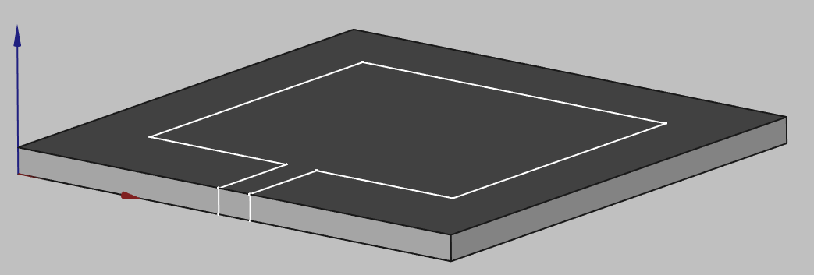
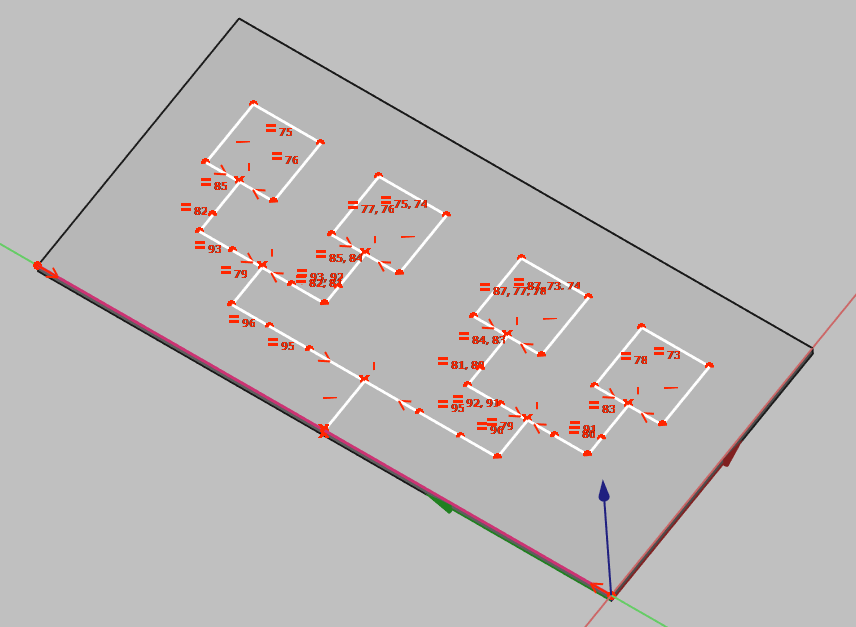
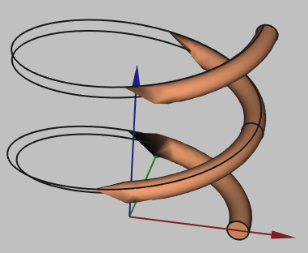
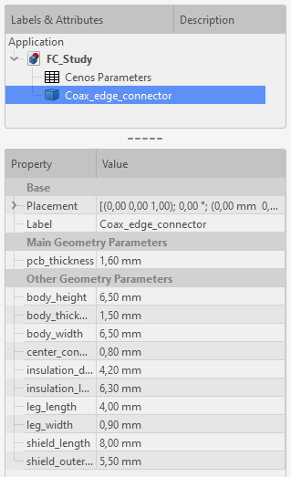

*CENOS Antenna Design* app has the possibility to simulate numerous antenna types. **In this article we will look at some of the most widely used antenna types and learn how to build their respective geometries for simulation in CENOS**!

---

## PCB/planar/patch antennas

PCB/planar/patch antennas are very widely used modern electronics. In this short guide we will take a look at **how to build patch antenna geometries in CENOS**, using its built-in geometry editor, *FreeCAD*.

---

### Substrate (dielectric)

To create a substrate volume, you need to [create a box](creation#3d-volumes) and change the parameters to your necessary values.

---

### Patch / Conductive layers

Conductive layers can be created both as **2D sketch or as a 3D solid**.

#### PROS/CONS

For 2D patch:
* **Easier to create** ([Sketch on surface](creation#from-scratch))
* Can **avoid meshing problems**

For 3D layer:
* Slightly more **difficult to create** (Have to create an [extrusion](creation#extrusion))
* **More accurate results**

---

### Port

Last thing we need to add is a uniform port surface. Select the side of the box and create a [uniform port](examples#uniform) sketch.

---

### Feed networks

For more **complex patch antennas** the **feed network needs to be drawn separately**. To make the feed creation as fast and easy as possible, **CENOS has a specific tool designed for this exact purpose**.

1. Create a sketch on top of the substrate volume.

   * Create the feed lines as **1D edges**.
   
   * Create the patch surfaces as **fully closed wires**.
   

2. Close the sketch, switch to **Part** workbench and select the sketch object.

3. Select the **Feed Network** tool

4. Select all edges **with the same trace width** and click **Add** to create separate width groups for each of them.

    * Create one group with a width of 0 for the all of the **enclosed patch edges*.

5. Click **OK** to generate the feed network.

:::note
You will see some visual artifacts (the golden feed surface will appear to flicker).
This happens when two surfaces overlap, **this is normal behavior and means you did everything correctly**!
:::

:::tip
You can create chamfered corners by filleting the sketch path with a radius half of the trace width:

:::

---

## Wire antennas

### Import NEC

If you have a ***.NEC*** (or other format) file, you can import it from the Part module.

---

### Manual creation

To **create a wire antenna from scratch**, you need to create a sketch of your antenna, and then define the thickness of your wire:

1. ***CREATE A SKETCH***

    1. For **2D sketches** you can **set sketch position** in its properties (In sketch properties *Base → Placement → Position*)
    
    

    

    

    
    2. To build **3D sketches**, use **Draft Workbench → Drafting → Line**. There you will need to build lines one by one and adjust the *Start* and *End* points to match your design.
    
    

    

    

    
    3. For **helixes or spirals** use **Create Primitives** function in *Part* workbench.
    
    

    

    

    
    In *Geometric Primitives* properties select **Helix** shape, and define your wire.
    
    

    

    

2. **Create a wire** with volume from the edges, select your shape, click **Wire thickness** tool in *Part Workbench* and define the wire thickness.

:::caution
Sometimes when building wires, the visualization will appear like this:

  
**This is a visualization problem, which does not affect the geometry itself**. You can continue and use this geometry in your setup!
:::

---

## Lumped Ports

It is quite important to correctly define ports of your antenna so that you would be able to carry out a complete antenna simulation. For this reason we need to **understand what kind of port we have, and make some additional geometry modifications accordingly**.

Currently there are two types of lumped ports in CENOS:

- *Uniform port*
- *Coaxial port*

---

### Uniform

Uniform ports are essentially a rectangular surface, either on a plane or curved, which is **used in most planar antenna design simulations**. In the picture below you can see an example of two uniform ports, rectangular and curved.

Uniform ports are **widely used in PCB antennas**, where the port connects the *patch* with the *conductive layer* or ground. As it is not resolved through the dielectric volume, we need to draw this port manually.

The simplest way to do this would be to **create a sketch on the side and draw a uniform port on the edge of the patch**, connecting the top conductive layer with the ground plane:

:::tip
If the port sketch is attached to a volume (substrate in this case), then you don't have to upgrade it to a face. But if it is in free air then you have to turn it into a face.
:::

---

### Coaxial

Coaxial ports, as the name suggests, are ports where the connection surface is made by a coaxial cable. For these kind of ports **you don't need to create a separate surface**, as it is already included in the volume definition.

You can create a coaxial connector yourself or use one from the **Snippet → Component**.

Select **Coaxial edge connector** and click **Create**.

Upon creating the connector, you can **position it** by left-clicking on it in the tree view and selecting **Transform**.

You can **change the size** of the connector by clicking on it and editing the **Property** tab to suit your application.

