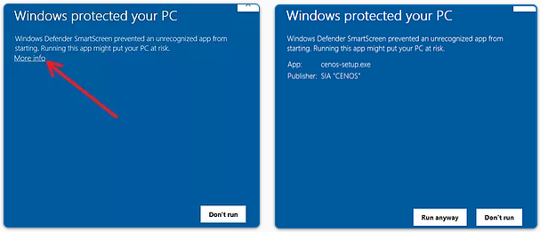

#### Can I install *CENOS Radio Frequency* app on *Windows 7*?

- No, CENOS AD app is built for usage on machines with **Windows 10 or Windows 11 only**. Earlier versions (Win7&8) will not support it!

#### What is the blue screen during the installation?

- Sometimes *Windows Defender* may ask your permission. Click **More info** and then **Run anyway** to install CENOS!

#### Why do I need to install separately all open-source components?

- Open-ource components are necessary for CENOS to run, however you don't need to install them manually - at the installation, click "Download automatically", and CENOS will do everything for you!

#### Can I install *CENOS Radio Frequency* app on *virtual machine*?

- Generally there are no limitations for virtual machines, but we do not support them officially. When installing on virtual machines you need to **be careful with GPU**, as they can be outdated and not able to run *ParaView* (**it must support** ***OpenGL 3.3***), which is a relatively large problem specific to virtual machines.

#### Why can't I run *FreeCAD*?

- If you encounter problems with *FreeCAD*, **double-check your installed version**. CENOS supports only **v0.19** - if you have installed *FreeCAD* separately, the version might be different and not compatible with CENOS.

#### Why *ParaView* with calculated results is not opening?

- If you encounter problems with *ParaView*, **check your graphics drivers** and **graphics card**. Outdated graphics drivers can interfere with *ParaView*, as well as old graphics card (it must support *OpenGL 3.3*).

#### When I open CENOS, I see *Kernel* trying to connect and disconnecting continuously, and I can't use the app. What to do?

- The most common reason for such **Kernel error** is local **firewall/antivirus**, which is blocking some part of CENOS. Check if you have all necessary antivirus exceptions in place!
