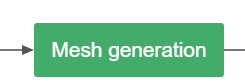
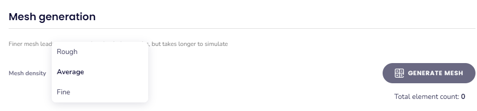
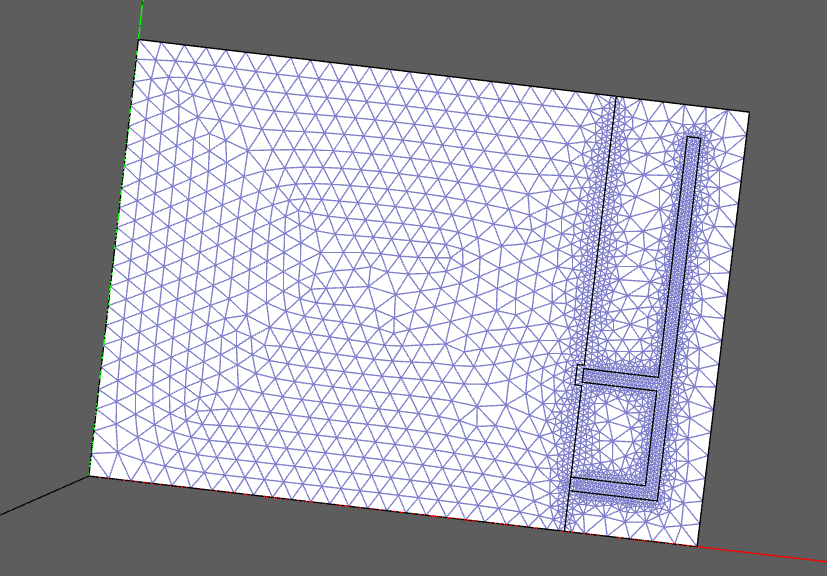
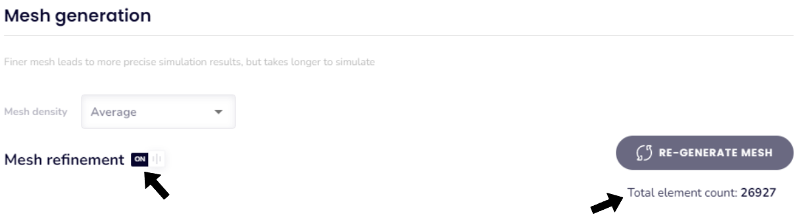
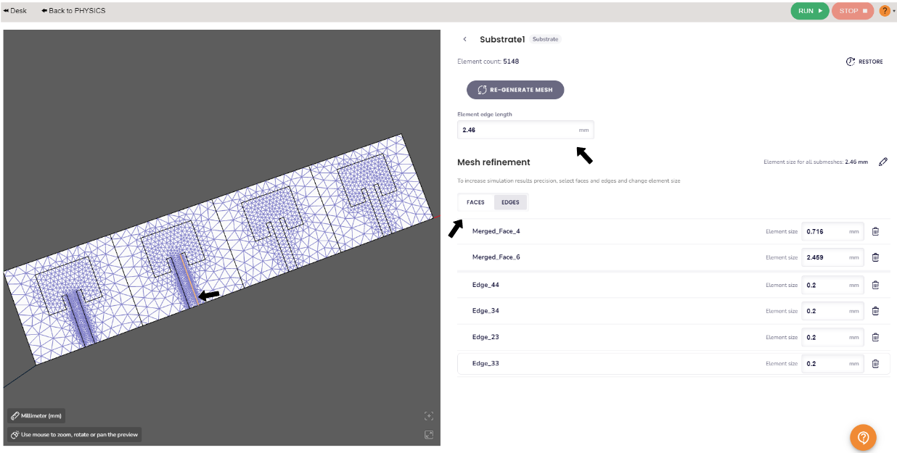
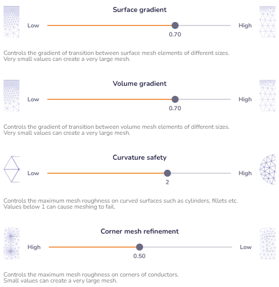

**Mesh creation** is one of the most important parts of the simulation setup. The **quality of the mesh will directly affect the results of your simulation**.

In this section we will review **mesh creation in the CENOS** interface. We will learn how to interact with the mesh generation window and go over the **different possible settings**.

When you are in the Mesh Generation section, on the left side you will see the preview of your model and on the right there will be the mesh settings.

# Automatic Mesh generation

_CENOS Radio Frequency_ provides you with **automatic mesh creation**, you can choose between 3 mesh densities - _Rough_, _Average_ and _Fine_. To create the mesh just click on _GENERATE MESH_ and **the mesh will be created automatically!**

The **automatic mesh** includes some **refinements**, depending on the geometry of your model to facilitate your simulation workflow!

:::note
When the geometry settings are done, you will have two options to continue:
1. _Go to MESHING_. You will go to the Mesh Generation section where you can **modify the mesh** or simply check that the **density** is right for your model.
2. _RUN_. Usually it is not necessary to go through the Mesh Generation stage, **CENOS will generate the mesh automatically** and then **the simulation will start**. 

:::

# Manual mesh selection
You can make modifications directly to the mesh of your geometry. After generating the automatic mesh you can enable mesh refinement. Doing so will display a list of the solids in your RF model.

You can **make modifications** directly to the mesh of your geometry in order to **adapt the mesh** in the most appropriate way and have a good performance. After generating the automatic mesh, you can enable **mesh refinement** and a list of the solids of your RF model will be displayed.

You can select between solids and you can do **face and edge refinement** for each solid separately! At the top you will find the _Element edge length_ value of the selected solid.

To do the **refinement of a face**, just hover over it and you will see how it is highlighted. The same goes for **edge refinement**, just make sure you are in the _EDGES_ tab.

**Click on the face/edge and it will be added to a list on the right** side where you can change the **element size**.

## More properties

If you want to further refine the mesh you can use the **surface gradient and the volume gradient**. You will find these parameters at the bottom of the window, click on Show and you will find two slider bars. To **refine the mesh use a smaller value of the gradient**. 

You will find a third slider bar corresponding to the **curvature safety**, which controls the refinement for curved surfaces. This is very useful for manual refinement of the wire antennas mesh!

:::important
When the modifications to the mesh dimensions are ready **click on _RE-GENERATE MESH_ for the changes to be applied**.
:::

