For geometry manipulations *CENOS Radio Frequency* uses a very strong geometry editor - *FreeCAD*. This editor is used in the *Geometry Editor* workflow, so **it is important for us to understand how to work with FreeCAD**. 

**Watch a short video on how to use FreeCAD for CENOS Radio Frequency app**:

<iframe width="560" height="315" src="https://www.youtube.com/embed/NF4v3oVvyYY?list=PLtRpbWakrmMf29rhPnm0bxjosBow-nM8q" title="CENOS Antenna Design - Geometry creation (FreeCAD)" frameborder="0" allow="accelerometer; autoplay; clipboard-write; encrypted-media; gyroscope; picture-in-picture" allowfullscreen></iframe>

## Geometry import

Sometimes when building an RF simulation, you will already have pre-made geometry, which you can import into FreeCAD for additional geometry manipulations.

### DXF/STEP/IGES

You can easily import your CAD file in **DXF**, **IGES** or **STEP** file formats.

**To import such files**, open *Geometry Editor* and simply **drag & drop** your geometry into *FreeCAD*!

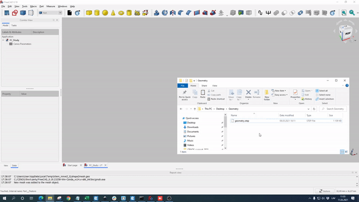

### KiCAD PCB files

To import KiCAD PCB files directly into *CENOS RF*, select the *Geometry Editor* approach and there you will need to click on the folder icon to load your geometry.

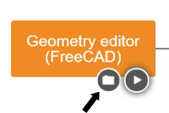

Once you have selected your file you will return to the main CENOS interface where you will now click on the play icon. Then the software will ask you to save the case and, after this, *FreeCAD* will automatically open with your geometry!

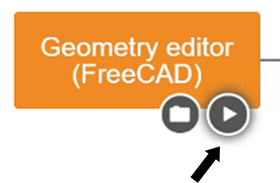

You have the option to use your model completely in 3D or **flatten the thin conductive parts**, such as tracks, to have them in 2D. We recommend selecting the **Faces mode**, as the results will not be significantly affected but the mesh will be easier to create and the calculation time will be reduced! 

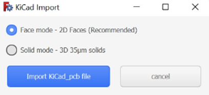

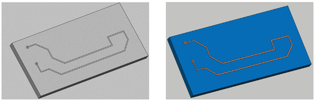

:::warning important

**RFID geometries should not be simplified as 2D faces** as this will affect results.

:::

:::note
We recommend that for the substrate you use a geometric figure **without curvatures** since this would cause troubles reading the geometry and it will not be imported correctly into *FreecCAD*. If the curvatures in the substrate are important in your model, you can create it within *FreeCAD* once the model has already been imported.

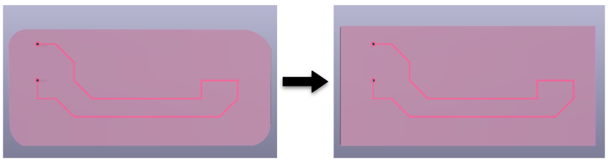

:::

### .NEC

If you have a ***.NEC*** (or other format) file, you can import it from the Part module.

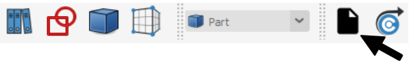

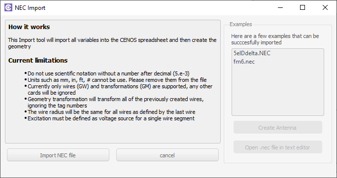

### Unit scaling

CAD files which are imported in *FreeCAD* must be in the **correct units - milimeters**. If your geometry is **scaled incorrectly**, you **need to rescale it**, otherwise meshing problems will occur.

To scale your geometry:

1. Switch to **Draft** workbench.

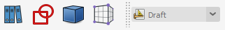

2. In *Tree View* select your geometry and click **Clone** (this function will create a **scalable copy** of your geometry).

3. Once the clone object is created, **scale your geometry** in *Properties*. Make sure that the scale factor is the same in every direction to avoid distorting your geometry!

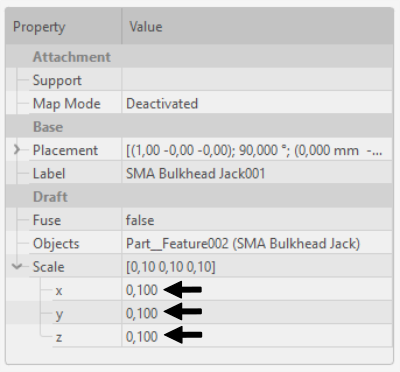

:::note
As an alternative to geometry scaling you can use **Scale** function, but it will **not work on every geometry**, as opposed to the **Clone** approach.

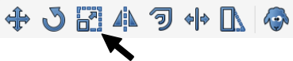

:::

### CAD compound check

If you have imported one or more CAD files and **stumble into a problem either at meshing or anywhere else**, it might be an **indicator that the CAD file is actually not a solid, but a compound of surfaces**, which can cause problems for *FreeCAD*.

To check if your CAD is a solid:

1. Click on the object in *Tree View* and open **Python console** (*right-click* on the icon toolbar and select *Python console*)

2. On the lower right corner *Python console* will open. Write **len(obj.Shape.Solids)** and click enter.

3. Take a look at the output.

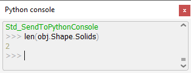

The number of solids indicate how many volumes are there. If this number is high, **evaluate the quality of your CAD file**!

:::note
If you get an error message and cannot display the number of solids, click **Edit → Send to python console**, and redo the previous steps!
:::

## Component Library

You can use **CENOS Component Library** templates to **build or add patch or SMA connector geometries**.

### Patch antenna

**Select the patch you want to build** and click **Create**.

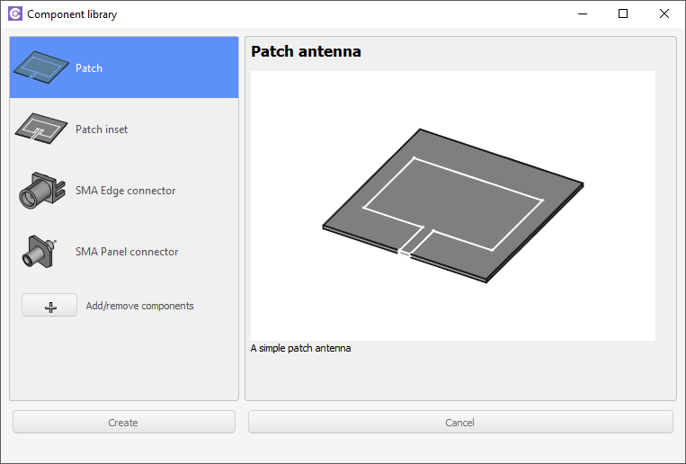

You can **change the parameters** for the template **by clicking on the spreadsheet titled "Patch Parameters"** or **"Patch inset parameters"** if you chose the patch with an inset.

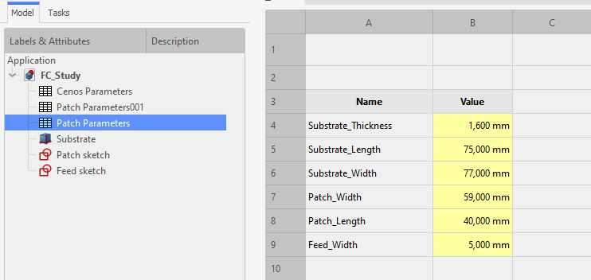

:::tip
To navigate between *Cenos Parameters* and geometry preview, use the tabs below the spreadsheet.
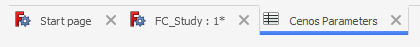
:::

### Coaxial edge connector

Select **Coaxial edge connector** and click **Create**.

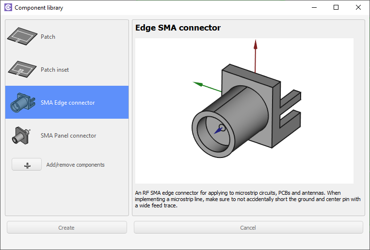

The connector will be automatically placed in your workbench, so you can **position it** by right-clicking on it in the tree view and selecting **Transform**.

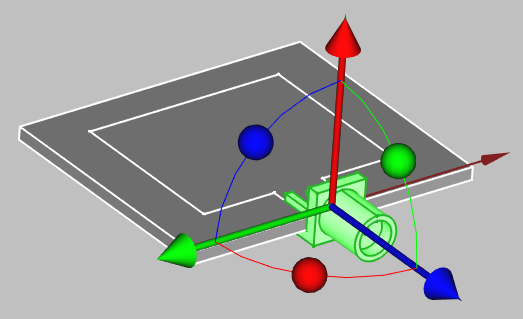

To **change the size** of the connector, select it in tree view and edit the **Property** tab to suit your application.

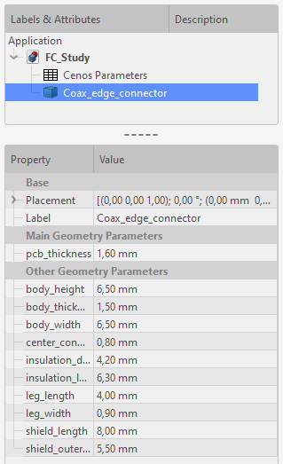

## Sketches

A **sketch is the base for almost all geometrical objects** you can create, **including geometries for RF models**, which is why we need to know how to create one.

### From scratch

In *FreeCAD* you can create sketches in the **Sketcher workbench**, which you can access directly through the shortcut icon:

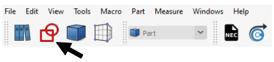

Once in the workbench, click **Create a new sketch**.

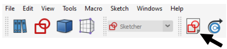

**Select the plane where you want to create you sketch**, and you can start to draw the actual geometry.

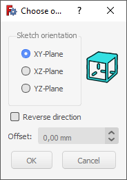

*FreeCAD* offers a large variety of tools designed to easily and precisely create any geometry.

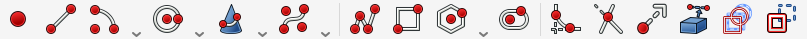

:::tip
Hold down **Alt** to rotate the camera in sketch view
:::

Draw your model's geometry, and, once you are done, click **Close**.

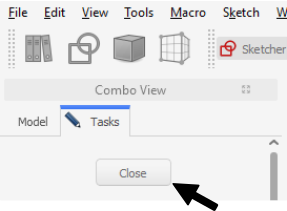

### On volumes

In some cases **it is beneficial to create a sketch on an already created volume**, for example, PCB antennas. Once you have created a 3D volume, for example, a box, you can select one surface on which to create your sketch.

:::note
The geometry you create will be partitioned upon sending it to CENOS, which means that **sketches created on top of volumes will appear as separate surfaces in CENOS**!

For example, you don't need to create an extrusion for patch, as it is enough to create only a sketch for it.
:::

In the **Part** workbench select the face on which you want to draw.

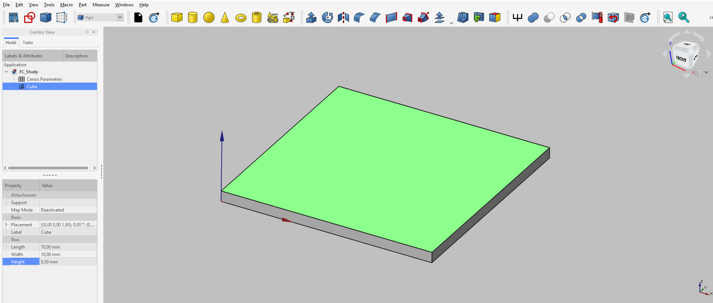

Click **Sketcher workbench**.

Then click **Create a new sketch**.

Click **OK** to *FlatFace* definition, and start to draw.

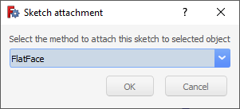

:::tip
Hold down **Alt** to rotate the camera in sketch view
:::

Once you have finished drawing your sketch, simply **Close** it and you are done!

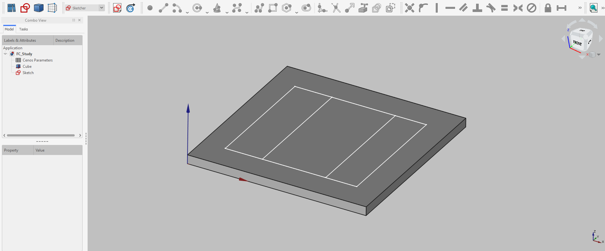

## 3D volumes

For a lot of times it will be necessary to **create 3D geometries, not only 2D sketches**. Fortunately 3D modeling in *FreeCAD* is very straightforward!

:::warning important
When creating volumes, make sure that they do not overlap with each other. **Overlapping volume objects are forbidden**!
:::

### Basic Shapes

For the **simplest volume objects** like cubes, spheres or cylinders, *FreeCAD* offers an easy way of creating such geometries. As you open *FreeCAD*, you will be automatically put in **Part** workbench. There you can simply **select any geometry you want and build it**.

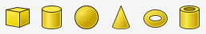

As you select an object, it will be built with a pre-defined size. **To change the size of your geometry**, select your object and change its properties.

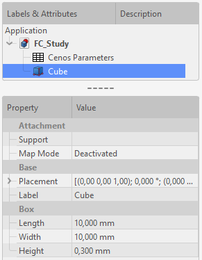

### Extrusion

For **more complicated geometries** it is possible to draw a sketch and create a 3D volume object from that sketch. There are multiple functions for this procedure, but the most commonly used one is **Extrusion**.

To use **Extrusion**, you need to **first create a sketch you need**.

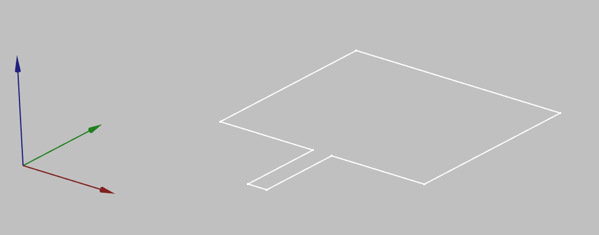

Then switch to **Part workbench**

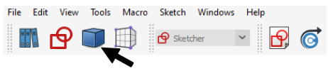

and click **Extrude a selected sketch**.

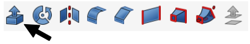

In **Extrude** properties window define the **extrusion lenght**, check **Create solid** and select **Sketch** as a shape to extrude. Once done, click *apply*.

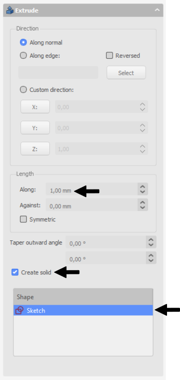

Now you have succesfully created a complex 3D object!

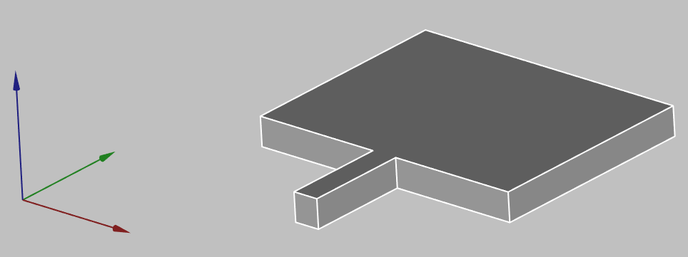

## Wire thickness

To **create a wire antenna from scratch**, you need to create a sketch of your antenna, and then define the thickness of your wire:

1. ***CREATE A SKETCH***

    1. For **2D sketches** you can **set sketch position** in its properties (In sketch properties *Base → Placement → Position*)
    
    

    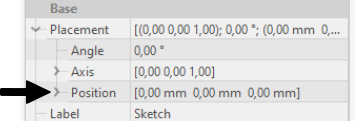

    

    
    2. To build **3D sketches**, use **Draft Workbench → Drafting → Line**. There you will need to build lines one by one and adjust the *Start* and *End* points to match your design.
    
    

    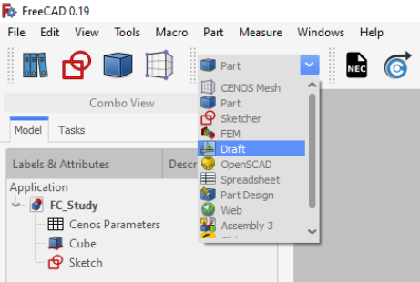

    

    
    3. For **helixes or spirals** use **Create Primitives** function in *Part* workbench.
    
    

    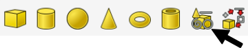

    

    
    In *Geometric Primitives* properties select **Helix** shape, and define your wire.
    
    

    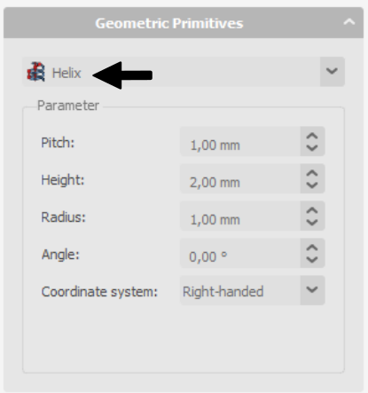

    

2. **Create a wire** with volume from the edges, select your shape, click **Wire thickness** tool in *Part Workbench* and define the wire thickness.

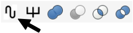

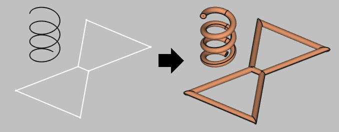

:::caution
Sometimes when building wires, the visualization will appear like this:

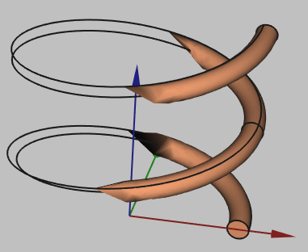

**This is a visualization problem, which does not affect the geometry itself**. You can continue and use this geometry in your setup!
:::

## Geometry parameters and Parametric study

A very useful thing to have is **parameterized geometry**. This way you can **create your geometry and dynamically change it through parameters** without the need to rebuild everything, as well as **perform a parametric study** of your geometry.

You can **define parameters** in the *Cenos Parameters* spreadsheet where you can use various units and/or mathematical equations for the values.

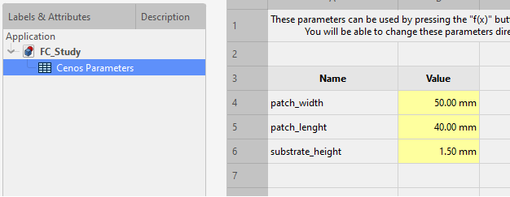

To **use these parameters**, click the *Formula Editor* button in the value field and then enter `CenosParameters.name`.

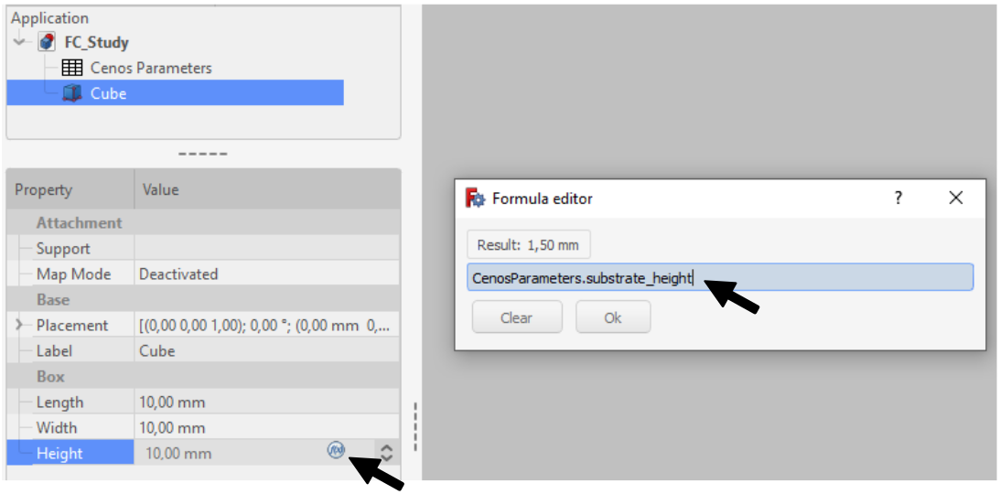

:::caution
Make sure to **constrain your model's sketches** and **check all the values you want to simulate** if you intend on performing a parametric study! Otherwise, your sketches might hang over your base geometry and the simulation will fail!

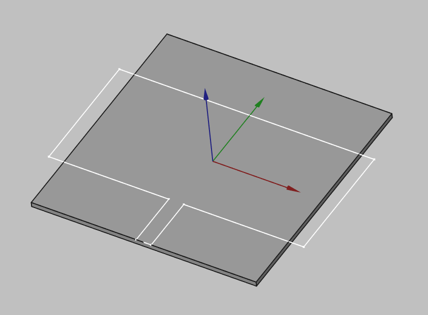

:::

Once you have finished working on your model and assigned all the parameters you are interested in, you can *send the geometry to CENOS*, where in the *Physics* section you will be able to start the parametric study.

## Getting the geometry to CENOS

To send your finished geometry to CENOS, you have to:

1. **Select all final objects** in the tree view.

2. Click **Send Geometry to CENOS**.

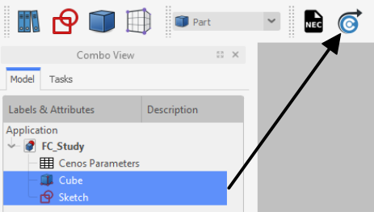

As geometry is being sent to CENOS, the **FreeCAD study will be automatically saved** in the simulation folder, so you can close it.

