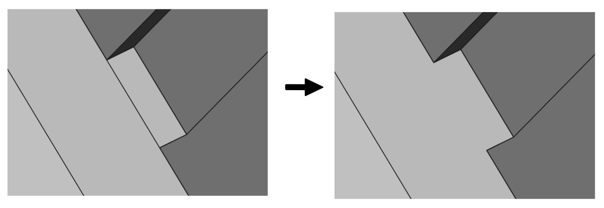
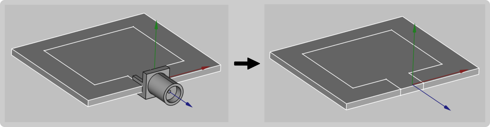
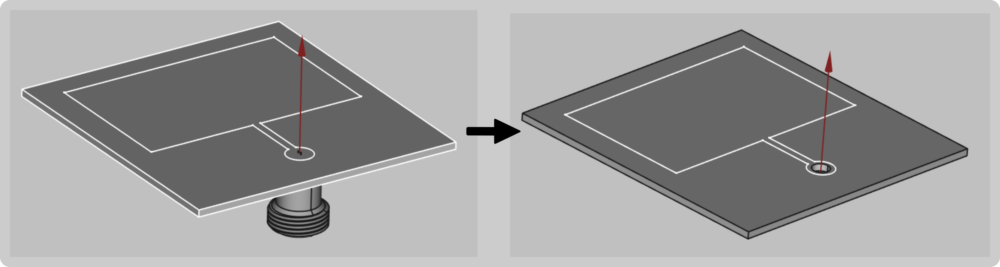

The geometry of your model plays a big role in **how easy or hard it will be to set up and get accurate results** from the simulation.

We have **summarized the main aspects for a good, simulation-friendly CAD file**, which should be followed in order to create simple, trouble-free geometry for your simulation.

## Build the parts of your model as a single solid

In many CAD softwares it is easier to build the geometry of the model from blocks, which all combined form a complete CAD model. When creating geometry for simulation, these **blocks should be fused together to form a single solid** – in this way you can get rid of unnecessary faces between blocks and ease not only the work with the geometry but simplify the meshing process as well.

### Fuse geometry in FreeCAD

You can easily fuse your geometry blocks together in *FreeCAD* as well, using the **Union** tool.

1. **Select all parts you want to fuse** and click **Union**.

2. In **Union** properties change **Refine** to **true** to remove any interface planes and edges between the fused solids.

## Simplify your design

Computer simulation starts with a geometrical model of the real life problem – you need to accurately depict the geometrical details to precisely calculate the physical aspects of the model. However, in most cases **you can disregard some of the geometrical details, which do not have such a significant impact on the physical results**, to optimize the simulation.

The following features can be deleted, as **they take up significant amount of calculation time and computer power without considerable contribution to results**. 

### Remove irrelevant plastic parts

Depending on the type of your model, one or more plastic components might be included in the design. You need to **evaluate the relevance** of those parts, and **remove them if they do not have a significant impact**.

For example, you can

- **remove plastic holders or small parts used for mechanical components**

but you should

- **leave any plastic encasings or covers over your geometry**.

### Delete unnecessary elements

Parts, such as **screws**, **bolts**, **threads** or **embedded text**, can be taken out of your model.

If you consider that any of these elements is necessary in the simulation, try to simplify it as much as possible. For example you can **replace the curvatures and threads** of a bolt with **simple cylinders**.

**Pay close attention to surfaces with curvatures**, as these add up to a large number of elements in the mesh, so it is strongly recommended to simplify them.

### Port simplification

The port or feed is one of the most important parts of the assembly, however, you can easily **simplify the port geometry**, to make the simulation faster without sigificant losses in accuracy.

  

  

  

## Resolve incorrect connections

During the creation of the geometry, be careful with connections between different parts of your model.

### Gaps & Overlapping

It is important that your geometry is continuous so be sure to avoid any overlappings and gaps, since inaccurate connections will result in meshing problems and calculation errors!

Sometimes there are gaps that can go undetected by the naked eye. If you have problems with the meshing of your geometry this may be a cause. We recommend that you **zoom in on the joints** of the model to verify that no component overlaps another or that there is a small gap.

