An essential element of your RF simulation is the *port* and it is important to figure out how to define it properly. For this reason, we need to **understand what kind of options we have and make modifications to our model, if necessary.**

_For most applications, you won’t need to modify your geometry to feed your model_, as defining a port in CENOS RF has been made incredibly straightforward and can be done with your existing geometry.

Currently there are two types of port definitions in CENOS:

- *Discrete port*
- *Coaxial port*

---

## Discrete port

The **discrete port** in CENOS is the _simplest way to define the feed of your model_. Essentially, **all you have to do is to select two terminals** - one on each conductive surface where you connect the feed in real life. The placement of each of the terminals is dependent on the type of model you are simulating.

For example, if you are simulating a simple microstrip antenna, such as an IFA, you would place one terminal on the edge of the feed line of the microstrip and the other on the closest edge of the ground plane.

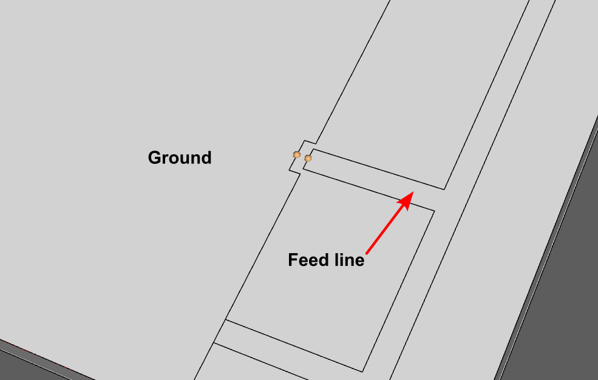

If you are simulating a symmetrical design, such as a dipole antenna, you would have to place a point on each pole, leaving a gap in between the poles.

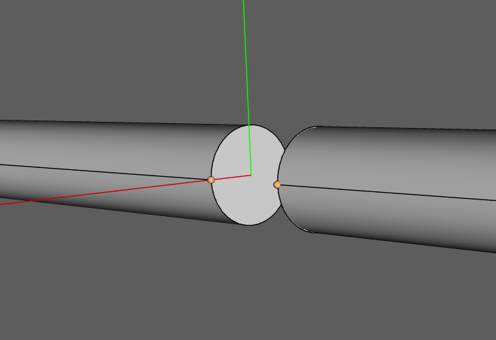

---

## Coaxial port

Coaxial ports are ports where the connection surface is made by a coaxial connector or cable. If your model already contains the geometry for the cable or connector, **all you have to do is to select the surface of the dielectric** to define such a port.

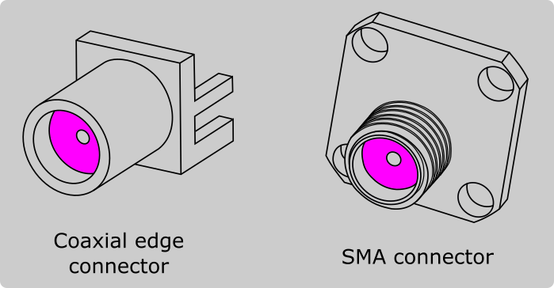

:::tip
You can create a coaxial connector yourself or use one from the **[Component Library](geometry-creation#component-library)** in FreeCAD.
:::

Here is a quick video tutorial on setting up a coaxial port and it's necessary roles:

<iframe width="560" height="315"
  src="https://www.youtube.com/embed/-55-D7FdeGI"
  title="Defining a coaxial port in CENOS Radio Frequency simulation software"
  frameborder="0" 
  allow="accelerometer; autoplay; encrypted-media; gyroscope; picture-in-picture" 
  allowfullscreen>
</iframe>

---

## Port geometry simplification

Quite frequently it makes sense to simplify your geometry in order to make the mesh smaller, and in turn reduce the overall calculation time. If your model contains a coaxial connector, you can choose to remove it from your design and use a discrete port instead.

Removal of the coaxial connector is quite frequently done if the connector is placed on the edge of the substrate, where the connector can be removed completely.

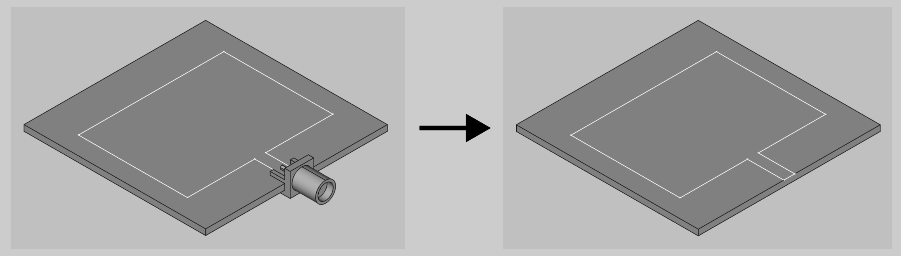

If you are using a panel type connector, you can remove the connector and create a cutout where the connector was placed previously.

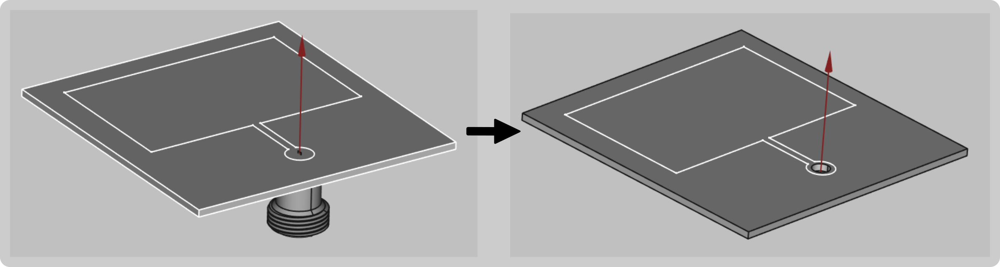

To **create a cutout feed** in FreeCAD:

1. **[Create a sketch](geometry-creation#sketches)** on the patch and **draw a circle** of where the port will be.

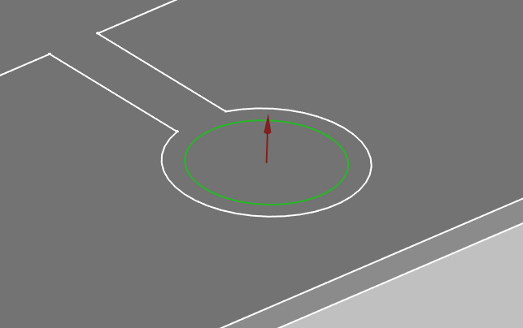

2. **[Extrude](geometry-creation#extrusion)** the port through the patch.

3. Choose the patch and cylinder objects and click **Cut** boolean to create a hole in the patch.

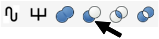

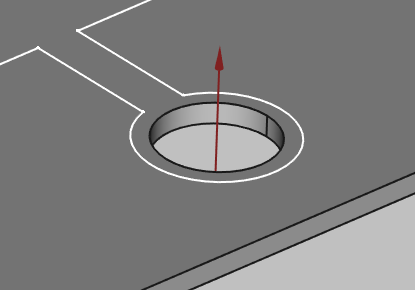

In cases where the coaxial connector functions as a probe, such as probe-fed horn antennas, you can **simplify the connector to a simple cylinder assembly**!

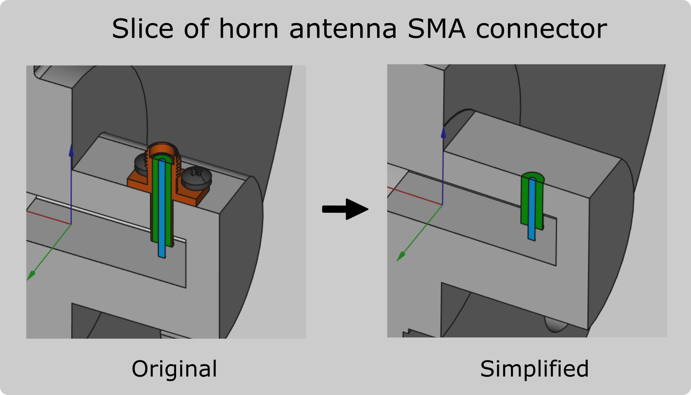

---

## Limitations

Although the process of defining a port in CENOS RF is incredibly straightforward, _there are a few things to keep in mind_.

### Discrete port terminal selection

Currently, the possible points of terminal selection are fixed. On a straight edge, you will be able to place a terminal on its leftmost and rightmost point and in the middle of these two points. 

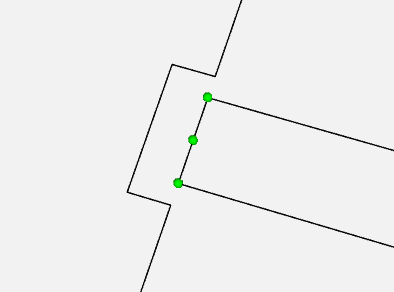

However, **this shouldn't affect the accuracy of the results**, as the solver finds the shortest path possible between the terminals along the mesh cells to excite the model.

### Mesh density around the port definition

_On rare occasions_, the mesh around the port definition might be too rough. If you notice a rough mesh (jagged Electric Field distribution) around where you defined the port, go back to the Mesh Generation screen, enable manual meshing and apply a finer refinement along the edges or face of the port.

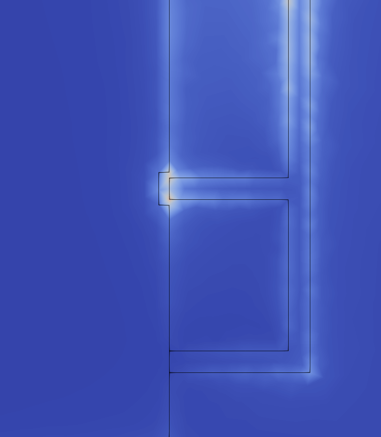

