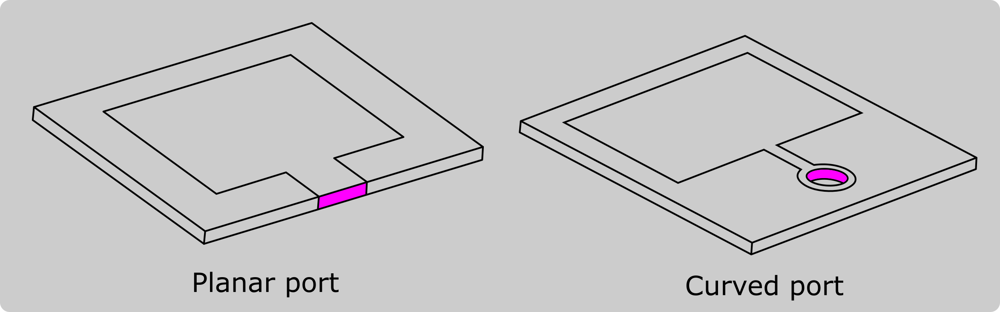

*Ports* or *feeds* are the power source of the antenna, and it is important that we define such ports correctly. 

For this reason we need to **understand what kind of port we have, and make some additional geometry modifications accordingly**.

Currently there are two types of lumped ports in CENOS:

- *Uniform port*
- *Coaxial port*

:::tip
Antenna simulations **do not require complex port geometries**, and most connectors **can be simplified** to a single feed surface or simple connector assembly - it will make the **meshing easier and calculation faster**, while **keeping the accuracy of the results**!
:::

---

## Uniform ports

Uniform port is essentially a rectangular surface, **planar** or **curved**, which is **used in most planar antenna design simulations**.

### Planar

Uniform ports are **widely used in PCB antennas**, where the port connects the *patch* with the *conductive layer* (ground). In real antennas **coaxial edge connectors** are often used, but for simulation they are not necessary and you can **replace them with simple planar ports**.

To **create planar feed**:

1. **[Create a sketch](geometry-creation#sketches) on the side and draw a uniform port on the edge of the patch**, connecting the top conductive layer with the ground plane.

### Curved

In addition to *coaxial edge connectors*, **SMA connectors** are commonly used in planar antennas. Again, the actual **connector can be simplified to a curved port**.

To **create curved feed**:

1. **[Create a sketch](geometry-creation#sketches)** on the patch and **draw a circle** of where the port will be.

2. **[Extrude](geometry-creation#extrusion)** the port through the patch.

3. Choose the patch and cylinder objects and click **Cut** boolean to create a hole in the patch.

---

## Coaxial port

Coaxial ports are ports where the connection surface is made by a coaxial cable. For these kind of ports **you don't need to create a separate surface**, as it is already included in the volume definition.

:::tip
You can create a coaxial connector yourself or use one from the **[Component Library](geometry-creation#component-library)**.
:::

Coaxial ports can be **simplified as well** - replace the complex assembly with simple cylinders!

