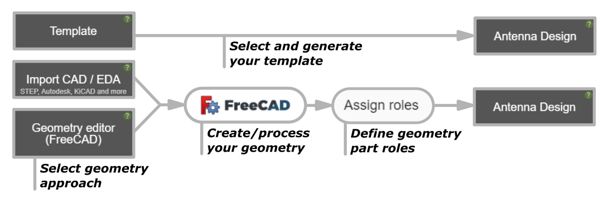
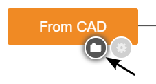
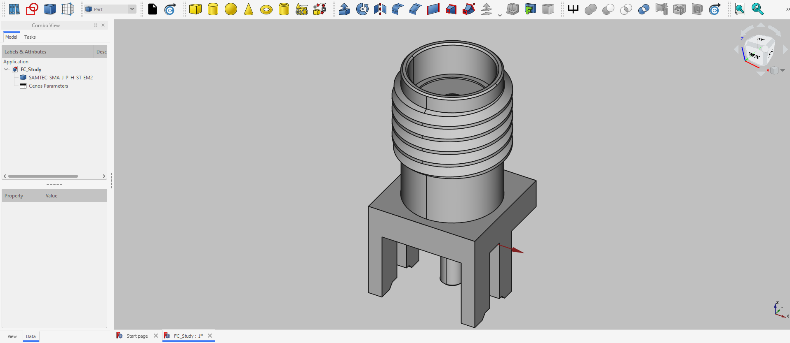
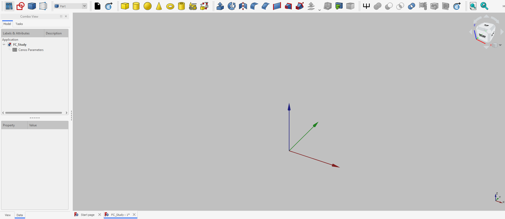

In **CENOS Antenna Design** app there are multiple ways available for antenna geometry creation - *Templates*, *Import CAD* and *Geometry editor*.

In this section we will take a look at the **general layout and workflow** of the geometry setup in *CENOS Antenna Design* app.

---

## Workflow

Depending on your geometry approach, you will need to **follow one of the workflows** to prepare your geometry for physics setup (and essentially for simulation itself).

To choose the appropriate geometry creation approach, **click on the respective block**.

---

### Templates

Templates is the easiest way to define geometry. Just select *Templates*, enter the geometrical properties of your antenna, and you are good to go! 

In *Templates* **geometry and mesh is being generated automatically**, and it can be used to very **quickly set up a simulation** for *Patch* or *Dipole* antenna!

---

### Import CAD

*Import CAD* approach is **useful when you have already created CAD** of your antenna. Simply click on the folder icon, select your CAD file, and it will be automatically imported in CENOS, where you will be able to process it!

---

### Geometry editor

If you want to **create your own geometries in CENOS**, then *Geometry editor* is the approach for you! Just select this approach, and our built-in geometry editor will automatically open, enabling you to create **any antenna you want**!

