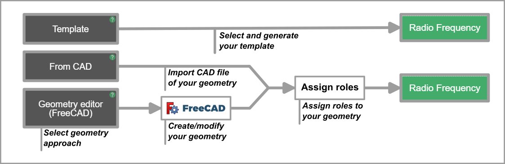

_CENOS Radio Frequency_ is a simulation software that helps engineers to save a significant amount of money and time in radio frequency designs and placement studies. This is done by replacing physical tests with computer simulations!

In this article we will learn what a simulation is and go over the main points on how to create one.

## What is a simulation?

A numerical simulation or **virtual testing** is a calculation done by a computer following a program that implements a mathematical model for a physical system.

It combines a **geometrical model** of the **physical system** with the physics definitions about that system to predict numerous **physical phenomenon** such as electric or magnetic fields.

## Simulation with CENOS

_CENOS_ stands for ***Connecting Engineering Open Source***, which highlights the way how CENOS creates and calculates simulations. By combining 3 powerful open-source tools - **GetDP, FreeCAD** and **ParaView** - _CENOS_ delivers the best tool for _Radio Frequency_ simulations.

The workflow of _CENOS_ simulation is based on these three open-source tools. It consists of 3 main parts - _Geometry, Physics_ and _Results_ - representing the steps you need to take to create a Radio Frequency simulation. _CENOS RF_ has an extra section - _Mesh generation_ - where you can generate the mesh of your model and make manual modifications if you want to!

## Workflow 

Depending on your geometry approach, you will need to **follow one of the workflows** to prepare your geometry for physics setup (and essentially for simulation itself). In ***CENOS Radio Frequency*** there are multiple ways available to work with RF model geometries - _Templates, From CAD_ and _Geometry editor_.

In this section we will take a look at the general layout and workflow of the geometry approaches in CENOS Radio Frequency app.

To choose the appropriate geometry creation approach, **click on the respective block**.

## Templates

Templates is the easiest and quickest way to define geometry. Just select *Templates*, enter the geometrical properties of your antenna, and you are good to go! 

In *Templates* **the geometry and mesh are generated automatically**, and it can be used to very **quickly set up a simulation** for *Patch* or *Wire* antennas!

## From CAD

The *From CAD* approach is **useful when you have already created a CAD file** of your RF model. Simply click on the folder icon, select your CAD file, and it will be automatically imported in CENOS, where you will be able to validate it!

### Supported Formats 

CENOS currently supports differents formats:
- CAD files - .step, .stp, .iges, .igs.

:::tip
You can use multiple CAD files to use in the same simulation. Just select the files you need and they will be automatically imported into CENOS!
:::

### Thin PCB conductor flattening

In RF models it is usual to find conductive parts with a very small thickness. When using the From CAD approach you will find the option to flatten these conductive objects (with a thickness of 50um or less) or keep them as 3D volumes. This feature will appear once you upload your CAD files. 

One of the big advantages of selecting _YES_ for this option is that it will decrease the chances of having problems with the mesh of the model and it will also **decrease the computation time**! Remember that working with 2D Faces instead of solids when dealing with very thin surfaces will not affect the results significantly and will **save you time in the simulation process**! 

:::important
RFID geometries should not be simplified as 2D faces, as this will affect the final results.
:::

### Air Domain generation

The air domain is needed for the calculations and its size can directly affect the simulation results. You will have the option to have the air box created automatically by CENOS or you can **create it manually** in your own CAD software and then import the CAD file along with your RF model.

### CAD reloading

In simulations, we often have to **make modifications to the geometry dimensions** to obtain the most suitable result for our project. You can create your RF model with different dimensions with your favorite CAD software and load the modified geometries into CENOS while **keeping all settings**! To do this you just need to go back to the main CENOS RF screen and click on the folder icon that appears in the From CAD box.

You need to choose whether to **overwrite the existing results or save it as a new case**. In the first option the results you have previously obtained will be lost and only the new calculations generated will be saved;  with the second option a new folder containing the new results will be created, so you will have **two totally independent cases**.

With any option you choose, the new geometry will be loaded and all the parameters will already be set, so you can click RUN directly to continue with the simulation!

### Limitations

There are some limitations when using FromCAD, since with this approach you will not be able to **make modifications to your geometry directly in CENOS** - you will have to modify the model in your own CAD software, or use a different workflow - _Geometry Editor (FreeCAD)_. Another limitation is the use of the parametric study, which is only available with the _Geometry Editor (FreeCAD)_ workflow. 

If you want to continue working with other CAD software, you can create different geometries with the necessary modifications to the dimensions. This way you can **[reload each CAD file](#cad-reloading)** and the role assignment and materials will be kept, without the need to do all the work more than once!

## Geometry editor 

If you want to **create your own geometry in CENOS**, then the Geometry Editor (FreeCAD) is the approach for you! Just select this approach, and our built-in geometry editor will automatically open, enabling you to create **any RF model you want**!

