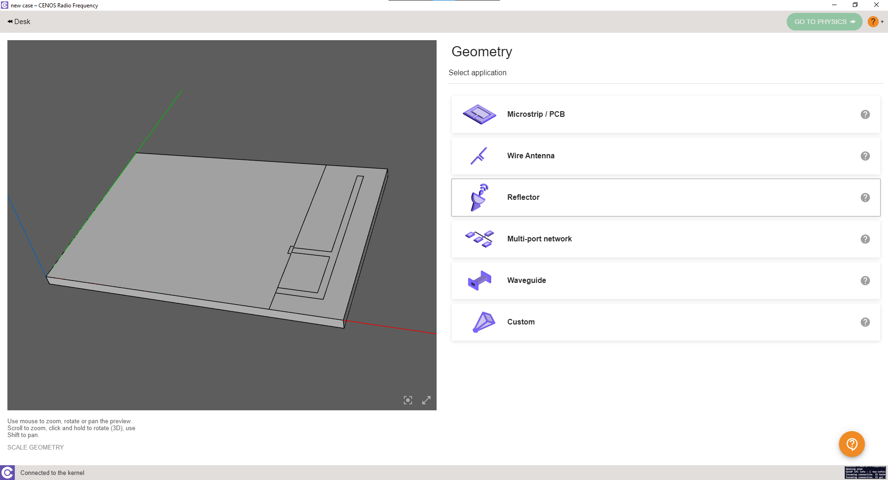
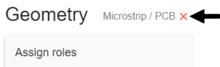
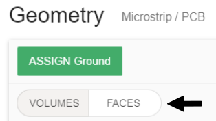
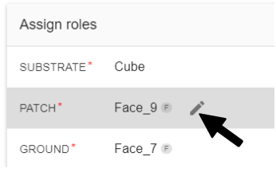
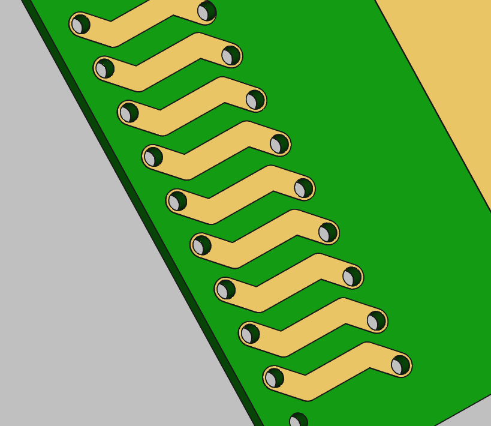
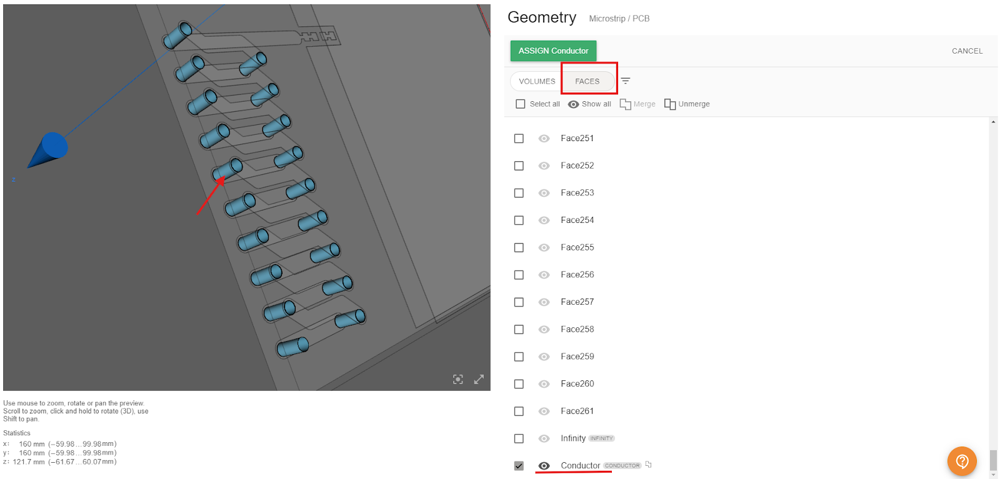
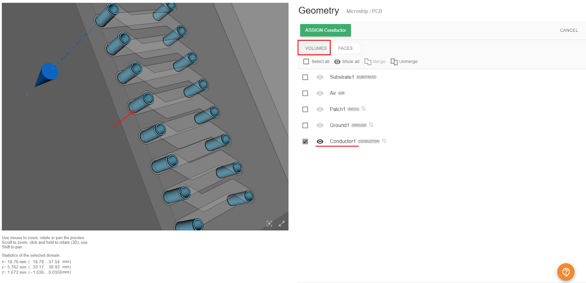
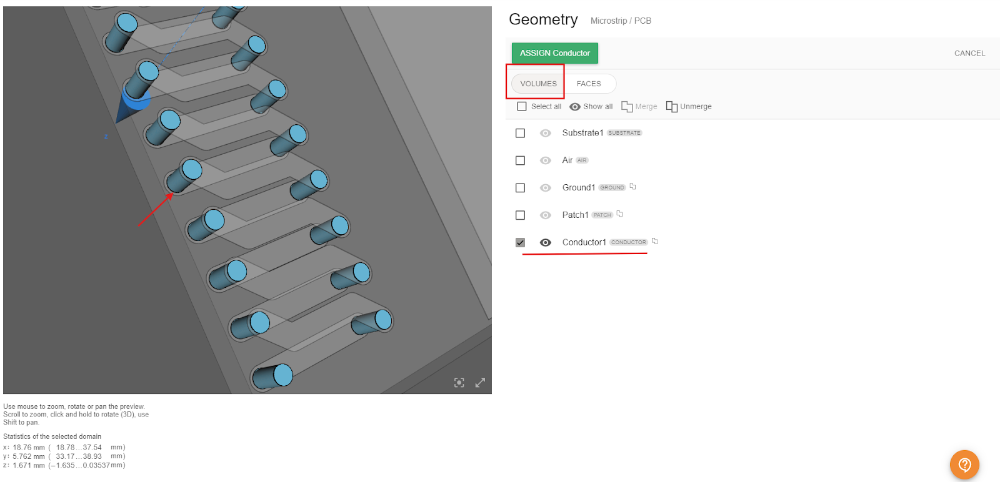
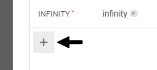

Once you have imported your CAD file and **[sent it to CENOS](geometry-creation#getting-the-geometry-to-cenos)**, you will need to **define volumes and surfaces of your RF model**.

**Watch a short video on how to define roles in CENOS Radio Frequency app**:

<iframe width="560" height="315" src="https://www.youtube.com/embed/COWEdo17b8I?list=PLtRpbWakrmMf29rhPnm0bxjosBow-nM8q" title="CENOS Antenna Design - Geometry roles" frameborder="0" allow="accelerometer; autoplay; clipboard-write; encrypted-media; gyroscope; picture-in-picture" allowfullscreen></iframe>

## Select the type of your model
First you need to **select the type of your model** - _Microstrip/PCB, RFID, Wire Antenna, Reflector, Multi-port network, Waveguide_ or _Custom_.

:::note tip
If you want to **change selected model type**, click *Reset geometry type*.

:::

## Assign roles to your geometry.
 1. Click *Select...* to **enter role selection**.
 2. Choose if you will define *volume* or *face*.

 3. **Select the appropriate object** (volume or surface). Once done, click **ASSIGN** to finish role selection.

:::note tip
You can **rename objects** by simply clicking the edit tool next to the name.

:::

### PCB vias in CENOS RF
In PCB design and simulation, vias are essential for establishing electrical connections between different layers of the board. In CENOS RF simulation, assigning vias is a crucial step to ensure the accuracy of your electromagnetic analysis.

To assign PCB vias in a simulation, you need to define the via's geometry, location within the design and material properties. In this guide, we will walk you through the steps to assign and configure PCB vias in CENOS RF, ensuring that your simulation reflects the actual physical layout of your PCB design.

#### 2D faces
There are different ways to assign PCB vias in CENOS RF. One of these methods involves using 2D faces. In this approach, it is not necessary to define a 3D object for the vias; instead, you only need to have the required holes in the PCB and the corresponding conductive layers.

Once you have loaded the geometry, you can identify the substrate walls where the vias would be placed in the real model. This method simplifies the process by focusing on the key structural features, allowing for an efficient simulation without the need to explicitly model the vias in three dimensions.

When you are in the Geometry section, you can add a *Conductor* role to identify the vias. For this role, you will select the *FACES* tab and begin choosing the corresponding faces. An example can be seen in the following image:

Keep in mind that it is not necessary to add a role for each via. You can select all the faces and merge them into a single role. This way, assigning properties in the physics section will be simpler. This method is particularly useful for simplifying the modeling process and focusing on other relevant aspects of the design.

:::warning important

This method helps simplify the model and reduce the simulation time, but keep in mind that it may slightly affect the final results, as it relies on an approximation. You can use this method to get an idea of the results without consuming too much time, and later add more details for greater accuracy.

:::

#### 3D volumes
To obtain results that are as close to reality as possible, it is necessary to have a CAD model that is also accurate. Therefore, there is also the option to work with a 3D model of the vias, just as in the real model. Once you have included the vias in your CAD file, you can load it into CENOS RF and assign the roles to your geometry. For the vias, simply select the *Conductor* role and start selecting the corresponding solids. Make sure you are in the *VOLUMES* tab to do this.

Finally, we have a third option that uses cylinders to represent the vias. This approach strikes a balance between CAD design time and simulation time, as it simplifies the meshing process, reduces the number of elements, and ultimately shortens the simulation duration. The process for assigning the vias would be the same as in previous cases: select a *Conductor* role and assign all the corresponding cylinders.

## GO TO PHYSICS

Once all *Roles* are assigned, the **GO TO PHYSICS** button will enable, and you can move on to the physics setup!

:::note tip
You can **add more roles** if for example you created a coaxial connector, then you can add a dielectric, and two more conductors.

:::
