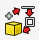
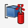
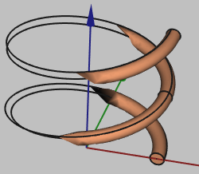

## Common tasks

:::note
Denominations for used solutions:
- **Blue** for workbench selection (e.g. **Part**)
- **Green** for toolbar selection (e.g. **View**)
- **Orange** for shortcut icons (e.g. **Create a Cylinder**)
:::

| Task                                     | Solution                                   | Icon                                   |
| ---------------------------------------- | ------------------------------------------ | ------------------------------------------ |
| Move object                              | Left-click in tree view on object → *Transform*                     |
| Move sketch                              | Sketch Properties → *Attachment/Base* → *Placement* → *Position*        |
| Create a face from edges                 | **Part** → **Advanced Utility** → *Face from edges* |  |
| Create an array from *objects*           | **Draft** → **Modification** → *Array Tools* |
| Create an array in a *sketch*            | **Sketcher** → **Sketch** → *Sketcher tools* → *Rectangular array* |
| Turn compound into multiple solids       | **Part** → Select your compound → **Explode Compound** |              |
| Position one object next to another      | Select the first object, click **Part** → *Attachment*, select the second object's face, set mode to "XY on plane"               |
| Change unit system or number of decimals | **Edit** → *Preferences* → *General* → *Units*                                                                                       |
| Turn edge into wire with thickness       | Select your edge/wire and click **Apply a thickness to a 1D wire** |  |
| Toggle object visibility                 | Right-click on the object in tree view and click *Show/Hide selection*.                                                        |
| Toggle grid visibility                   | **Draft** → **Utilities** → *Toggle Grid*                                                                                        |

---

## Useful shortcuts
    
| Function                   | Shortcut     |
| -------------------------- | ------------ |
| Toggle object visibility   | *Space*        |
| Set camera rotation center | *Middle-click* |
| Pan camera                 | *Left-click*   |
| Import File                | *Drag&drop*    |
| Rectangle select objects   | *Shift+B*      |
| Rectangle select elements  | *Shift+E*      |
| Import File                | *Drag&drop*    |

---

## Problems

| Problem               | Solution                                   |
| ---------------------------- | ------------------------------------------ |
| Extrusion does not work      | Double-check that you use a sketch which is closed, without holes or branching wires |
|       | This can occur when creating wire geometries. **This is just a visualization problem and in no way affect the geometry - you can still use it**! |

