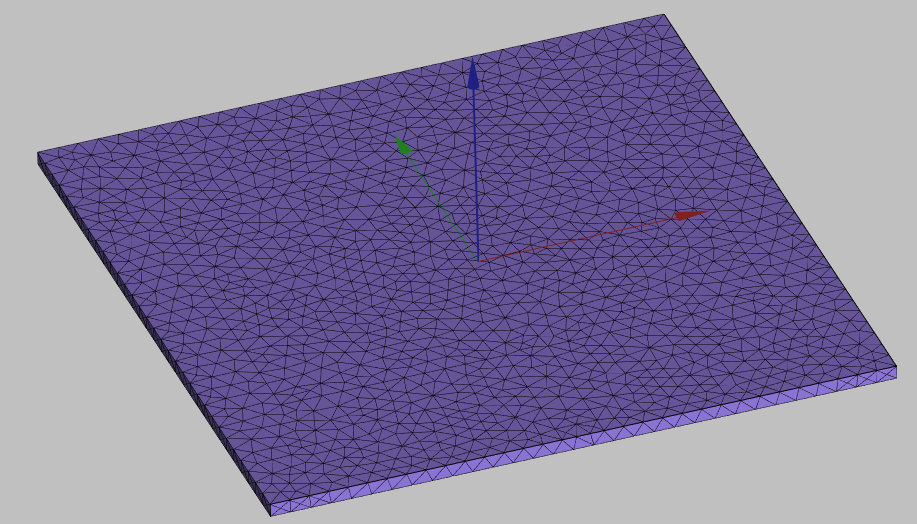
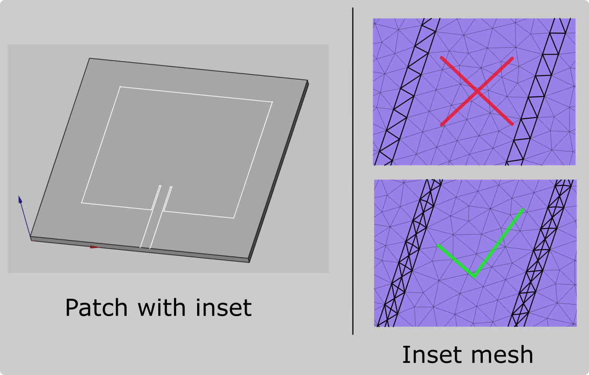

By default *FreeCAD* is necessary only for the geometry building, as the numerical mesh for your antenna is generated automatically when you calculate your simulation. However, **in some cases the automatic meshing might fail**, and **in such occasion you will need to create your geometry manually**.

If during the calculation you get a **message about meshing problems**, you will need to manually mesh your antenna in *FreeCAD*. You can also mesh it manually already when building your geometry (while still in *FreeCAD*) in case you want more control over your simulation.

---

## General mesh

To create the mesh manually in *FreeCAD*:

1. Switch to the **Meshing** workbench

2. Select all objects of your design from the tree view and click **Create Mesh**.

Mesh size will be **automatically chosen** and mesh generated.

:::tip
If you want to **change mesh size**, you need to click on the respective submesh and in properties change the **Characteristics** value.

:::

---

### General refinements

Based on the mesh we genereated previously, it looks like we meshed just a simple plate, but if we disable mesh visibility and visualize the original geometry, we can see that on this plate we actually have a patch drawing.

As you can see, the **mesh we created for the box does not resolute the patch on it**, so we need to **create this resolution manually**.

You can **create a mesh refinement** for elements (faces, edges, vertices) in the 3D view or whole objects (sketches, solids) in the tree view:

1. **Select the objects** which you want to use mesh refinement.

2. Click **Refine mesh**.

3. Click **Recompute mesh**.

4. Enable the *mesh* visibility to see the new mesh.

:::tip
To **toggle visibility** of any object, right-click on it and click **Show/Hide selection**.
:::

---

## Patch meshing

Different antenna types might require different meshing approaches to optimize the simulation. In this section **we will take a look at different meshing approaches specific to patch antenna**.

### Outer edge refinement

For patch antennas we often need to refine the mesh of the patch, but we don't need to refine the whole patch, because the Electric and Magnetic field gradients are the strongest on the outer border of the patch.

For such cases we need to **refine the outer edge of our patch**, which will **create a good resolution of the outer border of the patch**, but will still leave quite **coarse mesh in the middle** of it, which will bring down the mesh element count and optimize the calculation, while increasing the precision of our results!

To create such edge refinement:

1. **Create an additional edge in your [sketch](creation#sketches)** (in the middle of the patch). This will work as a reference edge for keeping the mesh element size in the middle of the patch large.

2. **Before creating [mesh refinement](meshing#general-refinements)**, [enable the visibility](tips#common-tasks) of the sketch and **select the outer edges of your patch**. Leave the internal edge unselected!

Now just create the *Mesh refinement* for the selected edges, and you have created an optimized mesh for your patch!

---

### Inset refinement

For patch antennas with insets it is **important to resolute the inset gaps through mesh sufficiently**, as incorrect mesh in these parts can affect the results.

To refine mesh in these places:

1. **Create two additional edges in your [sketch](creation#sketches)** (in the middle of both insets). These will work as a reference edges for decreasing the mesh element size in the middle of the inset.

2. **Before creating [mesh refinement](meshing#general-refinements)**, [enable the visibility](tips#common-tasks) of the sketch and **select the two edges in your inset parts**.

Now just create the *Mesh refinement* for the selected edges, and you have refined your inset parts!

---

## Send mesh to CENOS

Once you are satisfied with the mesh, click **Send mesh to CENOS**!

