PCB/planar/patch antennas are **very widely used in modern electronics**, and often it is **beneficial to make a computer model to predict the behaviour** of the patch antenna even before the physical tests have started.

In this guide we will take a look at **how to build a complete patch antenna simulation from scratch in CENOS Antenna Design app**, using its built-in geometry editor, *FreeCAD*.

---

## Case setup

Before we can actually start building our simulation, we need to first prepare our case - **choose the way we will build our geometry**, and **save the case**.

---

### Choose geometry approach

You have three options from which to choose - **Templates**, **Import CAD** (if you have your own CAD file ready) and **Geometry Editor**.

Patch antenna **can be simulated with any one of these approaches**, as there is also a template for it, but for this example we will choose **Geometry Editor** and build our patch geometry ourselves.

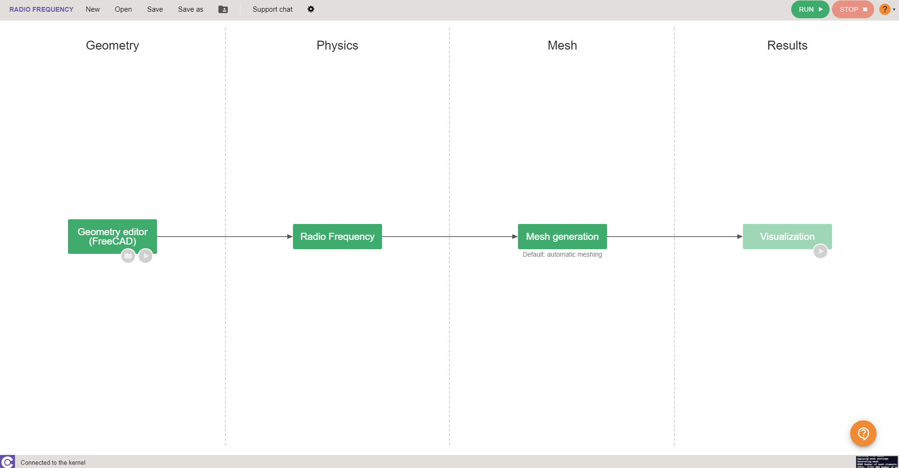

---

### Save the case

At this point you need to **save the case**, otherwise if you try to open *FreeCAD*, *CENOS* will not let you move forward.

Once the case is saved, click the *Play* icon to open *FreeCAD* - CENOS geometry editor.

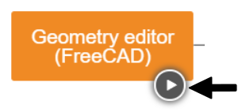

---

## Geometry creation

In *FreeCAD* we have all the possibilities to **build our antenna geometry**, and we are going to do just that.

In this *Geometry creation* section we will cover **all main points you need to complete** to build your own patch antenna geometry manually.

---

### Substrate (dielectric)

First thing we need to do is to build the substrate. The easiest way to do that is through box creation.

In **Part** workbench **[create a box](creation#3d-volumes)** and **change the parameters** (height) to the values corresponding to your antenna substrate.

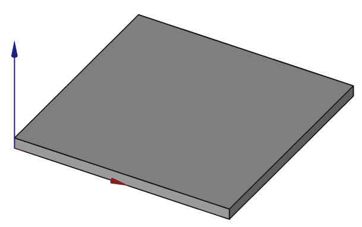

---

### Patch / Conductive layers

Next we need to create the patch for our antenna. In **Sketch** workbench patch can be drawn directly on the substrate as a **[2D sketch](creation#on-volumes)** or created as a **[3D extrusion](creation#extrusion)**. **They both work!**

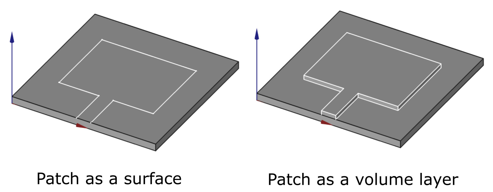

#### PROS/CONS

For 2D patch:
* **Easier to create** ([Sketch on surface](creation#from-scratch))
* Can **avoid meshing problems**

For 3D layer:
* Slightly more **difficult to create** (Have to create an [extrusion](creation#extrusion))
* **More accurate results**

---

### Port/feed

Last thing we need to add is a uniform port surface. Select the side of the box and in **Sketch** workbench create a **uniform port sketch**.

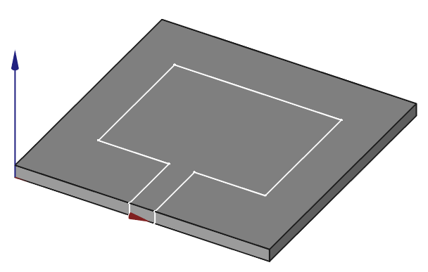

Depending on your patch, you can create **[planar](lumped-ports#planar)** or **[curved](lumped-ports#curved)** ports.

:::note
Remember that you can **simplify your port geometry from a connector to a simple feed plane!**
:::

---

### Feed networks

For more **complex patch antennas** the **feed network needs to be drawn separately**. To make the feed creation as fast and easy as possible, **CENOS has a specific tool designed for this exact purpose**.

1.  In **Sketch** workbench create a sketch on top of the substrate volume.

    - Create the feed lines as **1D edges**.
   
    - Create the patch surfaces as **fully closed wires**.
   
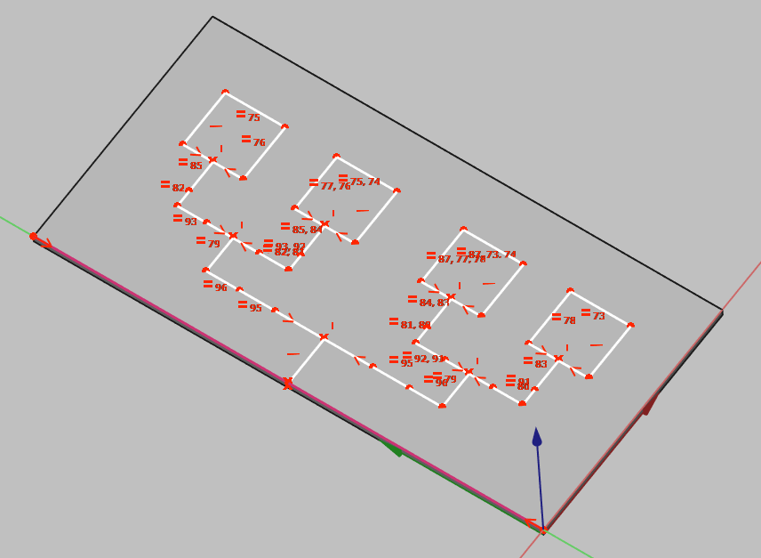

2. Close the sketch, switch to **Part** workbench and select the sketch object.

3. Select the **Feed Network** tool

4. Select all edges **with the same trace width** and click **Add** to create separate width groups for each of them.

    * Create one group with a width of 0 for the all of the **enclosed patch edges*.

5. Click **OK** to generate the feed network.

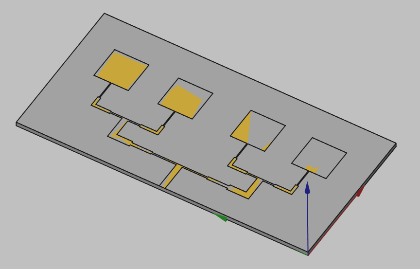

:::note
You will see some visual artifacts (the golden feed surface will appear to flicker).
This happens when two surfaces overlap, **this is normal behavior and means you did everything correctly**!
:::

:::tip
You can create chamfered corners by filleting the sketch path with a radius half of the trace width:

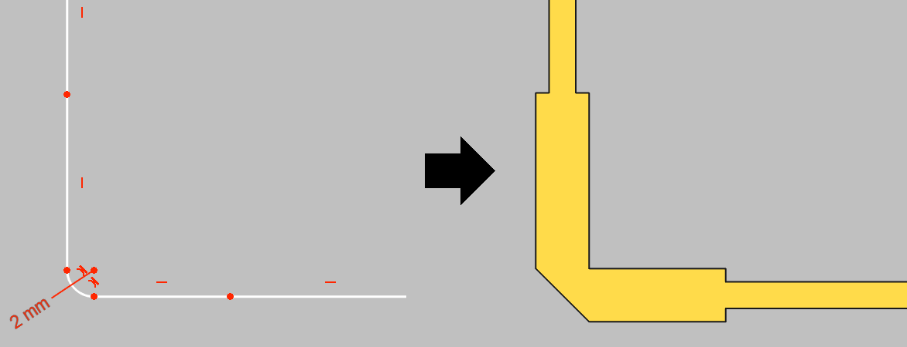
:::

---

### Send geometry to CENOS

Once you have finished the geometry, you need to send the mesh to CENOS. To do that:

1. **Select all final objects** in the tree view.

2. Click **Geometry to CENOS**.

As geometry is being sent to CENOS, **FreeCAD study will be automatically saved** in the simulation folder, so you can close it.

---

### Manual meshing

If during the calculation you get a **message about meshing problems**, you will need to **[manually mesh](meshing#general-mesh)** your antenna in FreeCAD. You can also mesh it manually already when building your geometry (while still in FreeCAD) in case you want more control over your simulation.

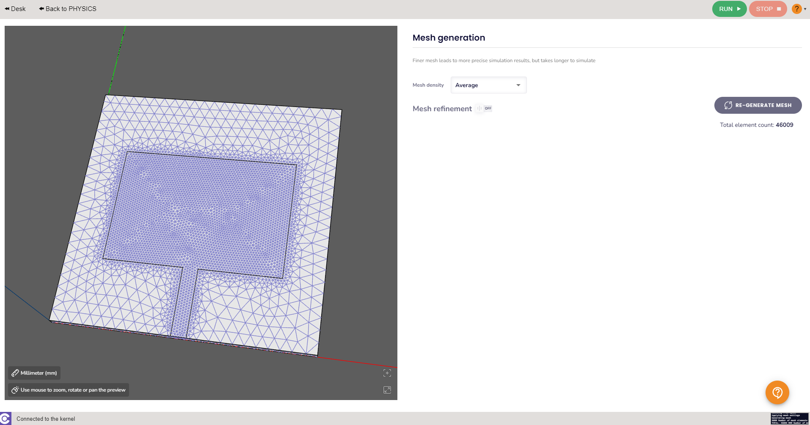

---

## Roles

Once the geometry is finished and sent to CENOS, you need to **define your geometry** before defining the physics on it.

Essentially you need to clarify which part of your geometry is the dielectric, which is the port etc., in other words, **define roles for parts of your geometry**.

---

### Type of antenna

Before you define roles, you need to **[select what kind of antenna you have](definition#select-the-type-of-your-antenna)** - *Microstrip*, *Wire* or *Other*.

For this example we choose **Microstrip/PCB** antenna type.

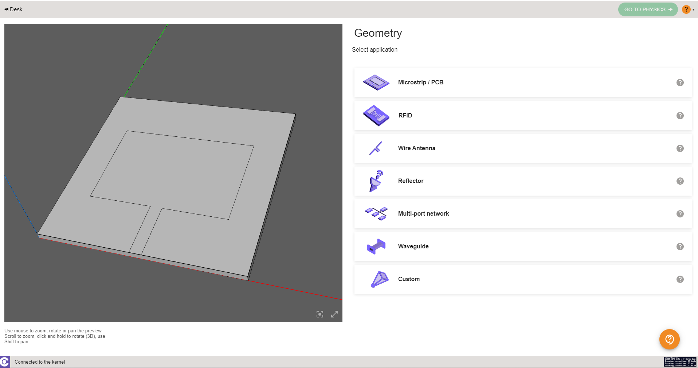

---

### Surface/volume roles

Now you need to **[define surface and volume roles](definition#assign-roles-to-your-geometry)** for your substrate, patch, ground and port.

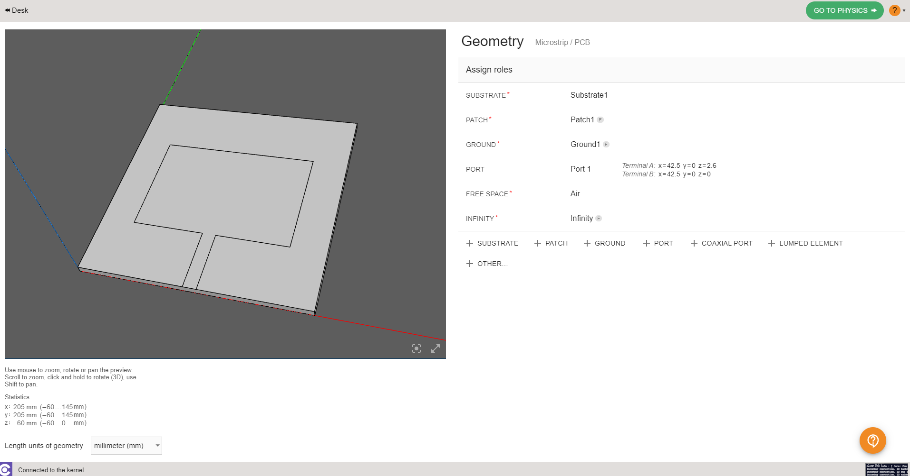

---

### Got to physics

When roles are assigned, **GO TO PHYSICS** button will become active - click it to **move to the Physics definition**!

---

## Physics

In physics you need to **define the physical parameters of your simulation**, which include **frequencies**, **material definitions** and **boundary conditions**.

---

### Simulation control

In **SIMULATION CONTROL** you define either a **single frequency** or a **frequency sweep**.

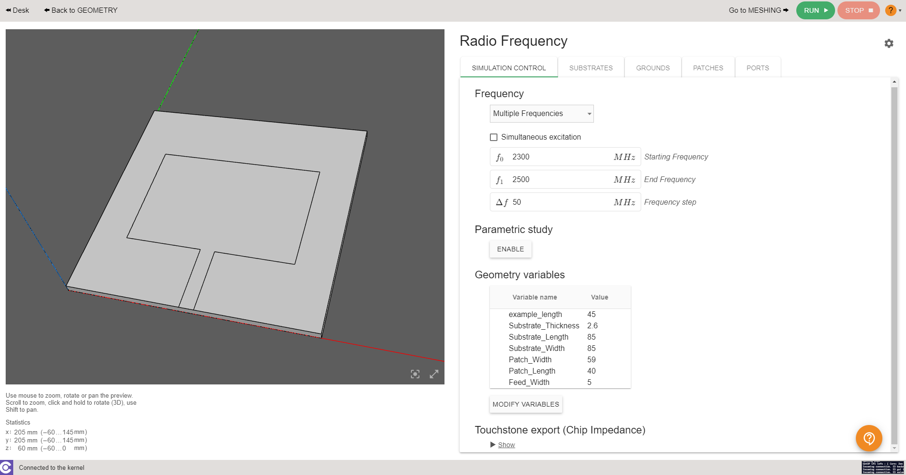

---

### Volumes/free space

For substrate you only need to specify the material - ***Free space*** **is already predefined for you**, so you don't need to worry about that

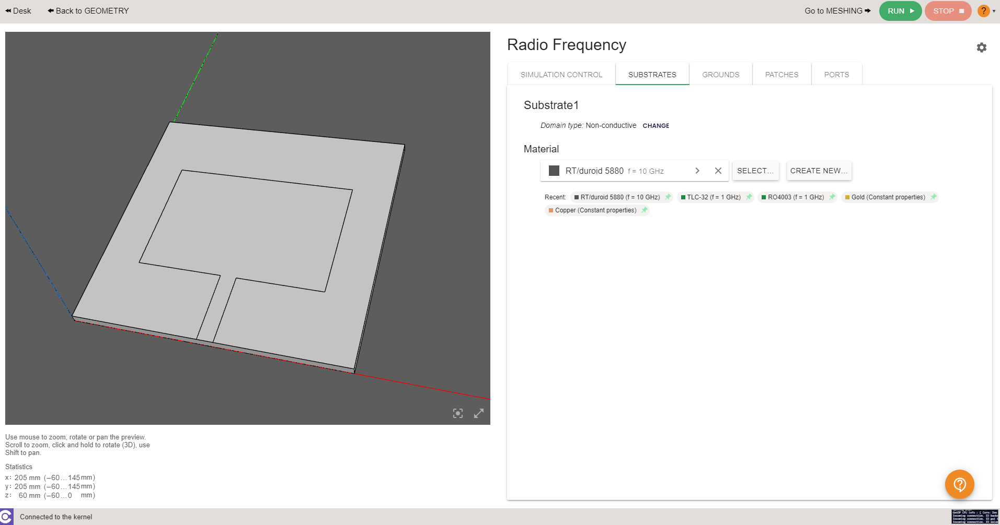

### Boundaries

**Boundaries** or boundary conditions have also been **predefined**:

- *Feed* surface → **Uniform Port** (with default 50 Ohm Impedance)

- *Patch* and *Ground* → **Perfect Electric Conductor**

- Outer surface of free space → **Radiation Boundary**

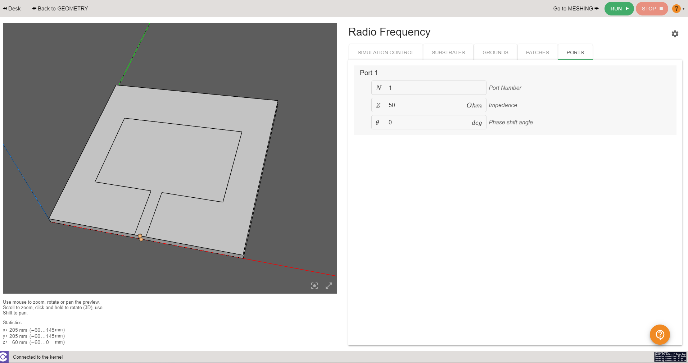

Once all physical parameters are filled, **RUN** button will become active and you will be able to **run the simulation**!

---

## Results

When calculation is done, results will automatically open in a new window. Congratulations, you have **successfully finished a patch antenna simulation**!

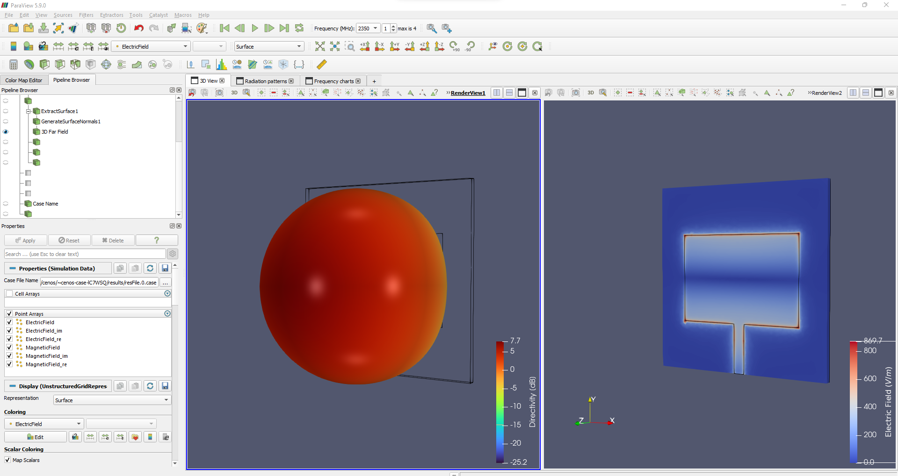

