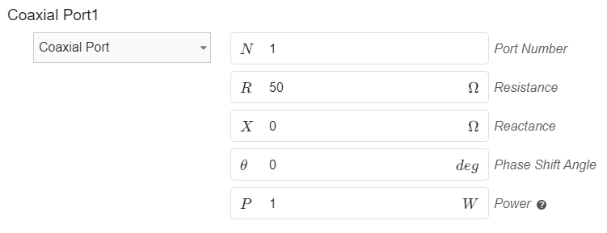
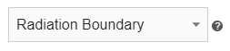
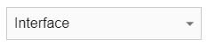

**Boundary conditions** or **Boundaries** are very important part of the simulation, as they are needed to physically define your antenna design. Even though *Boundaries* are always filled automatically, in some occasions you will need to **change or adjust the default definitions**.

In this article we will **go over the boundary conditions available** in *CENOS Radio Frequency* app and **learn the meaning of each definition**.

## Coaxial port

This a boundary condition that will be automatically assigned to the face that has been defined with the ***Coaxial*** port role in the Geometry section. Port **Impedance** (Port resistance and reactance) by default is set to **50 Ohms**, which you can easily adjust for your use case. Additionally, you have the option to specify a **phase shift** in the provided box for the port, allowing you to adjust the angle of wave excitation at the antenna input. Furthermore, you can enter the desired **input power** value to tailor the simulation parameters to your needs.

## Perfect Electric Conductor

**Perfect Electric Conductor** is a condition which is by default **applied to wire of wire antenna or conductive layers of patch antenna** (patch and ground). It assumes perfect electric conductivity of the boundary.

## Conductor

You can use **Conductor** boundary instead of *Perfect Electric Conductor*. **Conductor** takes into account the resistive losses, which can give more precise simulation results.

## Radiation Boundary

**Radiation Boundary** is by default applied to the **outer surface of the air box** - a domain which is automatically generated around your antenna. By default, this boundary condition is hidden. The radiation boundary in CENOS uses the *Silver-Muller absorbing condition*. 

## Interface

**Interface** is used to define an internal contact surface between two separate domains.

