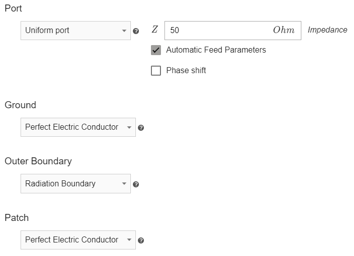

## Overview

Physics window in *CENOS* is quite straightforward. On the left side you can see the **preview window** with your antenna geometry.

On the right you can find the actual **physical definitions** of your antenna. You can **switch between definitions using tabs**.

---

## Definitions

In *Physics* the definitions are quite straightforward.

### SIMULATION CONTROL

In **SIMULATION CONTROL** you need to define only the frequency of your antenna. You can set one frequency, or do a **frequency sweep** to test your antenna for a whole range of frequencies.

---

### DIELECTRIC/VOLUMES

For volume objects of your antenna you need to **define only the material** it is made of.

You can write the name of your material directly into **search bar**, choose from CENOS **built-in material library** or **create your own material**!

---

### BOUNDARIES

**BOUDARIES** is the place where you define boundary surfaces of your antenna, such as *feed*, *ground*, *patch* and other surfaces.

