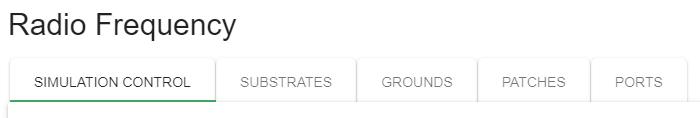
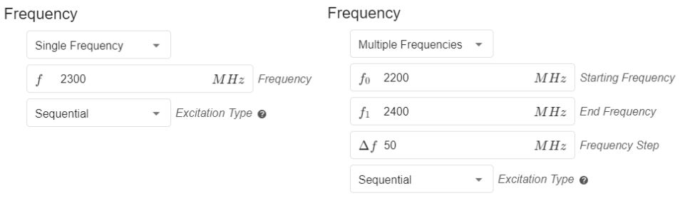
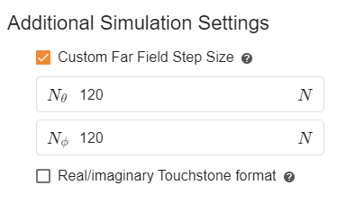
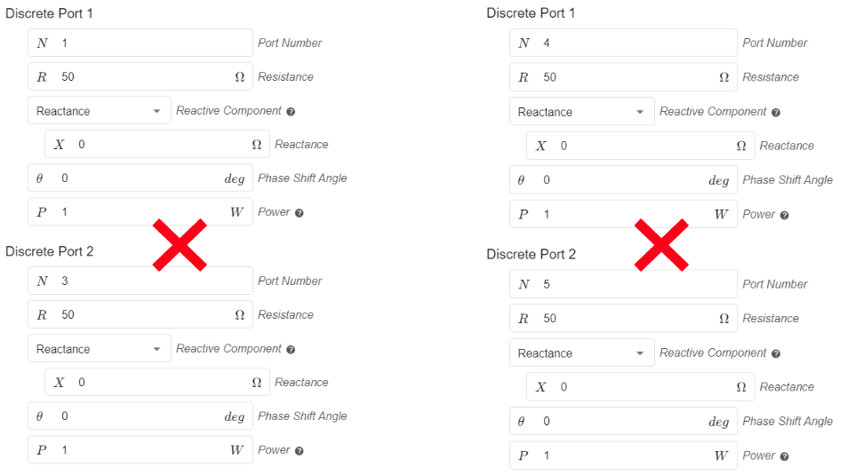
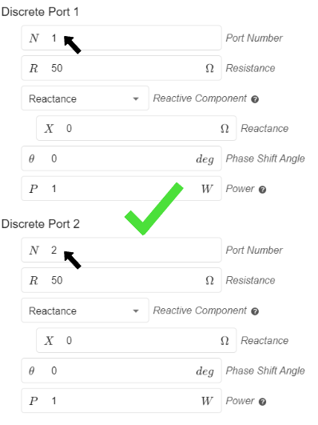

## Overview

Setting up the physical settings in *CENOS* is simple. On the left side you can see the **preview window** of your geometry.

On the right you can find the **physical definitions** of your model. You can **switch between the definitions using the tabs**. The material definitions are sorted by role, so you will see the volumes and surfaces with the same role under the same tab.

## Definitions

In *Physics* the definitions are quite straightforward.

## Simulation Control

In **Simulation Control** you need to select the frequency of your model, choose whether you want to enable **Sequential or Simultaneous excitation** of the defined ports and enable the **Parametric Study**. You can set one frequency, or do a **frequency sweep** to test your model for a whole range of frequencies.

In the case that you are using multiple ports, you will also be able to select whether you want to use **sequential** or **simultaneous excitation**.

### Computation Settings

You will also find **Computation Settings**, where you can select the **algorithm** to use:
1. Fast.- It uses 2nd order mesh elements.
2. Accurate.- It uses 3rd order mesh elements. This algorithm can provide more accurate results but will increase the computation time.

You will find the definition of the **number of processes**. The value determined here defines the number of processes that will be **calculated in parallel**. This will help you to significantly **reduce your calculation time**! Note that this will increase the resource usage of your PC, so try to choose a value that is appropriate for what your computer can handle.

### Additional Simulation Settings
Within this section you can customize the **total step count for the far field** generation. Increasing the values will help you to have more values in the far field results and therefore a higher resolution.

You can specify whether you want the results of the **Touchstone file** to be displayed in *real and imaginary* format instead of *dB and angle*.

The Touchstone file is saved in the folder called "extra_results" located in the general folder of your case *(case_folder\extra_results)*. In this same folder you will find the **Smith Chart** that you can use as a tool for impedance visualization!

## [Parametric Study](geometry-creation#geometry-parameters-and-parametric-study)
With _CENOS RF_ software it is possible to create a **parameterized model** and change the dimensions of your geometry in a simple way.

Without parametric values, each geometry modification requires the creation of a new model **from scratch or going back to previous stages** of the simulation to make the required changes, which can be very **time consuming**. If the model is parameterized, geometry modifications only require changing the required parameter in the _Simulation Control_.

### How to use Parametric Study?

The _Parametric Study_ feature is available through the Geometry Editor approach. The first step is to **[parametrize your geometry](geometry-creation#geometry-parameters-and-parametric-study)** within _FreeCAD_.

Once you have sent your geometry to _CENOS_ and are in the _Simulation Control_, you will need to **enable the parametric study** and click on **CONFIGURE**. 

The parameters you have previously defined will appear in a new window, you can add one or more parameters! You can also add as many cases as you need to simulate - just click _Add_ and a new case will be created. 

When you have finished making the necessary adjustments, you just need to close the parametric study window and continue with the usual workflow.

#### Limitations

**Geometry overlapping**

By changing the parameter values, geometry can become non-physical, i.e. elements can overlap each other or sketches can be left out of a solid surface. It is necessary to avoid these situations so that the simulations work properly and the results are obtained without any inconvenience. Make sure that your geometry has the **necessary constraints** and that the parameter dimensions are **physically possible**. 

## Volumes

For volume objects of your model you only need to **define the material** it is made of.

You can write the name of your material directly into **search bar**, choose from CENOS's **built-in material library** or **define your own material**!

You can browse through the whole material library by clicking on *Select...* and see all the defined materials. If you have defined some new materials, you can see them all in the *MY MATERIALS* tab.

## Surfaces

The surfaces of your model, which are typically conductive materials, are automatically assigned as *perfect electric conductors*, but you are able to redefine them as real materials as well, such as *copper* or *aluminum*.

## Ports

After you have defined your ports in the *Geometry* section, you can define the configuration of your ports in the **PORTS** tab.

### Lumped ports

When using a discrete port you can define several of its parameters, one of them is the complex part of the impedance, which can be configured as reactance or frequency-dependent capacitance.

You can also define the phase shift angle, as well as the input power of each port when using sequential excitation. 

### Coaxial port

The coaxial ports in CENOS are defined using one face of the dielectric. You can easily modify the **input impedance**, **phase shift angle** and **input power**.

### Waveguide port

In the waveguide ports you can change the port number and select the **Mode** you will use.

:::note

When using multiple ports don't forget to **number each one with a different number sequentially**, starting at number 1. If there are ports with the same port number this will cause problems! 

:::

### Lumped elements

If you have defined some **lumped elements** in your model, you can define the *resistance*, *capacitance* and/or *inductance* for each element in the **Lumped Elements** tab. Here you can also switch the configuration of each element between *Serial* and *Parallel*.

