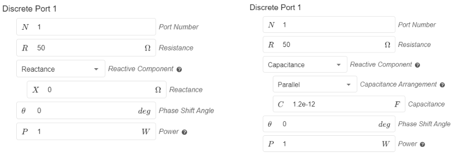

## Overview

Setting up the physical settings in *CENOS* is simple. On the left side you can see the **preview window** of your geometry.

On the right you can find the **physical definitions** of your model. You can **switch between the definitions using the tabs**. The material definitions are sorted by role, so you will see the volumes and surfaces with the same role under the same tab.

---

## Definitions

In *Physics* the definitions are quite straightforward.

### SIMULATION CONTROL

In **SIMULATION CONTROL** you need to select the frequency of your model, choose whether you want to enable **Sequential or Simultaneous excitation** of the defined ports and enable the **Parametric Study**. You can set one frequency, or do a **frequency sweep** to test your model for a whole range of frequencies.

---

### VOLUMES

For volume objects of your model you only need to **define the material** it is made of.

You can write the name of your material directly into **search bar**, choose from CENOS's **built-in material library** or **define your own material**!

---

### SURFACES

The surfaces of your model, which are typically conductive materials, are automatically assigned as *perfect electric conductors*, but you are able to redefine them as real materials as well, such as *copper* or *aluminium*.

---

### PORTS

After you have defined your ports in the *Geometry* section, you can define the **input impedance** and the **phase shift angle** in the **PORTS** tab.

---

### LUMPED ELEMENTS

If you have defined some **lumped elements** in your model, you can define the *resistance*, *capacitance* and/or *inductance* for each element in the **LUMPED ELEMENTS** tab. Here you can also switch the configuration of each element between *Serial* and *Parallel*.

