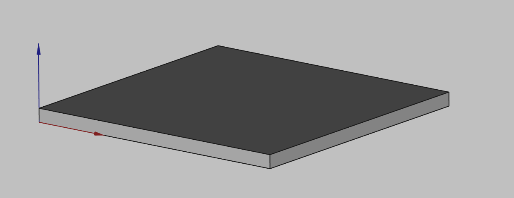
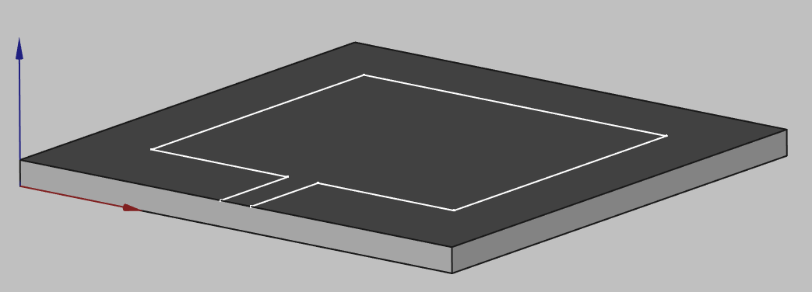
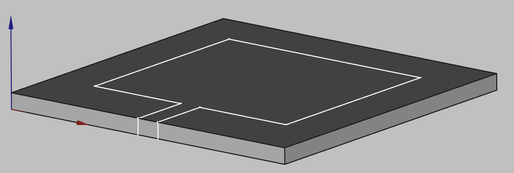

PCB/planar/patch antennas are very widely used modern electronics. In this short guide we will take a look at **how to build patch antenna geometries in CENOS**, using its built-in geometry editor, *FreeCAD*.

## Substrate (dielectric)

To create a substrate volume, you need to ***CREATE A BOX*** and change the parameters to your necessary values.

## Patch

Select the top face of the cube and ***CREATE THE SKETCH*** of your patch antenna.

:::tip
As the patch thicnkess is very small, we can treat it as a 2D surface. For simulation purposes it is completely enough to draw a sketch only, you **don't need to extrude the patch layer**.
:::

## Port

Last thing we need to add is a uniform port surface. Select the side of the box and create a ***UNIFORM PORT*** sketch.

