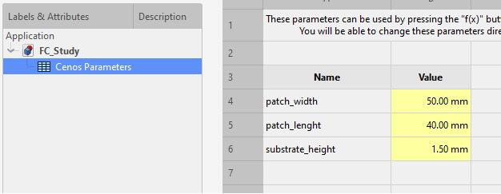
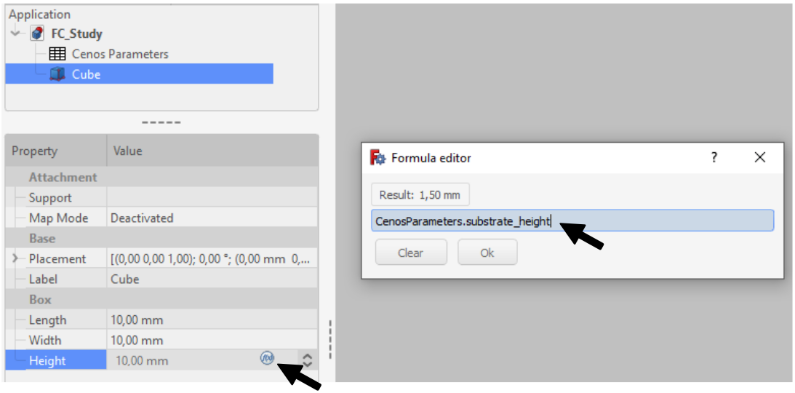
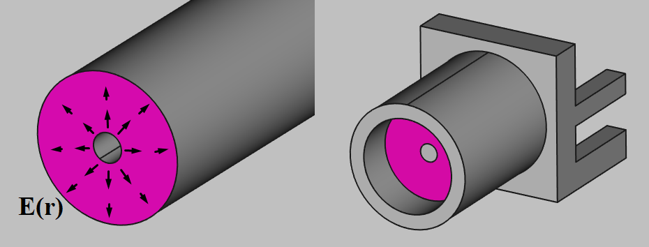
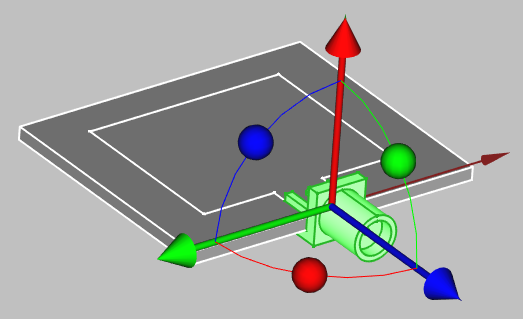
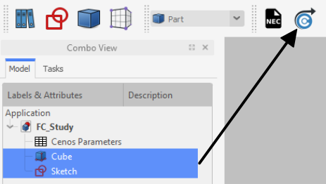

## To Do
:::warning TODO
* Add a common folder in assets for just icons (for freecad, salome) that can be used in multiple artices. Prefereably in .svg format if supported
* How to see mesh in ParaView
* 3D sketch creation in detail
* Near field visualization
:::

:::tip done
* Explain that CENOS has two workflows: templates and FreeCAD (*geometry editor* and *import Step file*, which are actually the same thing).
* Figure out where to put the common tasks, shortcuts tables.
* Add all inline icons in quickstart where there is (pic)
* Explain that conductive layers can be simulated both as 2D surfaces and as thin (35	µm) 3D extrusions
* Explain that sketches will appear as surfaces in CENOS (geometry will be partitioned), user does not have to create an extrusion of a patch (this is optional).
* Explain that ovelapping solids are forbidden but overlapping faces are ok
* Explain that DXF, STEP files can be imported by simply into the 3D view
* Full simulation workflow overview (in a separate section?)
:::

TODO: A video of a simple example case is available here:

## FreeCAD

### General information
FreeCAD has all its tools organized into ***workbenches***, such as *Part, Sketcher, Draft*, most tasks can be done using only *Part* and *Sketcher*. You will see them be referenced for most of the tools (Example: Part → Extrude) 

### Parameters
:::important
Currently you will have to open FreeCAD and re-send the geometry to CENOS in order to change the parameters.  
We are actively working on making the parameters accessible from the CENOS interface.
:::

You can create parameters in the *Cenos Parameters* spreadsheet where you can use various units and mathematical equations for the values, similar to excel.

To reference these parameters, use the (pic) button in the value field and then enter `CenosParameters.name`

### Creating planar/PCB/patch antennas

Start by creating a box (pic), you can edit the object properties either by double clicking it in the tree view or underneath in the properties table

Select the top face of the cube, go to the sketcher workbench and click create new sketch and click create new sketch 

Click OK for the *flat face* attachment. The sketch will be attached to this face regardless of the cube dimensions.

:::tip
Hold down ***alt*** to rotate the camera in sketch view
:::

Here you can see a finished example with:
* Substrate (box) edges referenced using (reference external geometry) (pic)
* Horizontal and vertical constraints (pic) for the lines applied automatically.
* *Equality* constraints for opposite edges
* *Equality*  constrained blue *construction lines* (pic) for centering the patch. These will become invisible once sketch view is exited
* *Dimensions* applied using the length constraints

:::note
You can see that the edges are green in the example. This is because the sketch is fully constrained **(TODO: Explain what this means)**, if your lines are white, you can hold and drag them  around to see how they can move. Sketches do not have to be fully constrained, but it is considered good practice.
:::

:::caution

Occasionally Sketcher will create ***redundant constraints***. In that case the sketch will seem to freeze in place and wont change. Fix:

1. click on ***(click to select)***
2. press ***delete***.

:::

#### Common tasks / problems

| Task / problem               | Solution                                   |
| ---------------------------- | ------------------------------------------ |
| Move object     | Left click in tree view → **Transform** (pic)         |
| Move sketch     | **Sketch Properties** → Attachment/Base → Placement → Position) (pic)         |
| Create a face from edges     | Part → **Make Face from wires** (pic)         |
| Create a face from edges     | Part → **Shape builder** (pic)         |
| Create an array from objects | Draft → Modification → **Array Tools** (pic) |
| Create an array in a *sketch* | Sketcher → Sketch → Sketcher tools → **Rectangular array** (pic) |
| Turn compound into solids    | Part → Compound → **Explode Compound** (pic) |
| Extrusion does not work      | Use a sketch of a single closed wire, without holes or branching wires |
| Attach object to another    | Select one object, use Part → ***Attachment*** (pic), select the other object's face, set mode to ***XY on plane***|
| Change unit system or number of decimals | Edit → Preferences → (General) → Units |

#### Useful shortcuts

| Function                   | Shortcut     |
| -------------------------- | ------------ |
| Toggle object visibility   | Space        |
| Set camera rotation center | Middle mouse |
| Pan camera                 | Left mouse   |
| Import File                | Drag&drop    |
| Rectangle select objects   | Shift+B      |
| Rectangle select elements  | Shift+E      |
| Import File                | Drag&drop    |

### 2D vs 3D conductive layers

You can create the conductive layers both as 2D faces or 3D extrusions:

For 2D you can simply create a sketch on a surface and later, in CENOS you will be able to select any faces of the sketch

For 3D layers, you can extrude the sketch or profile (for example 35	µm) and then send all of that to CENOS. Note that this will most likely not have a significant impact on the results, and it may cause problems meshing. So this is not recmmoended

:::caution
Make sure the newly created conductive solid does not overlap with the substrate
:::

### Ports

There are currently two types of lumped ports in CENOS:

**Uniform:**

The simplest way would be to create a uniform port on the edge of the patch, connecting the top conductive layer with the ground plane:

:::note
If the port sketch is attached to a solid (substrate in this case), then you don't have to upgrade it to a face. But if it is in free air then you have to turn it into a face.
:::

**Coaxial:**

You can create a coaxial connector yourself or use one from the snippet library (pic) next to sketcher Workbench button.

Upon creating it, you can position it by left clicking in the tree view→ *transform*. And change the properties (under the tree view) to suit your application.

### Feed networks
1. Create a sketch of on top a substrate solid.
   * Create the feed lines as 1D edges
   * Create the patch surfaces as fully closed wires

1. Close the sketch
1. Select the sketch object
1. In Part Workbench, activate the Feed Network tool (pic)
1. Select all edges with the same trace width and click *add*
1. Create one group with a width of 0 for the all of the enclosed patch edges

1. Click *OK* to see the result

:::note
You will see some visual artifacts (the golden feed surface will appear to flicker).
This happens when two surfaces overlap, this is normal behavior and means you did everything correctly.
:::

:::tip
You can create chamfered corners by filleting the sketch path with a radius half of the trace width:

:::

### Wire antennas
:::note
If you have a ***.NEC*** (or other format) file, you can import it from the Part module (pic)
:::

To create a wire antenna from scratch:
* Create any planar elements in sketcher
* Set sketch position in its properties (Attachment→Placement→Position)
* For edges in 3 dimensions, use Draft Workbench→Drafting→Line. Then change its endpoints in its properties.
* To create helixes or spirals use Part→Create Primitives (pic)
* To create a wire with volume from the edges use ***Wire thickness*** (pic) in Part Workbench
  

### Getting the geometry to CENOS

Once you are done with the geometry:
1. select all the final objects in the tree view
2. Click "Geometry to CENOS"
3. The FreeCAD study will be automatically saved in the CENOS case, so you can close it.

### Alternative meshing in FreeCAD (optional)

If when running a calculation you get a meshing error, you will have the option to manually mesh the antenna in FreeCAD. You can also mesh it manually in the beginning (while still in FreeCAD) if you would like more control over the mesh.

1. Switch to the meshing workbench (pic) 
2. Select all of the objects from the tree view
3. Click create mesh (pic).

Next, you can disable the *sub mesh* visibility and enable the original geometry visibility:

You can create a mesh refinement for elements (faces, edges, vertices) in the 3D view or whole objects (sketches, solids) in the tree view. 
1. Select the objects
2. press *refine mesh* (pic). This will create a new refinement object. 
3. Press recompute mesh (pic)
4. Enable the *sub mesh* visibility.

<!--  -->

Once you are satisfied with the mesh, you can press *send mesh to cenos* (pic).

