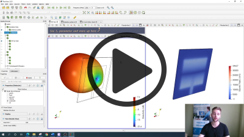
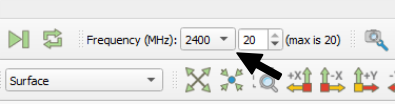
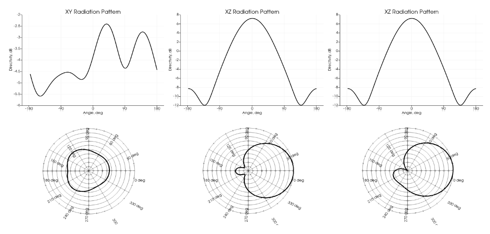
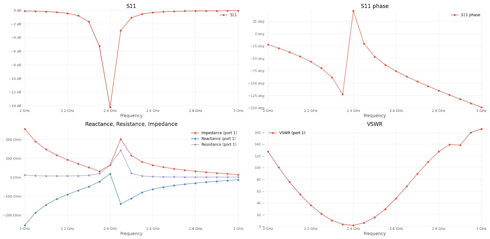
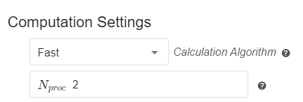
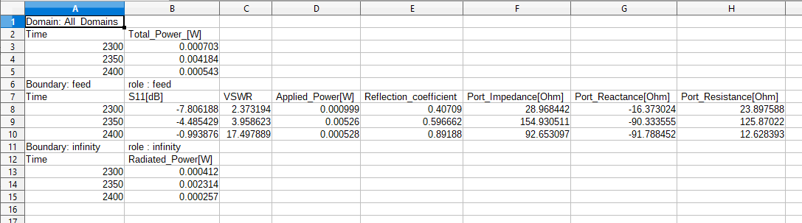
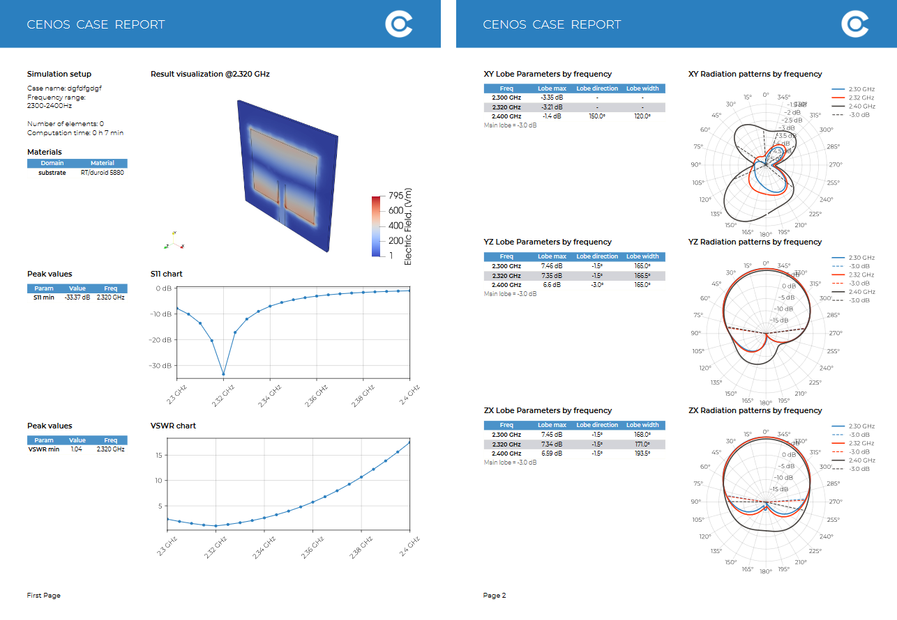

Once the simulation is done, results will be processed and opened in a separate window. *CENOS Antenna Design* app offers different ways and tools to analyze your antenna design. **In this section we will learn how to use CENOS to analyze antenna simulation results**.

**Watch a short video on how to evaluate results in CENOS Antenna Design app**:

---

## Overview

To analyze your antenna simulation, you have 3 different tools for that:

- **ParaView** (visual results)
- **Spreadsheet** (easy for result analysis in Excel)
- **PDF** (simulation report generation)

You can **access these directly** through CENOS Desk view under *Visualization* block.

---

## ParaView

When the simulation is finished, a new *ParaView* window will open with processed results.

---

### Electric/magnetic field

By default the *Electric field* is visualized,.

You can **change this visualization to see the** ***Magnetic field*** as well.

To switch between different field visualizations:

1. **Select the left side view** (should  be highlighted by a blue outline)

2. Select the **Dielectric** in the *Pipeline browser* tree.

3. **Change the field selection** to *Magnetic field*.

Now the new field is visualized!

:::tip
In the same way you can change visualization for *Far Field* as well.
1. Select the left view
2. Select *3D Far Field* in *Pipeline Browser*
3. Change the field selection in the dropdown.
:::

---

### Frequency range

If you calculated your design using *frequency sweep*, you can visualize results for different frequencies by selecting the frequency of interest.

---

### Radiation pattern

You can analyze the radiation pattern by switchin to **Radiation patterns** tab.

Here you can find radiation patterns displayed in **cartesian** and **polar** coordinates.

---

### S11 and other charts

To analyze parameters such as **S11**, **VSWR**, **Impedance**, **Resistance**, **Reactance** and **Applied Power**, switch to *S11 and other charts* tab.

:::tip
For *S11 and other charts* you can **set a custom frequency range** at the bottom left part of the window, in the properties:

:::

---

## Spreadsheet

*CENOS Antenna Design* outputs a .csv file with all of the global values such as **S11, VSWR**, and many more. You can open this in Excel, for example, where you can then plot, compare and analyze the results however you wish.

---

## PDF Reports

A very useful feature for reports is CENOS **built-in PDF report generator**. With this tool you can generate a **PDF file with your simulation setup and result overview**, which you can easily share with others!

