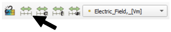
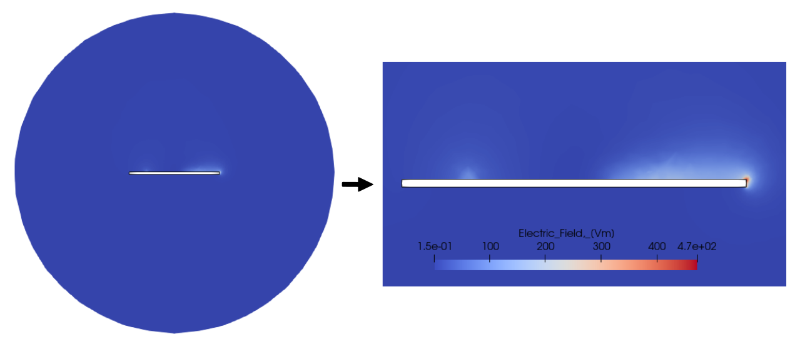
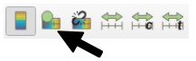
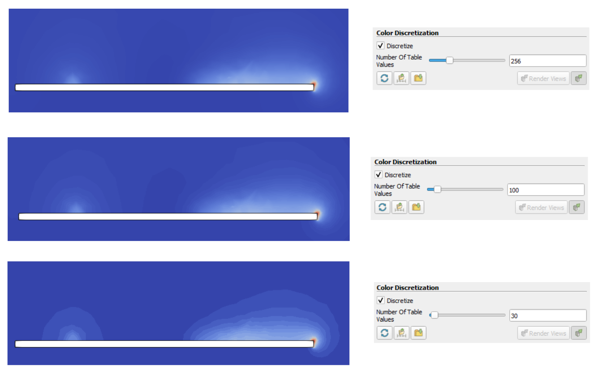

Besides the default information and evaluation that *CENOS Radio Frequency app* generates there is a **huge amount of manipulations** which you can carry out to **more deeply analyse** results and **get additional information** out of the results.

**In this section we will learn different methods on how to manually analyze antenna simulation results**.

---

### Electric/magnetic field on surface

By default the *Electric field* on your antenna is visualized.

You can **change this visualization to see the** ***Magnetic field*** as well.

To switch between different field visualizations:

1. **Select the right side view** (should  be highlighted by a blue outline)

2. Select the **Dielectric** in the *Pipeline browser* tree.

3. **Change the field selection** to *Magnetic field*.

Now the new field is visualized!

:::tip
In the same way you can change visualization for *Far Field* as well.
1. Select the left view
2. Select *3D Far Field* in *Pipeline Browser*
3. Change the field selection in the dropdown.
:::

---

### Near-field

For antenna analysis it is often interesting to take a look at the ***Electric field*** **and see how it is distributed around antenna**.

In the example below - *patch antenna near-field side view*.

To analyze the *near-field*:

1. **Select the left side view** (should  be highlighted by a blue outline)

2. Disable the visibility for **3D Far Field** in the *Pipeline browser* tree.

3. Select **Simulation Data**.

4. Click **Filters → Search...**. In search box write **Extract Block** and press *Enter*.

5. In *Properties* window select **air** and click *Apply*.

We have now created a new object in our *Tree View* - **ExtractBlock1**, and we can visually see the air domain (sphere) around our geometry.

We need to **slice the air domain to analyze the near-field** around our antenna.

6. With *ExtractBlock1* selected, click **Slice**. Position your slice plane (you can change the normals in *Properties*) and click *Apply*.

7. Rescale the *Electric Field* scale to better see the field around your antenna, and that is it!

---

### Color discretization

Often when analyzing fields or gradients, it is quite **hard to visually evaluate results**, as the **color distribution is very smooth and blended with the background**.

In such cases it is useful to **discretize the color table** to **make the result rougher, but more easily visible**.

To discretize color table:

1. In *Pipeline Browser* select the object you want to change visualization for and click **Edit Color Map**.

2. **Color Map Editor** will open on the right side of the screen. At the bottom of it you will find **Color Discretization** section, where you can change the **Number Of Table Values**.

:::note tip
By default the table value will be 256 - if you **decrease it**, you can decrease the number of colors used in the visualization, and use that to **evaluate the results more closely**!
:::

---

### Result accuracy (mesh)

As the calculation is done and results are displayed, you can evaluate not only the results, but the **quality of your simulation** as well. The easiest way is to look at the *Electric field* default visualization.

If you zoom in on your geometry, you can **visually examine** if the result is good or not. If you see **unphysical spikes**, it is worth checking the mesh influence on the results.

To **visualize the mesh over calculated results**:

1. **Select the right side view** (should  be highlighted by a blue outline)

2. Select the part you want to test in the *Pipeline browser* tree (*Dielectric* in this example).

3. Change the visualization to **Surface With Edges**.

As you do this, the **generated mesh will be visualized on your results**, and you will see if the spikes are connected with the mesh!

In this case the spikes are numerical effect caused by coarse mesh, so we should **[refine the mesh](geometry-meshing#patch-meshing)** to get more precise results!

---
