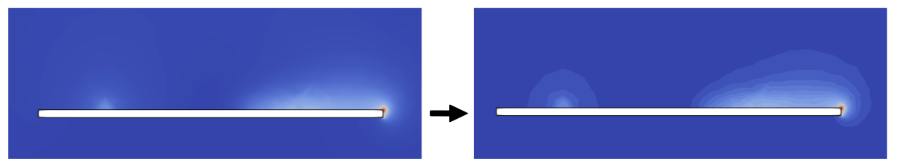
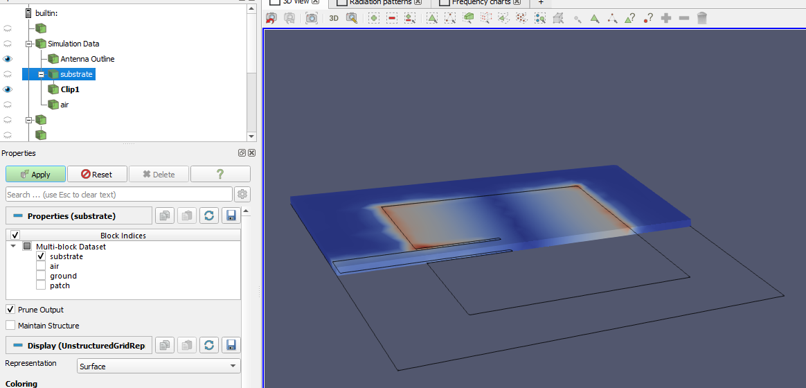

Besides the default information and evaluation that *CENOS Radio Frequency app* generates there is a **huge amount of manipulations** which you can carry out to **more deeply analyse** results and **get additional information** out of the results.

**In this section we will learn different methods on how to manually analyze antenna simulation results**.

### Electric/magnetic field on surface

By default the *Electric field* on your antenna is visualized. You can _change this visualization to see the Magnetic field_ as well.

To switch between different field visualizations:

1. **Select the right side view** (should  be highlighted by a blue outline).

2. Select the **Dielectric** in the *Pipeline browser* tree.

3. **Change the field selection** to *Magnetic field*.

Now the new field is visualized!

:::tip
In the same way you can change visualization for *Far Field* as well.
1. Select the left view.
2. Select *3D Far Field* in *Pipeline Browser*.
3. Change the field selection in the dropdown.
:::

### Color discretization

Often when analyzing fields or gradients, it is quite **hard to visually evaluate results**, as the **color distribution is very smooth and blended with the background**.

In such cases it is useful to **discretize the color table** to **make the result rougher, but more easily visible**.

To discretize color table:

1. In *Pipeline Browser* select the object you want to change visualization for and click **Edit Color Map**.

2. **Color Map Editor** will open on the right side of the screen. At the bottom of it you will find **Color Discretization** section, where you can change the **Number Of Table Values**.

:::note tip
By default the table value will be 256 - if you **decrease it**, you can decrease the number of colors used in the visualization, and use that to **evaluate the results more closely**!
:::

### Plane cut 
Sometimes, making a **cut in a plane** helps us to better analyze the distribution of the **electric field within a structure**.

Here is how you can cut any object in ParaView:

1. Click in the Electric Field Distribution window, which is on the right side – you can see this when the window has a blue outline.

2. Select the object you want to cut in the _Pipeline Browser_ on the left of your screen and make sure *it is marked blue*!

3. Now in the upper toolbar, find the **Slice** or **Clip** tool. Choose whichever you like! Slice creates a thin slice where you position the plane to be. Clip cuts the object, leaving it in half in its place.

4. Once you have selected the tool, click on it. You should see a new object appear in the browser, named either _Slice1_ or _Clip1_, depending on what you chose. The Visualization in the screen will now have a white frame and a red rectangle.

5. Now you have to select where you want to cut. There are **different ways to change the angle and placement of the cut**.
  
    1. The first way is to **drag it in place in the Visualization window**. Placing your cursor on the white part of the red frame will turn it green, thus allowing you to move the plane in the selected axis by clicking and dragging.
    
    2. If you click and hold the red arrow, you can **change its angle**.
    
    3.  You can select **specific angles** for the cut in the Properties tab for the object you created on the left. Here you can specify **normal vectors** for the placement of the red frame (X Y and Z normal will reset the red frame to the middle and the respective normal vector).

6. Now that you have selected the place you want to cut, **click apply** in the top of the Properties tab. Now you are done!

:::note tip
Here are a few useful small tips when creating a plane cut:

1. Select a different object in the Pipeline Browser, so that you can **pan around the field visualization without changing the cut plane**! Once you have done this, you will no longer have the red frame for cutting.

2. If you have made any mistake during this process, you can use _Ctrl+Z_ **to undo those mistakes**!

3. You can change the created cut within ParaView by selecting the cut Clip or Plane in the Pipeline browser and then checking the Properties tab. Changing the cut in the Visualization is also allowed!

4. If you want to **rescale the data range** (for example, make colors above or beyond a certain range be completely red), you select the Rescale to Custom Data Range tool in the upper toolbar, select the values you want and the click Rescale:

The result should look like this (note the scale has changed in the right side of the screen):

:::

### Result accuracy (mesh)

As the calculation is done and results are displayed, you can evaluate not only the results, but the **quality of your simulation** as well. The easiest way is to look at the *Electric field* default visualization.

If you zoom in on your geometry, you can **visually examine** if the result is good or not. If you see **unphysical spikes**, it is worth checking the mesh influence on the results.

To **visualize the mesh over calculated results**:

1. **Select the right side view** (should  be highlighted by a blue outline).

2. Select the part you want to test in the *Pipeline browser* tree (*Dielectric* in this example).

3. Change the visualization to **Surface With Edges**.

As you do this, the **generated mesh will be visualized on your results**, and you will see if the spikes are connected with the mesh!

In this case the spikes are numerical effect caused by coarse mesh, so we should **[refine the mesh](geometry-meshing#patch-meshing)** to get more precise results!

