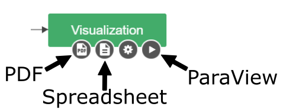
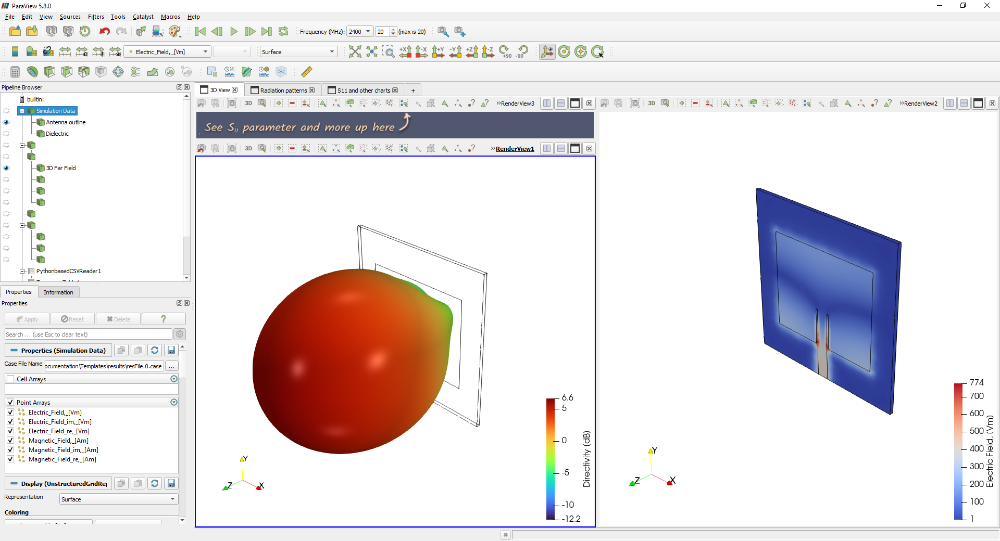
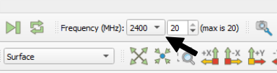
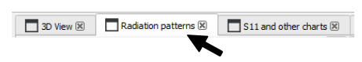
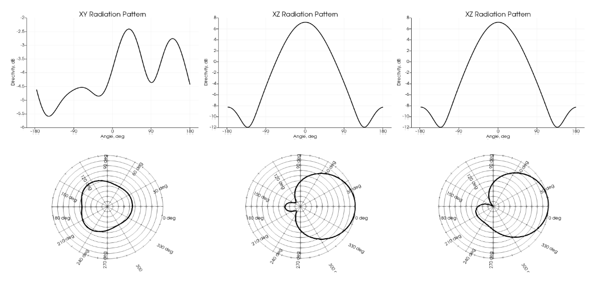
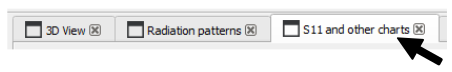
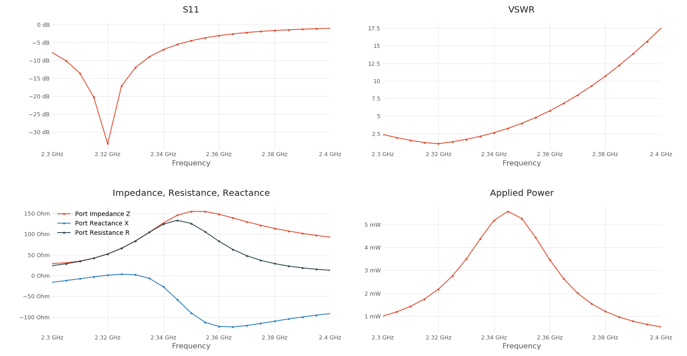
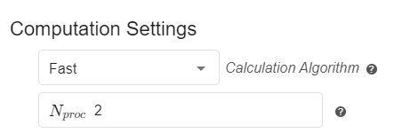
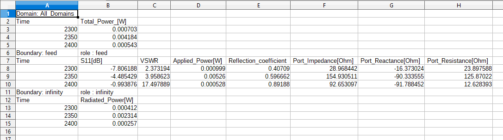
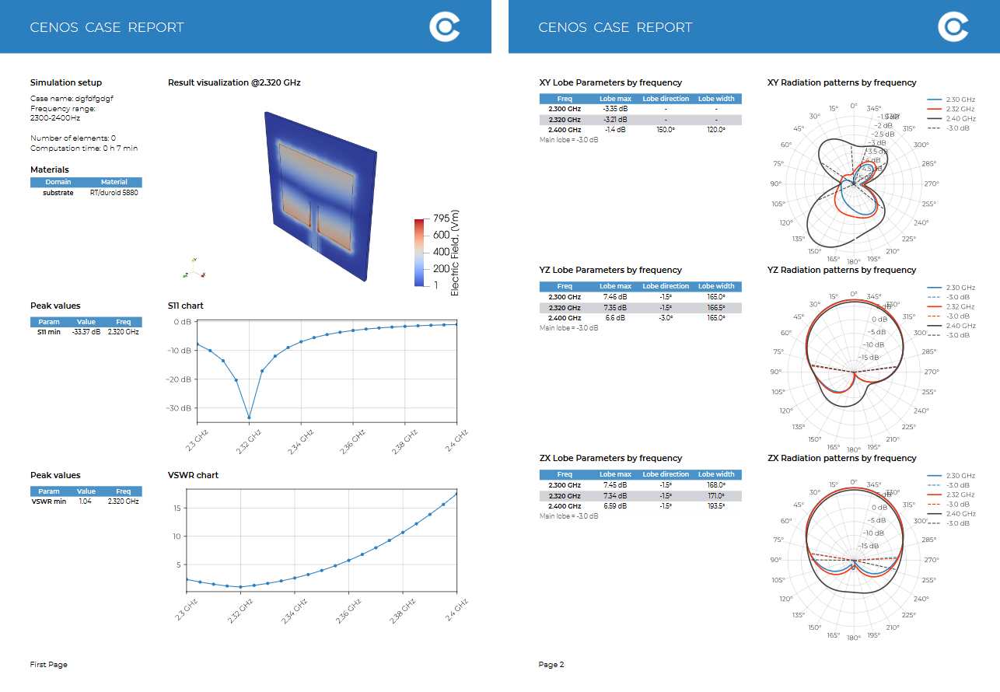

Once the simulation is done, results will be processed and opened in a separate window. *CENOS Radio Frequency* app offers different ways and tools to analyze your antenna design.

**In this section we will go over the default result evaluation layout for antenna simulation results**.

**Watch a short video on how to evaluate results in CENOS Radio Frequency app**:

<iframe width="560" height="315" src="https://www.youtube.com/embed/ZVUSHj0AmAI?list=PLtRpbWakrmMf29rhPnm0bxjosBow-nM8q" title="CENOS Antenna Design - Result evaluation" frameborder="0" allow="accelerometer; autoplay; clipboard-write; encrypted-media; gyroscope; picture-in-picture" allowfullscreen></iframe>

---

## Overview

To analyze your antenna simulation, you have 3 different tools for that:

- **ParaView** (visual results)
- **Spreadsheet** (easy for result analysis in Excel)
- **PDF** (simulation report generation)

You can **access these directly** through CENOS Desk view under *Visualization* block.

---

## ParaView

When the simulation is finished, a new *ParaView* window will open with processed results.

### 3D View

In the *3D View* tab you can see your antenna with ***Electric field*** visualized on the right, together with the ***Radiation pattern*** visualized on the left.

---

#### Frequency range

If you calculated your design using *frequency sweep*, you can visualize results for different frequencies by selecting the frequency of interest.

---

### Radiation pattern

You can analyze the radiation pattern by switching to **Radiation patterns** tab.

Here you can find radiation patterns displayed in **cartesian** and **polar** coordinates.

---

### S11 and other charts

To analyze parameters such as **S11**, **VSWR**, **Impedance**, **Resistance**, **Reactance** and **Applied Power**, switch to *S11 and other charts* tab.

:::tip
For *S11 and other charts* you can **set a custom frequency range** at the bottom left part of the window, in the properties:

:::

---

## Spreadsheet

*CENOS Radio Frequency* outputs a .csv file with all of the global values such as **S11, VSWR**, and many more. You can open this in Excel, for example, where you can then plot, compare and analyze the results however you wish.

---

## PDF Reports

A very useful feature for reports is CENOS **built-in PDF report generator**. With this tool you can generate a **PDF file with your simulation setup and result overview**, which you can easily share with others!

