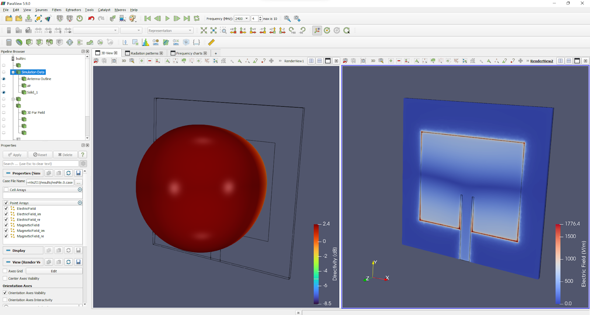

Once the simulation is done, results will be processed and opened in a separate window. *CENOS Radio Frequency* app offers different ways and tools to analyze your antenna design.

**In this section we will go over the default result evaluation layout for antenna simulation results**.

**Watch a short video on how to evaluate results in CENOS Radio Frequency app**:

<iframe width="560" height="315" src="https://www.youtube.com/embed/ZVUSHj0AmAI?list=PLtRpbWakrmMf29rhPnm0bxjosBow-nM8q" title="CENOS Antenna Design - Result evaluation" frameborder="0" allow="accelerometer; autoplay; clipboard-write; encrypted-media; gyroscope; picture-in-picture" allowfullscreen></iframe>

## Overview

To analyze your antenna simulation, you have 4 different options for that:

- **Python plots** (visual results).
- **ParaView** (visual results).
- **Spreadsheet** (easy for result analysis in Excel).
- **Touchstone file** (documenting the n-port network parameter data).
- **PDF** (simulation report generation) - _Pro plan only_.

You can **access these directly** through CENOS Desk view under *Visualization* block.

## Python plots
Upon completing your simulation, you will be able to observe the results within the CENOS interface.

### Charts

#### Frequency charts

You can access the Frequency charts tab, where you will observe information such as *S-parameters, VSWR, Impedance*, or *Power*.

#### Custom plots

If you would like to create your own plots this is possible from the Custom plots window! You will have access to various simulation data that you can manipulate using Python code.

### Radiation  Patterns

If you're interested in visualizing information about your model such as *Directivity, Gain, Radiation Intensity,* or *Far Field*, you can do so in the **Radiation Patterns tab**. CENOS provides various approaches, starting with the visualization of 2D cuts. Once you select the pattern to visualize, you can choose different cutting planes, as well as select the coordinate system to use!

If you've run a simulation with multiple frequencies, don't forget that you can review the graphs depending on the selected frequency.

If your intention is to create a 2D cut at a specific angle, you can accomplish this within the **Custom Cuts** tab! Begin by selecting the 3D reference pattern. Then, opt for the cutting plane; this can be achieved through two distinct methods:

1. You can adjust the exact values of theta and phi.
2. If you click and hold the red arrow, you can change its angle.

Once you have selected the appropriate angle, ensure to choose the correct coordinate system, as well as the frequency. Afterward, click on the PLOT CUSTOM CUTS button, and you will be able to observe the corresponding information.

Another common way to visualize radiation patterns is in 3D, and you can find this information in the **3D Radiation Patterns** tab.

### Polarization

The polarization of an antenna is essential to ensure efficient transmission and reception of electromagnetic signals in various applications. The polarization of an antenna refers to the orientation of the electric field of the electromagnetic waves radiated by the antenna. Common polarizations in antennas include vertical polarization, horizontal polarization, and circular polarization. 

CENOS provides you with the **axial ratio** of your model. Such value serves as a measure of polarization quality and is essential to ensure reliable transmission and reception of signals. This information can be found in the **Polarization** tab. The values can be displayed either in adimensional or logarithmic format.

### Electric Field

Within the results, the distribution of the **Electric Field** is displayed, based on the selected frequency. You will have various tools at your disposal for improved visualization, such as data range rescaling.

Similarly, you can orient the visualization of your model according to a selected plane. These tools can be found at the top of the window.

Saving screenshots of the results you are viewing can be very useful for future reference or for sharing with your colleagues. You can save images of your results by clicking on the camera icon displayed at the top of the window.

Visualizing *streamlines* allows you to observe how energy is distributed along your model. To activate them, you should select the air domain and enable its visualization. Then, in the displayed result, choose **either the imaginary or real part of the Electric Field**. Afterward, in the representation type, select streamlines.

In a similar way to streamlines, you can display *stream vectors*. Just follow the same steps and, at the end, change the representation to vectors.

### Magnetic Field

Just as it's important to observe the electric field of the simulated model, observing the **magnetic field** helps understand how the model radiates energy in space and interacts with its environment. To access the magnetic field data, navigate to this tab; the window and tools will be very similar to those in the electric field tab.

### Near Field

Examining the **near field** in an RF model simulation is essential for understanding its behavior in close environments, optimizing its design, and ensuring its proper operation in practical applications. You can incorporate this information into the CENOS results!

You can enable the display of the plane to be shown and adjust it as it suits you best!  Placing your cursor on the white part of the red frame will turn it green, thus allowing you to move the plane in the selected axis by clicking and dragging.

### Current Density 

If your simulation involves a domain with a real conductor, you will be able to observe the enabled **current density** tab. Current density patterns can unveil coupling issues, electromagnetic interference, or other problems that might impact the model's performance. Identifying these issues during the simulation phase allows for their correction before practical implementation.

## ParaView

When the simulation is finished, a new *ParaView* window will open with processed results.

### 3D View

In the *3D View* tab you can see your antenna with ***Electric field*** visualized on the right, together with the ***Radiation pattern*** visualized on the left.
  

#### Frequency range

If you calculated your design using *frequency sweep*, you can visualize results for different frequencies by selecting the frequency of interest.

### Radiation pattern

You can analyze the radiation pattern by switching to **Radiation patterns** tab.

Here you can find radiation patterns displayed in **cartesian** and **polar** coordinates.

### Frequency charts

To analyze parameters such as **S11 magnitude**, **S11 phase**, **Impedance**, **Resistance**, **Reactance** and **VSWR**, switch to *Frequency charts* tab.

## Parametric Study Results

If you used the [Parametric Study](physics-overview#parametric-study) in the simulation of your RF model, the results you will see automatically displayed will be the **S-parameter values of all cases**. This way you can directly compare the performance between cases with different dimensions!

By clicking on the _PARAMETRIC STUDY_ box you can see the number of simulated cases and the dimensions of the parameters that were modified.  

If you need to see the rest of the results for each case such as the radiation pattern or the electric field it is possible to do so by clicking on the results box of the case of interest! By doing so you will see that a **Paraview window is automatically displayed** with all the results.

If you need to see the rest of the results for each case such as the radiation pattern or the electric field it is possible to do so by clicking on the results box of the case of interest! The 3D button will open the results in a Paraview window, the other button will show you the results in Python plots.

:::tip
When simulating numerous cases in the parametric study, it can be challenging to maintain a clear visualization of the combined results as they may appear cluttered. In such instances, it is possible to enable/disable certain graphs by clicking on the legend of each graph. Furthermore, you can double-click on the legend to isolate a trace.

:::

## Spreadsheet

*CENOS Radio Frequency* outputs a .csv file with all of the global values such as **S11, VSWR**, and many more. You can open this in Excel, for example, where you can then plot, compare and analyze the results however you wish.

## PDF Reports 

A very useful feature for reports is CENOS **built-in PDF report generator**. With this tool you can generate a **PDF file with your simulation setup and result overview**, which you can easily share with others!

## Extra results

In the _extra_results_ folder you can find **more information about your case**! You can easily access these results from the _CENOS Radio Frequency_ interface, just click on the folder icon under the visualization box. *CENOS RF* automatically produces a **Touchstone file** export for the impedance you set for your port, as well as any impedance you may have defined with the impedance renormalization settings.

The **Touchstone file** corresponding to your case results for future processing will be available here! In addition, _CENOS Radio Frequency_ provides you with an image corresponding to the **Smith Chart**! 

:::note

Remember that by using the option **[Real/Imaginary format](physics-overview#touchstone-export)** you will have the option to display the Touchstone file results in _dB and angle_ or in _Real and Imaginary_ format. Depending on the option you choose, your data will be displayed. 

:::
