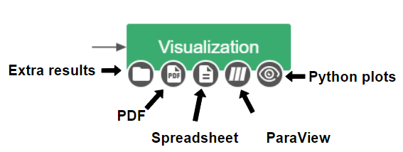

Once the simulation is done, results will be processed and opened in a separate window. *CENOS Radio Frequency* app offers different ways and tools to analyze your antenna design.

**In this section we will go over the default result evaluation layout for antenna simulation results**.

**Watch a short video on how to evaluate results in CENOS Radio Frequency app**:

<iframe width="560" height="315" src="https://www.youtube.com/embed/ZVUSHj0AmAI?list=PLtRpbWakrmMf29rhPnm0bxjosBow-nM8q" title="CENOS Antenna Design - Result evaluation" frameborder="0" allow="accelerometer; autoplay; clipboard-write; encrypted-media; gyroscope; picture-in-picture" allowfullscreen></iframe>

## Overview

To analyze your antenna simulation, you have 3 different tools for that:

- **ParaView** (visual results).
- **Spreadsheet** (easy for result analysis in Excel).
- **Touchstone file** (documenting the n-port network parameter data).
- **PDF** (simulation report generation) - _Pro plan only_.

You can **access these directly** through CENOS Desk view under *Visualization* block.

## ParaView

When the simulation is finished, a new *ParaView* window will open with processed results.

### 3D View

In the *3D View* tab you can see your antenna with ***Electric field*** visualized on the right, together with the ***Radiation pattern*** visualized on the left.

  

#### Frequency range

If you calculated your design using *frequency sweep*, you can visualize results for different frequencies by selecting the frequency of interest.

### Radiation pattern

You can analyze the radiation pattern by switching to **Radiation patterns** tab.

Here you can find radiation patterns displayed in **cartesian** and **polar** coordinates.

### Frequency charts

To analyze parameters such as **S11 magnitude**, **S11 phase**, **Impedance**, **Resistance**, **Reactance** and **VSWR**, switch to *Frequency charts* tab.

## Parametric Study Results

If you used the [Parametric Study](geometry-creation#geometry parameters and parametric study) in the simulation of your RF model, the results you will see automatically displayed will be the **S-parameter values of all cases**. This way you can directly compare the performance between cases with different dimensions!

By clicking on the _PARAMETRIC STUDY_ box you can see the number of simulated cases and the dimensions of the parameters that were modified.  

If you need to see the rest of the results for each case such as the radiation pattern or the electric field it is possible to do so by clicking on the results box of the case of interest! By doing so you will see that a **Paraview window is automatically displayed** with all the results.

## Spreadsheet

*CENOS Radio Frequency* outputs a .csv file with all of the global values such as **S11, VSWR**, and many more. You can open this in Excel, for example, where you can then plot, compare and analyze the results however you wish.

## PDF Reports 

A very useful feature for reports is CENOS **built-in PDF report generator**. With this tool you can generate a **PDF file with your simulation setup and result overview**, which you can easily share with others!

