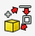
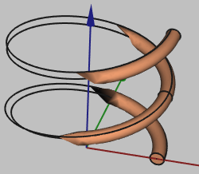

## Common tasks

:::note
Denominations for used solutions:
- **bold** for workbench selection (e.g. **Part**)
- *italic* for toolbar selection (e.g. *View*)
- ***bold+italic*** for shortcut icons (e.g. ***Create a Cylinder***)
- no formatting for other selections (e.g. selection in shape property window)
:::

| Task                                     | Solution                                   | Icon                                   |
| ---------------------------------------- | ------------------------------------------ | ------------------------------------------ |
| Move object                              | Left-click in tree view on object → Transform      |
| Move sketch                              | Sketch Properties → Attachment/Base → Placement → Position        |
| Create a face from edges                 | **Part** → ***Advanced Utility*** → Face from edges |  |
| Create an array from *objects*           | **Draft** → *Modification* → Array Tools |
| Create an array in a *sketch*            | **Sketcher** → *Sketch* → Sketcher tools → Rectangular array |
| Turn compound into multiple solids       | **Part** → Select your compound → ***Explode Compound*** | |
| Position one object next to another      | Select the first object, click *Part* → Attachment, select the second object's face, set mode to "XY on plane"|
| Change unit system or number of decimals | *Edit* → Preferences → General → Units |
| Turn edge into wire with thickness       | Select your edge/wire and click ***Apply a thickness to a 1D wire*** |  |
| Toggle object visibility                 | Right-click on the object in tree view and click Show/Hide selection.      |
| Toggle grid visibility                  | **Draft** → *Utilities* → Toggle Grid      |

---

## Useful shortcuts

| Function                   | Shortcut     |
| -------------------------- | ------------ |
| Toggle object visibility   | *Space*        |
| Set camera rotation center | *Middle-click* |
| Pan camera                 | *Left-click*   |
| Import File                | *Drag&drop*    |
| Rectangle select objects   | *Shift+B*      |
| Rectangle select elements  | *Shift+E*      |
| Import File                | *Drag&drop*    |

---

## Problems

| Problem               | Solution                                   |
| ---------------------------- | ------------------------------------------ |
| Extrusion does not work      | Double-check that you use a sketch which is closed, without holes or branching wires |
|       | This can occur when creating wire geometries. **This is just a visualization problem and in no way affect the geometry - you can still use it**! |

