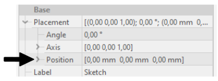
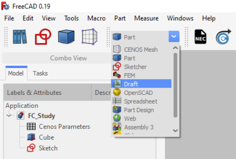
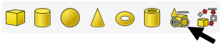
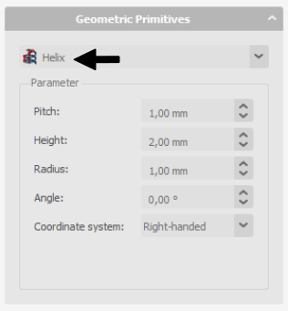
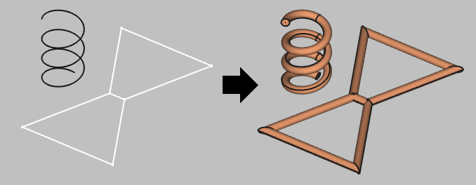

## Geometry creation

### Import NEC

If you have a ***.NEC*** (or other format) file, you can import it from the Part module.

---

### Manual creation

To **create a wire antenna from scratch**, you need to create a sketch of your antenna, and then define the thickness of your wire:

1. ***CREATE A SKETCH***

    1. For **2D sketches** you can **set sketch position** in its properties (In sketch properties *Base → Placement → Position*)
    
    

    

    

    
    2. To build **3D sketches**, use **Draft Workbench → Drafting → Line**. There you will need to build lines one by one and adjust the *Start* and *End* points to match your design.
    
    

    

    

    
    3. For **helixes or spirals** use **Create Primitives** function in *Part* workbench.
    
    

    

    

    
    In *Geometric Primitives* properties select **Helix** shape, and define your wire.
    
    

    

    

2. **Create a wire** with volume from the edges, select your shape, click **Wire thickness** tool in *Part Workbench* and define the wire thickness.

:::caution
Sometimes when building wires, the visualization will appear like this:

**This is a visualization problem, which does not affect the geometry itself**. You can continue and use this geometry in your setup!
:::

